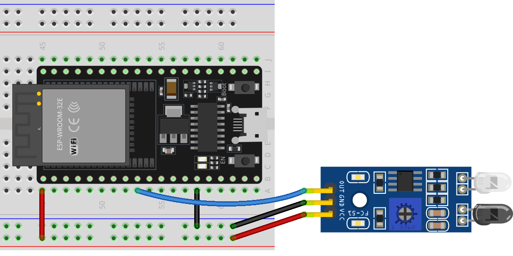

.. note::

    Hello, welcome to the SunFounder Raspberry Pi & Arduino & ESP32 Enthusiasts Community on Facebook! Dive deeper into Raspberry Pi, Arduino, and ESP32 with fellow enthusiasts.

    **Why Join?**

    - **Expert Support**: Solve post-sale issues and technical challenges with help from our community and team.
    - **Learn & Share**: Exchange tips and tutorials to enhance your skills.
    - **Exclusive Previews**: Get early access to new product announcements and sneak peeks.
    - **Special Discounts**: Enjoy exclusive discounts on our newest products.
    - **Festive Promotions and Giveaways**: Take part in giveaways and holiday promotions.

    👉 Ready to explore and create with us? Click [|link_sf_facebook|] and join today!

.. _esp32_lesson08_ir_obstacle_avoidance:

Lesson 08: IR Obstacle Avoidance Sensor Module
====================================================

In this lesson, you'll learn how to use an Infrared obstacle avoidance sensor with an ESP32 Development Board. We'll explore how the sensor detects obstacles and alters its output signal. You'll also learn how to read these signals using the ESP32 and display them on the serial monitor. This project provides a great opportunity for beginners to gain hands-on experience with sensors and digital input processing on the ESP32 platform, making it perfect for those interested in building interactive projects.

Required Components
--------------------------

In this project, we need the following components. 

It's definitely convenient to buy a whole kit, here's the link: 

.. list-table::
    :widths: 20 20 20
    :header-rows: 1

    *   - Name	
        - ITEMS IN THIS KIT
        - LINK
    *   - Universal Maker Sensor Kit
        - 94
        - |link_umsk|

You can also buy them separately from the links below.

.. list-table::
    :widths: 30 20
    :header-rows: 1

    *   - Component Introduction
        - Purchase Link

    *   - ESP32 & Development Board (:ref:`cpn_esp32_wroom_32e`)
        - |link_esp32_camera_pro_kit_buy|
    *   - :ref:`cpn_ir_obstacle`
        - |link_obstacle_avoidance_module_buy|
    *   - :ref:`cpn_breadboard`
        - |link_breadboard_buy|

Wiring
---------------------------

Code
---------------------------

.. raw:: html

    <iframe src=https://create.arduino.cc/editor/sunfounder01/e04a4a04-e707-46a1-aee5-488add646356/preview?embed style="height:510px;width:100%;margin:10px 0" frameborder=0></iframe>

Code Analysis
---------------------------

1. Define pin number for sensor connection:

   .. code-block:: arduino

     const int sensorPin = 25;

   Connect the sensor's output pin to pin 25.

2. Setup serial communication and define sensor pin as input:

   .. code-block:: arduino

     void setup() {
       pinMode(sensorPin, INPUT);  
       Serial.begin(9600);
     }

   Initialize serial communication at 9600 baud rate to print to serial monitor.
   Set sensor pin as input to read input signal.

3. Read sensor value and print to serial monitor:

   .. code-block:: arduino

     void loop() {
       Serial.println(digitalRead(sensorPin));
       delay(50); 
     }
   
   Continuously read digital value from sensor pin using ``digitalRead()`` and print value to serial monitor using ``Serial.println()``.
   Add 50ms delay between prints for better viewing.

   .. note:: 
   
      If the sensor is not working properly, adjust the IR transmitter and receiver to make them parallel. Additionally, you can adjust the detection range using the built-in potentiometer.
