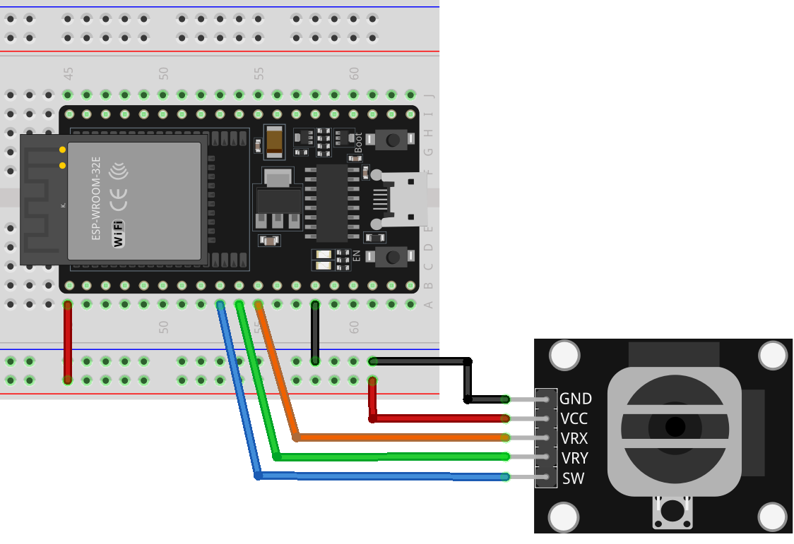

.. note::

    こんにちは、SunFounder Raspberry Pi & Arduino & ESP32 Enthusiasts Communityへようこそ！Facebook上で、仲間と一緒にRaspberry Pi、Arduino、ESP32をさらに深く探求しましょう。

    **なぜ参加するのか？**

    - **専門的なサポート**：購入後の問題や技術的な課題をコミュニティやチームの助けを借りて解決。
    - **学びと共有**：スキルを向上させるためのヒントやチュートリアルを交換。
    - **限定プレビュー**：新製品発表や予告編に早期アクセス。
    - **特別割引**：最新製品の特別割引を楽しむ。
    - **フェスティブプロモーションとプレゼント**：プレゼントやホリデープロモーションに参加。

    👉 私たちと一緒に探索と創造を始める準備はできましたか？[|link_sf_facebook|]をクリックして、今すぐ参加しましょう！

.. _esp32_lesson09_joystick:

Lesson 09: Joystick Module
==================================

In this lesson, you will learn how to read values from a joystick module using the ESP32 Development Board. We'll cover measuring the X and Y axis movements of the joystick and interpreting the switch position. By integrating these inputs with the ESP32, you'll gain insights into handling analog and digital signals. This project is perfect for beginners, providing hands-on experience in reading and processing data from interactive hardware components.

Required Components
--------------------------

In this project, we need the following components. 

It's definitely convenient to buy a whole kit, here's the link: 

.. list-table::
    :widths: 20 20 20
    :header-rows: 1

    *   - Name	
        - ITEMS IN THIS KIT
        - LINK
    *   - Universal Maker Sensor Kit
        - 94
        - |link_umsk|

You can also buy them separately from the links below.

.. list-table::
    :widths: 30 20
    :header-rows: 1

    *   - Component Introduction
        - Purchase Link

    *   - ESP32 & Development Board
        - |link_esp32_camera_pro_kit_buy|
    *   - :ref:`cpn_joystick`
        - |link_joystick_buy|
    *   - :ref:`cpn_breadboard`
        - |link_breadboard_buy|

Wiring
---------------------------

Code
---------------------------

.. raw:: html

    <iframe src=https://create.arduino.cc/editor/sunfounder01/6a9f54fb-a117-48f2-bca0-fd43bdd45b51/preview?embed style="height:510px;width:100%;margin:10px 0" frameborder=0></iframe>

Code Analysis
---------------------------

#. Pin Definitions:
   
   .. code-block:: arduino
   
      const int xPin = 27;  //the VRX attach to
      const int yPin = 26;  //the VRY attach to
      const int swPin = 25;  //the SW attach to

   Constants for the joystick pins are defined. ``xPin`` and ``yPin`` are analog pins for the joystick's X and Y axes. ``swPin`` is a digital pin for the joystick's switch.

#. Setup Function:

   .. code-block:: arduino
   
      void setup() {
        pinMode(swPin, INPUT_PULLUP);
        Serial.begin(9600);
      }

   Initializes ``swPin`` as an input with a pull-up resistor, essential for the switch's functionality. Starts serial communication at 9600 baud.

#. Main Loop:

   .. code-block:: arduino
   
      void loop() {
        Serial.print("X: ");
        Serial.print(analogRead(xPin));  // print the value of VRX
        Serial.print("|Y: ");
        Serial.print(analogRead(yPin));  // print the value of VRY
        Serial.print("|Z: ");
        Serial.println(digitalRead(swPin));  // print the value of SW
        delay(50);
      }

   Continuously reads and prints the values from the joystick's axes and switch to the Serial Monitor, with a delay of 50 ms between readings.