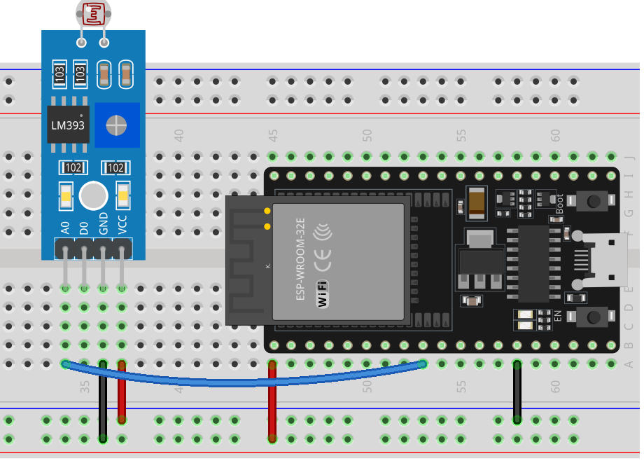

.. note::

    こんにちは、SunFounder Raspberry Pi & Arduino & ESP32 Enthusiasts Communityへようこそ！Facebook上で、仲間と一緒にRaspberry Pi、Arduino、ESP32をさらに深く探求しましょう。

    **なぜ参加するのか？**

    - **専門的なサポート**：購入後の問題や技術的な課題をコミュニティやチームの助けを借りて解決。
    - **学びと共有**：スキルを向上させるためのヒントやチュートリアルを交換。
    - **限定プレビュー**：新製品発表や予告編に早期アクセス。
    - **特別割引**：最新製品の特別割引を楽しむ。
    - **フェスティブプロモーションとプレゼント**：プレゼントやホリデープロモーションに参加。

    👉 私たちと一緒に探索と創造を始める準備はできましたか？[|link_sf_facebook|]をクリックして、今すぐ参加しましょう！
    
.. _esp32_lesson11_photoresistor:

レッスン11: フォトレジスターモジュール
======================================

このレッスンでは、ESP32開発ボードを使用してフォトレジスタセンサーを利用し、光の強さを測定する方法を学びます。センサーが異なる光レベルを検出し、その読み取り値をシリアルモニターに表示する方法を探ります。このプロジェクトは、アナログセンサーとArduinoプログラミングによるリアルタイムデータ処理の実践的な経験を提供するため、初心者に最適です。

必要な部品
--------------------------

このプロジェクトには以下の部品が必要です。

全ての部品が揃ったキットを購入すると便利です。リンクはこちら：

.. list-table::
    :widths: 20 20 20
    :header-rows: 1

    *   - Name	
        - ITEMS IN THIS KIT
        - LINK
    *   - Universal Maker Sensor Kit
        - 94
        - |link_umsk|

以下のリンクから個別に購入することもできます。

.. list-table::
    :widths: 30 20
    :header-rows: 1

    *   - Component Introduction
        - Purchase Link

    *   - ESP32 & Development Board
        - |link_esp32_camera_pro_kit_buy|
    *   - :ref:`cpn_photoresistor`
        - |link_photoresistor_sensor_module_buy|
    *   - :ref:`cpn_breadboard`
        - |link_breadboard_buy|

配線
---------------------------

コード
---------------------------

.. raw:: html

    <iframe src=https://create.arduino.cc/editor/sunfounder01/d66fd803-df3b-4afd-9986-b335e0739241/preview?embed style="height:510px;width:100%;margin:10px 0" frameborder=0></iframe>

コード解析
---------------------------

#. **センサーピンの設定とシリアル通信の初期化**

   setup関数でセンサーピンを定義し、シリアル通信を初期化します。フォトレジスタはピン25に接続されます。

   .. code-block:: arduino

      const int sensorPin = 25;  // Pin connected to the photoresistor

      void setup() {
        Serial.begin(9600);  // Start serial communication at 9600 baud rate
      }

#. **センサーデータの読み取りと表示**

   loop関数では、センサーからアナログ値を連続的に読み取り、シリアルモニターに出力します。また、読み取り値を安定させるために短い遅延を追加します。

   .. code-block:: arduino

      void loop() {
        Serial.println(analogRead(sensorPin));  // Read and print the analog value
        delay(50);                              // Short delay to stabilize readings
      }

