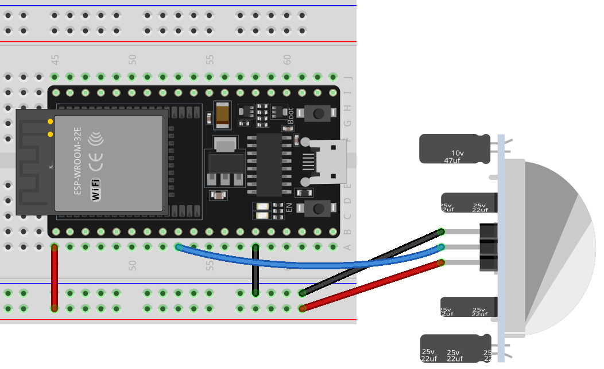

 .. note::

    Hallo und willkommen in der SunFounder Raspberry Pi & Arduino & ESP32 Enthusiasten-Gemeinschaft auf Facebook! Tauchen Sie tiefer ein in die Welt von Raspberry Pi, Arduino und ESP32 mit anderen Enthusiasten.

    **Warum beitreten?**

    - **Expertenunterstützung**: Lösen Sie Nachverkaufsprobleme und technische Herausforderungen mit Hilfe unserer Gemeinschaft und unseres Teams.
    - **Lernen & Teilen**: Tauschen Sie Tipps und Anleitungen aus, um Ihre Fähigkeiten zu verbessern.
    - **Exklusive Vorschauen**: Erhalten Sie frühzeitigen Zugang zu neuen Produktankündigungen und exklusiven Einblicken.
    - **Spezialrabatte**: Genießen Sie exklusive Rabatte auf unsere neuesten Produkte.
    - **Festliche Aktionen und Gewinnspiele**: Nehmen Sie an Gewinnspielen und Feiertagsaktionen teil.

    👉 Sind Sie bereit, mit uns zu erkunden und zu erschaffen? Klicken Sie auf [|link_sf_facebook|] und treten Sie heute bei!

.. _esp32_lesson12_pir_motion:

Lektion 12: PIR-Bewegungssensor (HC-SR501)
============================================

In dieser Lektion lernen Sie, wie Sie einen PIR (Passive Infrared) Bewegungssensor mit einem ESP32-Entwicklungsboard verwenden. Sie lernen, wie Sie digitale Eingaben vom Sensor lesen, um Bewegungen zu erkennen, und eine entsprechende Nachricht auf dem seriellen Monitor ausgeben. Wir behandeln die Einrichtung und Programmierung des ESP32-Boards, um zu reagieren, wenn der Sensor die Anwesenheit einer Person erkennt und "Somebody here!" anzeigt.

Benötigte Komponenten
--------------------------

Für dieses Projekt benötigen wir die folgenden Komponenten.

Es ist definitiv praktisch, ein ganzes Kit zu kaufen, hier ist der Link:

.. list-table::
    :widths: 20 20 20
    :header-rows: 1

    *   - Name	
        - ITEMS IN THIS KIT
        - LINK
    *   - Universal Maker Sensor Kit
        - 94
        - |link_umsk|

Sie können sie auch einzeln über die unten stehenden Links kaufen.

.. list-table::
    :widths: 30 20
    :header-rows: 1

    *   - Component Introduction
        - Purchase Link

    *   - ESP32 & Development Board
        - |link_esp32_camera_pro_kit_buy|
    *   - :ref:`cpn_pir_motion`
        - \-
    *   - :ref:`cpn_breadboard`
        - |link_breadboard_buy|

Verdrahtung
---------------------------

Code
---------------------------

.. raw:: html

    <iframe src=https://create.arduino.cc/editor/sunfounder01/62dbb20a-775e-415b-9032-1db0f0506faf/preview?embed style="height:510px;width:100%;margin:10px 0" frameborder=0></iframe>

Code-Analyse
---------------------------

1. Einrichtung des PIR-Sensorpins. Der Pin für den PIR-Sensor ist als Pin 25 definiert.

   .. code-block:: arduino

      const int pirPin = 25;
      int state = 0;

2. Initialisierung des PIR-Sensors. In der ``setup()``-Funktion wird der PIR-Sensorpin als Eingang festgelegt. Dadurch kann der Arduino den Zustand des PIR-Sensors lesen.

   .. code-block:: arduino

      void setup() {
        pinMode(pirPin, INPUT);
        Serial.begin(9600);
      }

3. Auslesen des PIR-Sensors und Anzeigen der Ergebnisse. In der ``loop()``-Funktion wird der Zustand des PIR-Sensors kontinuierlich gelesen.

   .. code-block:: arduino

      void loop() {
        state = digitalRead(pirPin);
        if (state == HIGH) {
          Serial.println("Somebody here!");
        } else {
          Serial.println("Monitoring...");
          delay(100);
        }
      }

   Wenn der Zustand ``HIGH`` ist, was bedeutet, dass eine Bewegung erkannt wurde, wird die Nachricht "Somebody here!" auf dem seriellen Monitor ausgegeben. Andernfalls wird "Monitoring..." angezeigt.
