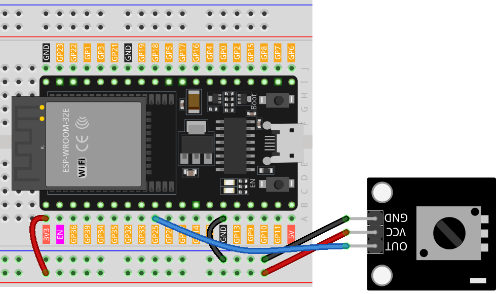

 .. note::

    Hallo und willkommen in der SunFounder Raspberry Pi & Arduino & ESP32 Enthusiasten-Gemeinschaft auf Facebook! Tauchen Sie tiefer ein in die Welt von Raspberry Pi, Arduino und ESP32 mit anderen Enthusiasten.

    **Warum beitreten?**

    - **Expertenunterstützung**: Lösen Sie Nachverkaufsprobleme und technische Herausforderungen mit Hilfe unserer Gemeinschaft und unseres Teams.
    - **Lernen & Teilen**: Tauschen Sie Tipps und Anleitungen aus, um Ihre Fähigkeiten zu verbessern.
    - **Exklusive Vorschauen**: Erhalten Sie frühzeitigen Zugang zu neuen Produktankündigungen und exklusiven Einblicken.
    - **Spezialrabatte**: Genießen Sie exklusive Rabatte auf unsere neuesten Produkte.
    - **Festliche Aktionen und Gewinnspiele**: Nehmen Sie an Gewinnspielen und Feiertagsaktionen teil.

    👉 Sind Sie bereit, mit uns zu erkunden und zu erschaffen? Klicken Sie auf [|link_sf_facebook|] und treten Sie heute bei!

.. _esp32_lesson13_potentiometer:

Lektion 13: Potentiometer-Modul
==================================

In dieser Lektion lernen Sie, wie Sie den analogen Wert eines Potentiometers mit dem ESP32-Entwicklungsboard auslesen. Wir werden ein Potentiometermodul an Pin 25 anschließen und die sich ändernden Analogwerte (0-4095) im seriellen Monitor beobachten. Dieses Projekt bietet praktische Erfahrungen im Verständnis von analogen Eingängen und serieller Kommunikation und ist eine ausgezeichnete Übung für Anfänger, um die Fähigkeiten des ESP32-Boards zu erkunden.

Benötigte Komponenten
--------------------------

Für dieses Projekt benötigen wir die folgenden Komponenten.

Es ist definitiv praktisch, ein ganzes Kit zu kaufen, hier ist der Link:

.. list-table::
    :widths: 20 20 20
    :header-rows: 1

    *   - Name	
        - ITEMS IN THIS KIT
        - LINK
    *   - Universal Maker Sensor Kit
        - 94
        - |link_umsk|

Sie können sie auch einzeln über die unten stehenden Links kaufen.

.. list-table::
    :widths: 30 20
    :header-rows: 1

    *   - Component Introduction
        - Purchase Link

    *   - ESP32 & Development Board
        - |link_esp32_camera_pro_kit_buy|
    *   - :ref:`cpn_potentiometer`
        - |link_potentiometer_sensor_module_buy|
    *   - :ref:`cpn_breadboard`
        - |link_breadboard_buy|

Verdrahtung
---------------------------

Code
---------------------------

.. raw:: html

    <iframe src=https://create.arduino.cc/editor/sunfounder01/80644221-74b4-4df5-804e-236fdc4ab30e/preview?embed style="height:510px;width:100%;margin:10px 0" frameborder=0></iframe>

Code-Analyse
---------------------------

#. Diese Codezeile definiert die Pinnummer, an die das Potentiometer am ESP32-Entwicklungsboard angeschlossen ist.

   .. code-block:: arduino

      const int sensorPin = 25;

#. Die ``setup()``-Funktion ist eine spezielle Funktion in Arduino, die nur einmal ausgeführt wird, wenn das ESP32-Entwicklungsboard eingeschaltet oder zurückgesetzt wird. In diesem Projekt initiiert der Befehl ``Serial.begin(9600)`` die serielle Kommunikation mit einer Baudrate von 9600.

   .. code-block:: arduino

      void setup() {
        Serial.begin(9600);  
      }

#. Die ``loop()``-Funktion ist die Hauptfunktion, in der das Programm wiederholt ausgeführt wird. In dieser Funktion liest die ``analogRead()``-Funktion den analogen Wert vom Potentiometer und gibt ihn mit ``Serial.println()`` auf dem seriellen Monitor aus. Der Befehl ``delay(50)`` lässt das Programm 50 Millisekunden warten, bevor die nächste Messung durchgeführt wird.

   .. code-block:: arduino

      void loop() {
        Serial.println(analogRead(sensorPin));  
        delay(50);
      }
