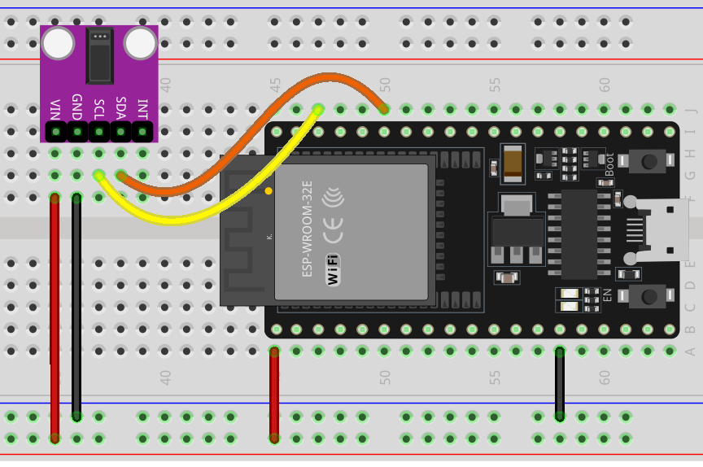

.. _esp32_lesson14_max30102:

Lesson 14: Pulse Oximeter and Heart Rate Sensor Module (MAX30102)
====================================================================

In this lesson, you will learn how to measure heart rate using an ESP32 Development Board and MAX30102 Pulse Oximeter and Heart Rate Sensor. We'll cover setting up the sensor, reading infrared values, and accurately calculating beats per minute (BPM). This project is ideal for those interested in health monitoring systems and provides a valuable introduction to working with biomedical sensors using the ESP32. 

.. warning::
    This project detects heart-rate optically. This method is tricky and prone to give false readings. So please **DO NOT** use it for actual medical diagnosis.

Required Components
---------------------------

.. list-table::
    :widths: 30 20
    :header-rows: 1

    *   - Component Introduction
        - Purchase Link

    *   - ESP32 Development Board
        - \-
    *   - :ref:`cpn_max30102`
        - |link_max30102_module_buy|
    *   - :ref:`cpn_breadboard`
        - |link_breadboard_buy|

Wiring
---------------------------

Code
---------------------------

.. raw:: html

    <iframe src=https://create.arduino.cc/editor/sunfounder01/a59539a0-dab1-414e-a195-3d221a61c9a9/preview?embed style="height:510px;width:100%;margin:10px 0" frameborder=0></iframe>

Code Analysis
---------------------------

1. **Including Libraries & Initializing Global Variables**:

   The essential libraries are imported, the sensor object is instantiated, and global variables for data management are set.

   .. note:: 
      To install the library, use the Arduino Library Manager and search for **"SparkFun MAX3010x"** and install it. 
   
   .. code-block:: arduino
    
      #include <Wire.h>
      #include "MAX30105.h"
      #include "heartRate.h"
      MAX30105 particleSensor;
      // ... (other global variables)

2. **Setup Function & Sensor Initialization**:

   The Serial communication is initialized at a baud rate of 9600. The sensor's connection is checked, and if successful, an initialization sequence is run. An error message is displayed if the sensor isn't detected.
   
   .. code-block:: arduino

      void setup() {
        Serial.begin(9600);
        if (!particleSensor.begin(Wire, I2C_SPEED_FAST)) {
          Serial.println("MAX30102 not found.");
          while (1) ;  // Infinite loop if sensor not detected.
        }
        // ... (further setup)

3. **Reading IR Value & Checking for Heartbeat**:

   The IR value, which is indicative of the blood flow, is fetched from the sensor. The ``checkForBeat()`` function assesses if a heartbeat is detected based on this value.

   .. code-block:: arduino

      long irValue = particleSensor.getIR();
      if (checkForBeat(irValue) == true) {
          // ... (heartbeat detected actions)
      }

4. **Calculating Beats Per Minute (BPM)**:

   Upon detecting a heartbeat, the BPM is calculated based on the time difference since the last detected heartbeat. The code also ensures the BPM falls within a realistic range before updating the average.

   .. code-block:: arduino

      long delta = millis() - lastBeat;
      beatsPerMinute = 60 / (delta / 1000.0);
      if (beatsPerMinute < 255 && beatsPerMinute > 20) {
          // ... (store and average BPM)
      }
      

5. **Printing Values to the Serial Monitor**:

   The IR value, current BPM, and average BPM are printed to the Serial Monitor. Additionally, the code checks if the IR value is too low, suggesting the absence of a finger.

   .. code-block:: arduino

      //Print the IR value, current BPM value, and average BPM value to the serial monitor
      Serial.print("IR=");
      Serial.print(irValue);
      Serial.print(", BPM=");
      Serial.print(beatsPerMinute);
      Serial.print(", Avg BPM=");
      Serial.print(beatAvg);

      if (irValue < 50000)
        Serial.print(" No finger?");