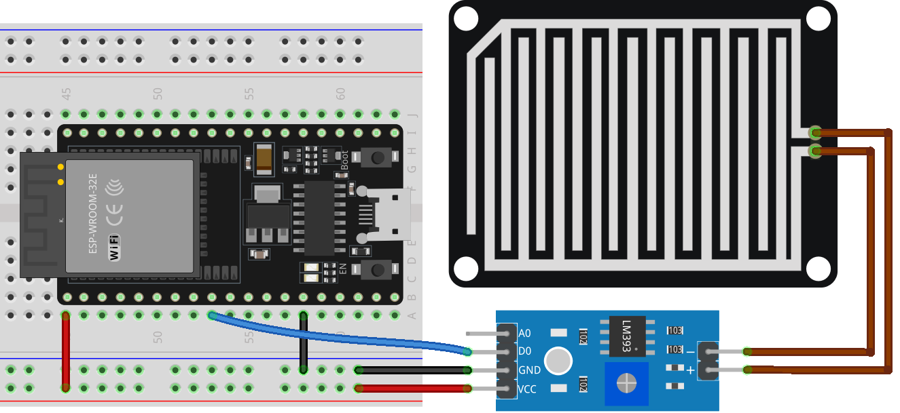

.. note::

    こんにちは、SunFounder Raspberry Pi & Arduino & ESP32 Enthusiasts Communityへようこそ！Facebook上で、仲間と一緒にRaspberry Pi、Arduino、ESP32をさらに深く探求しましょう。

    **なぜ参加するのか？**

    - **専門的なサポート**：購入後の問題や技術的な課題をコミュニティやチームの助けを借りて解決。
    - **学びと共有**：スキルを向上させるためのヒントやチュートリアルを交換。
    - **限定プレビュー**：新製品発表や予告編に早期アクセス。
    - **特別割引**：最新製品の特別割引を楽しむ。
    - **フェスティブプロモーションとプレゼント**：プレゼントやホリデープロモーションに参加。

    👉 私たちと一緒に探索と創造を始める準備はできましたか？[|link_sf_facebook|]をクリックして、今すぐ参加しましょう！
    
.. _esp32_lesson15_raindrop:

レッスン15: 雨滴検出モジュール
=======================================

このレッスンでは、ESP32開発ボードを使用して雨滴検出センサーの使い方を学びます。センサーが雨水を検出したときにデジタル信号を読み取り、この情報をシリアルモニターに表示する方法を説明します。このプロジェクトは、マイクロコントローラーのプログラミングにおけるデジタル入力と出力の理解を深めるための魅力的な方法を提供し、電子機器やESP32プラットフォームでのコーディング初心者に最適です。

必要な部品
--------------------------

このプロジェクトには以下の部品が必要です。

すべての部品が揃ったキットを購入すると便利です。リンクはこちら：

.. list-table::
    :widths: 20 20 20
    :header-rows: 1

    *   - Name	
        - ITEMS IN THIS KIT
        - LINK
    *   - Universal Maker Sensor Kit
        - 94
        - |link_umsk|

以下のリンクから個別に購入することもできます。

.. list-table::
    :widths: 30 20
    :header-rows: 1

    *   - Component Introduction
        - Purchase Link

    *   - ESP32 & Development Board
        - |link_esp32_camera_pro_kit_buy|
    *   - :ref:`cpn_raindrop`
        - |link_raindrop_sensor_module_buy|
    *   - :ref:`cpn_breadboard`
        - |link_breadboard_buy|

配線
---------------------------

コード
---------------------------

.. raw:: html

    <iframe src=https://create.arduino.cc/editor/sunfounder01/5aff47ab-22c5-4500-bbe3-fefc55f6e40f/preview?embed style="height:510px;width:100%;margin:10px 0" frameborder=0></iframe>

コード解析
---------------------------

1. センサーピンの定義

   ここでは、 ``sensorPin`` という名前の定数の整数が定義され、値25が割り当てられています。これは、雨滴検出センサーが接続されているESP32開発ボードのデジタルピンに対応します。

   .. code-block:: arduino
   
       const int sensorPin = 25;

2. ピンモードの設定とシリアル通信の開始

   ``setup()``関数では、2つの重要なステップが実行されます。まず、 ``pinMode()`` を使用して ``sensorPin`` を入力として設定し、雨滴センサーからデジタル値を読み取ることができるようにします。次に、9600ボーの速度でシリアル通信を初期化します。

   .. code-block:: arduino
   
       void setup() {
         pinMode(sensorPin, INPUT);
         Serial.begin(9600);
       }

3. デジタル値の読み取りとシリアルモニターへの送信

   ``loop()``関数では、``digitalRead()``を使用して雨滴センサーからデジタル値を読み取ります。この値（HIGHまたはLOW）はシリアルモニターに表示されます。雨滴が検出されるとシリアルモニターには0が表示され、検出されない場合は1が表示されます。その後、プログラムは次の読み取りまで50ミリ秒待機します。

   .. code-block:: arduino
   
       void loop() {
         Serial.println(digitalRead(sensorPin));
         delay(50);
       }
