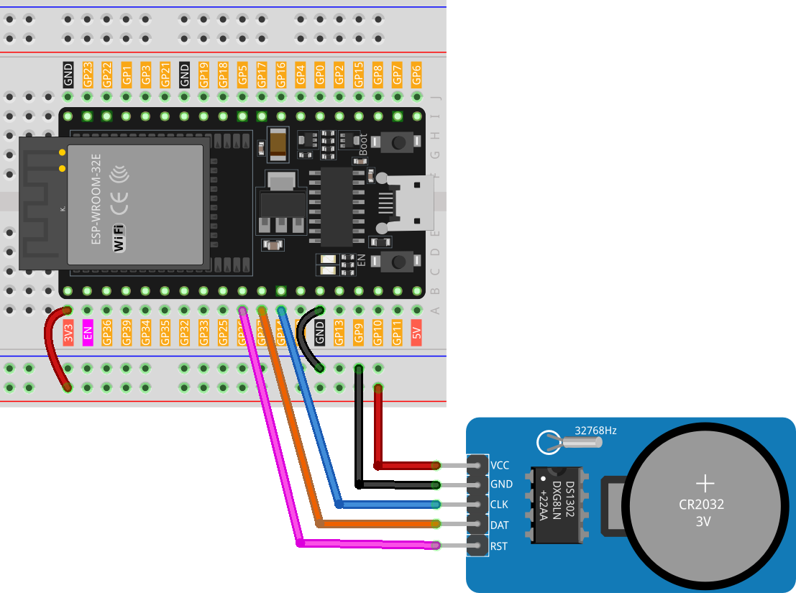

.. note::

    Hello, welcome to the SunFounder Raspberry Pi & Arduino & ESP32 Enthusiasts Community on Facebook! Dive deeper into Raspberry Pi, Arduino, and ESP32 with fellow enthusiasts.

    **Why Join?**

    - **Expert Support**: Solve post-sale issues and technical challenges with help from our community and team.
    - **Learn & Share**: Exchange tips and tutorials to enhance your skills.
    - **Exclusive Previews**: Get early access to new product announcements and sneak peeks.
    - **Special Discounts**: Enjoy exclusive discounts on our newest products.
    - **Festive Promotions and Giveaways**: Take part in giveaways and holiday promotions.

    👉 Ready to explore and create with us? Click [|link_sf_facebook|] and join today!

.. _esp32_lesson16_ds1306:

Lesson 16: Real Time Clock Module (DS1302)
==================================================

In this lesson, you will learn how to set up and use a Real Time Clock (RTC) module with an ESP32 development board. We'll cover integrating the DS1302 RTC module, understanding its functions, and programming the ESP32 to display the current date and time. You'll also learn how to handle situations where the RTC has lost its date and time settings and automatically set it to the compile time of your sketch. This project is ideal for those seeking to enhance their comprehension of time-related functions in microcontroller projects.

Required Components
--------------------------

In this project, we need the following components. 

It's definitely convenient to buy a whole kit, here's the link: 

.. list-table::
    :widths: 20 20 20
    :header-rows: 1

    *   - Name	
        - ITEMS IN THIS KIT
        - LINK
    *   - Universal Maker Sensor Kit
        - 94
        - |link_umsk|

You can also buy them separately from the links below.

.. list-table::
    :widths: 30 20
    :header-rows: 1

    *   - Component Introduction
        - Purchase Link

    *   - ESP32 & Development Board (:ref:`cpn_esp32_wroom_32e`)
        - |link_esp32_camera_pro_kit_buy|
    *   - :ref:`cpn_rtc_ds1302`
        - |link_ds1302_module_buy|
    *   - :ref:`cpn_breadboard`
        - |link_breadboard_buy|

Wiring
---------------------------

Code
---------------------------

.. note:: 
   To install the library, use the Arduino Library Manager and search for **"Rtc by Makuna"** and install it. 

.. raw:: html

    <iframe src=https://create.arduino.cc/editor/sunfounder01/12a5464b-7a6e-48e1-b43e-ca585cb9e310/preview?embed style="height:510px;width:100%;margin:10px 0" frameborder=0></iframe>

Code Analysis
---------------------------

#. Initialization and library inclusion

   .. note:: 
      To install the library, use the Arduino Library Manager and search for **"Rtc by Makuna"** and install it. 

   Here, necessary libraries are included for the DS1302 RTC module.

   .. code-block:: arduino

      #include <ThreeWire.h>
      #include <RtcDS1302.h>

#. Define pins and create RTC instance

   Pins for communication are defined and an instance of the RTC is created.

   .. code-block:: arduino

      const int IO = 27;    // DAT
      const int SCLK = 14;  // CLK
      const int CE = 26;    // RST

      ThreeWire myWire(IO, SCLK, CE));
      RtcDS1302<ThreeWire> Rtc(myWire);

#. ``setup()`` function

   This function initializes the serial communication and sets up the RTC module. Various checks are made to ensure the RTC is running correctly.

   .. code-block:: arduino

      void setup() {
        Serial.begin(9600);
      
        Serial.print("compiled: ");
        Serial.print(__DATE__);
        Serial.println(__TIME__);
      
        Rtc.Begin();
      
        RtcDateTime compiled = RtcDateTime(__DATE__, __TIME__);
        printDateTime(compiled);
        Serial.println();
      
        if (!Rtc.IsDateTimeValid()) {
          // Common Causes:
          //    1) first time you ran and the device wasn't running yet
          //    2) the battery on the device is low or even missing
      
          Serial.println("RTC lost confidence in the DateTime!");
          Rtc.SetDateTime(compiled);
        }
      
        if (Rtc.GetIsWriteProtected()) {
          Serial.println("RTC was write protected, enabling writing now");
          Rtc.SetIsWriteProtected(false);
        }
      
        if (!Rtc.GetIsRunning()) {
          Serial.println("RTC was not actively running, starting now");
          Rtc.SetIsRunning(true);
        }
      
        RtcDateTime now = Rtc.GetDateTime();
        if (now < compiled) {
          Serial.println("RTC is older than compile time!  (Updating DateTime)");
          Rtc.SetDateTime(compiled);
        } else if (now > compiled) {
          Serial.println("RTC is newer than compile time. (this is expected)");
        } else if (now == compiled) {
          Serial.println("RTC is the same as compile time! (not expected but all is fine)");
        }
      }

#. ``loop()`` function

   This function periodically fetches the current date and time from the RTC and prints it on the serial monitor. It also checks if the RTC is still maintaining a valid date and time.

   .. code-block:: arduino

      void loop() {
        RtcDateTime now = Rtc.GetDateTime();
      
        printDateTime(now);
        Serial.println();
      
        if (!now.IsValid()) {
          // Common Causes:
          //    1) the battery on the device is low or even missing and the power line was disconnected
          Serial.println("RTC lost confidence in the DateTime!");
        }
      
        delay(5000);  // five seconds
      }

#. Date and time printing function

   A helper function that takes a ``RtcDateTime`` object and prints the formatted date and time to the serial monitor.

   .. code-block:: arduino

      void printDateTime(const RtcDateTime& dt) {
        char datestring[20];
      
        snprintf_P(datestring,
                   countof(datestring),
                   PSTR("%02u/%02u/%04u %02u:%02u:%02u"),
                   dt.Month(),
                   dt.Day(),
                   dt.Year(),
                   dt.Hour(),
                   dt.Minute(),
                   dt.Second());
        Serial.print(datestring);
      }