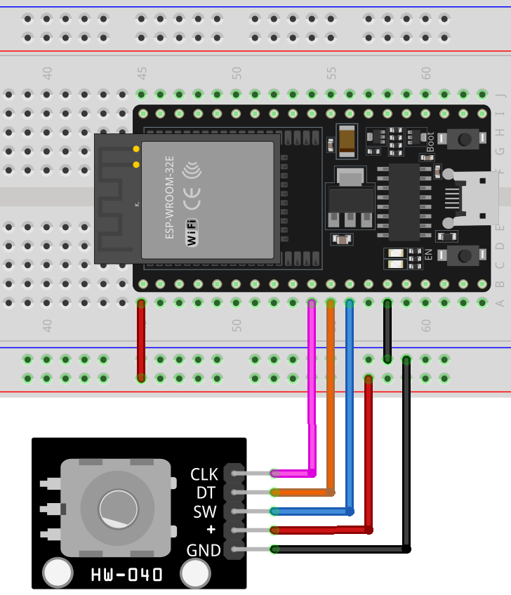

.. _esp32_lesson17_rotary_encoder:

Lesson 17: Rotary Encoder Module
==================================

In this lesson, you will learn how to use an ESP32 Development Board and a rotary encoder module to detect rotation direction and count, as well as button presses. We'll explore how the encoder signals clockwise and counterclockwise rotations and increments or decrements a counter accordingly. Additionally, you'll understand how to detect button presses on the encoder module. This project offers hands-on experience in managing rotary encoders and reading digital inputs, enhancing your skills in working with the ESP32 and Arduino programming.

Required Components
--------------------------

In this project, we need the following components. 

It's definitely convenient to buy a whole kit, here's the link: 

.. list-table::
    :widths: 20 20 20
    :header-rows: 1

    *   - Name	
        - ITEMS IN THIS KIT
        - LINK
    *   - Universal Maker Sensor Kit
        - 94
        - |link_umsk|

You can also buy them separately from the links below.

.. list-table::
    :widths: 30 20
    :header-rows: 1

    *   - Component Introduction
        - Purchase Link

    *   - ESP32 & Development Board
        - |link_esp32_camera_pro_kit_buy|
    *   - :ref:`cpn_rotary_encoder`
        - \-
    *   - :ref:`cpn_breadboard`
        - |link_breadboard_buy|
 

Wiring
---------------------------

Code
---------------------------

.. raw:: html

    <iframe src=https://create.arduino.cc/editor/sunfounder01/0ba81725-2139-4c8c-9575-c4d343be6708/preview?embed style="height:510px;width:100%;margin:10px 0" frameborder=0></iframe>

Code Analysis
---------------------------

#. **Setup and Initialization**

   .. code-block:: arduino

      void setup() {
        pinMode(CLK, INPUT);
        pinMode(DT, INPUT);
        pinMode(SW, INPUT_PULLUP);
        Serial.begin(9600);
        lastStateCLK = digitalRead(CLK);
      }

   In the setup function, the digital pins connected to the encoder's CLK and DT are set as inputs. The SW pin, which is connected to the button, is set as an input with an internal pull-up resistor. This setup prevents the need for an external pull-up resistor. The Serial communication is started at a baud rate of 9600 to enable data visualization on the Serial Monitor. The initial state of the CLK pin is read and stored.

#. **Main Loop: Reading Encoder and Button State**

   .. code-block:: arduino

      void loop() {
        currentStateCLK = digitalRead(CLK);
        if (currentStateCLK != lastStateCLK && currentStateCLK == 1) {
          if (digitalRead(DT) != currentStateCLK) {
            counter--;
            currentDir = "CCW";
          } else {
            counter++;
            currentDir = "CW";
          }
          Serial.print("Direction: ");
          Serial.print(currentDir);
          Serial.print(" | Counter: ");
          Serial.println(counter);
        }
        lastStateCLK = currentStateCLK;
        int btnState = digitalRead(SW);
        if (btnState == LOW) {
          if (millis() - lastButtonPress > 50) {
            Serial.println("Button pressed!");
          }
          lastButtonPress = millis();
        }
        delay(1);
      }

   In the loop function, the program continually reads the current state of the CLK pin. If there's a change in the state, it implies a rotation has occurred. The direction of rotation is determined by comparing the states of CLK and DT pins. If they are different, it indicates counterclockwise (CCW) rotation; otherwise, it's clockwise (CW). The encoder's count is incremented or decremented accordingly. This information is then sent to the Serial Monitor.

   The button state is read from the SW pin. If it's LOW (pressed), a debounce mechanism is implemented by checking the time elapsed since the last button press. If more than 50 milliseconds have passed, it's considered a valid press, and a message is sent to the Serial Monitor. The `delay(1)` at the end helps in debouncing.