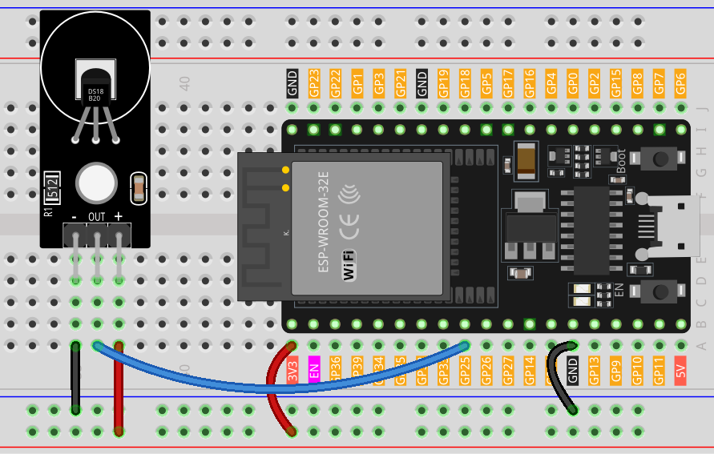

.. _esp32_lesson18_ds18b20:

Lesson 18: Temperature Sensor Module (DS18B20)
================================================

In this lesson, you will learn how to read temperature data from a DS18B20 temperature sensor module using an ESP32 Development Board. We’ll use the DallasTemperature library to interface with the sensor and display temperature readings in both Celsius and Fahrenheit units on the Serial Monitor. 

Required Components
--------------------------

In this project, we need the following components. 

It's definitely convenient to buy a whole kit, here's the link: 

.. list-table::
    :widths: 20 20 20
    :header-rows: 1

    *   - Name	
        - ITEMS IN THIS KIT
        - LINK
    *   - Universal Maker Sensor Kit
        - 94
        - |link_umsk|

You can also buy them separately from the links below.

.. list-table::
    :widths: 30 20
    :header-rows: 1

    *   - Component Introduction
        - Purchase Link

    *   - ESP32 & Development Board
        - |link_esp32_camera_pro_kit_buy|
    *   - :ref:`cpn_ds18b20`
        - \-
    *   - :ref:`cpn_breadboard`
        - |link_breadboard_buy|

Wiring
---------------------------

Code
---------------------------

.. raw:: html

    <iframe src=https://create.arduino.cc/editor/sunfounder01/08628842-3743-431f-871e-51b51ae1851f/preview?embed style="height:510px;width:100%;margin:10px 0" frameborder=0></iframe>

Code Analysis
---------------------------

#. Library inclusion

   The inclusion of the OneWire and DallasTemperature libraries allows communication with the DS18B20 sensor.

   .. code-block:: arduino

      #include <OneWire.h>
      #include <DallasTemperature.h>

#. Defining the sensor data pin

   The DS18B20 is connected to digital pin 25 of the Arduino.

   .. code-block:: arduino

      #define ONE_WIRE_BUS 25

#. Initializing the sensor

   The OneWire instance and DallasTemperature object are created and initialized.

   .. code-block:: arduino

      OneWire oneWire(ONE_WIRE_BUS);	
      DallasTemperature sensors(&oneWire);

#. Setup function

   The ``setup()`` function initializes the sensor and sets up serial communication.

   .. code-block:: arduino

      void setup(void)
      {
         sensors.begin();	// Start up the library
         Serial.begin(9600);
      }

#. Main loop

   In the ``loop()`` function, the program requests temperature readings and prints them in both Celsius and Fahrenheit.

   .. code-block:: arduino

      void loop(void)
      { 
         sensors.requestTemperatures();
         Serial.print("Temperature: ");
         Serial.print(sensors.getTempCByIndex(0));
         Serial.print("℃ | ");
         Serial.print((sensors.getTempCByIndex(0) * 9.0) / 5.0 + 32.0);
         Serial.println("℉");
         delay(500);
      }