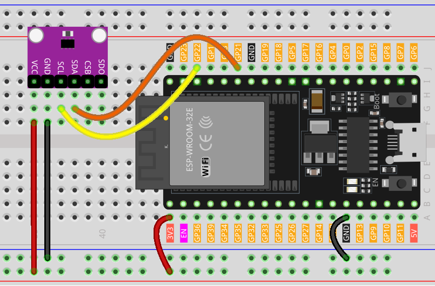

.. note::

   Hallo und willkommen in der SunFounder Raspberry Pi & Arduino & ESP32 Enthusiasten-Gemeinschaft auf Facebook! Tauchen Sie tiefer ein in die Welt von Raspberry Pi, Arduino und ESP32 mit anderen Enthusiasten.

   **Warum beitreten?**

   - **Expertenunterstützung**: Lösen Sie Nachverkaufsprobleme und technische Herausforderungen mit Hilfe unserer Gemeinschaft und unseres Teams.
   - **Lernen & Teilen**: Tauschen Sie Tipps und Anleitungen aus, um Ihre Fähigkeiten zu verbessern.
   - **Exklusive Vorschauen**: Erhalten Sie frühzeitigen Zugang zu neuen Produktankündigungen und exklusiven Einblicken.
   - **Spezialrabatte**: Genießen Sie exklusive Rabatte auf unsere neuesten Produkte.
   - **Festliche Aktionen und Gewinnspiele**: Nehmen Sie an Gewinnspielen und Feiertagsaktionen teil.

   👉 Sind Sie bereit, mit uns zu erkunden und zu erschaffen? Klicken Sie auf [|link_sf_facebook|] und treten Sie heute bei!

.. _esp32_lesson20_bmp280:

Lektion 20: Temperatur-, Feuchtigkeits- und Drucksensor (BMP280)
====================================================================

In dieser Lektion lernen Sie, wie Sie den atmosphärischen Druck, die Temperatur und die ungefähre Höhe mit dem BMP280-Sensor und einem ESP32-Entwicklungsboard messen können. Wir behandeln die Schnittstelle zum Sensor mit der Adafruit BMP280-Bibliothek und zeigen, wie die Messwerte im seriellen Monitor angezeigt werden. Dieses Tutorial ist ideal für alle, die ihr Verständnis für Umweltsensorik und Datenaufzeichnung auf der ESP32-Plattform vertiefen möchten.

Benötigte Komponenten
--------------------------

Für dieses Projekt benötigen wir die folgenden Komponenten. 

Es ist definitiv praktisch, ein ganzes Kit zu kaufen, hier ist der Link: 

.. list-table::
    :widths: 20 20 20
    :header-rows: 1

    *   - Name	
        - ITEMS IN THIS KIT
        - LINK
    *   - Universal Maker Sensor Kit
        - 94
        - |link_umsk|

Sie können sie auch einzeln über die unten stehenden Links kaufen.

.. list-table::
    :widths: 30 20
    :header-rows: 1

    *   - Component Introduction
        - Purchase Link

    *   - ESP32 & Development Board
        - |link_esp32_camera_pro_kit_buy|
    *   - :ref:`cpn_bmp280`
        - |link_bmp280_module_buy|
    *   - :ref:`cpn_breadboard`
        - |link_breadboard_buy|

Verdrahtung
---------------------------

Code
---------------------------

.. raw:: html

    <iframe src=https://create.arduino.cc/editor/sunfounder01/25c4b695-7d09-47f5-9385-61d239afa214/preview?embed style="height:510px;width:100%;margin:10px 0" frameborder=0></iframe>

Code-Analyse
---------------------------

1. Einbindung von Bibliotheken und Initialisierung. Notwendige Bibliotheken werden eingebunden und der BMP280-Sensor wird für die Kommunikation über die I2C-Schnittstelle initialisiert.

   .. note:: 
      Um die Bibliothek zu installieren, verwenden Sie den Arduino Library Manager und suchen Sie nach **"Adafruit BMP280"** und installieren Sie sie.

   - Adafruit BMP280 Library: Diese Bibliothek bietet eine benutzerfreundliche Schnittstelle für den BMP280-Sensor und ermöglicht das Auslesen von Temperatur, Druck und Höhe.
   - Wire.h: Wird für die I2C-Kommunikation verwendet.

   .. raw:: html
    
     

   .. code-block:: arduino
    
      #include <Wire.h>
      #include <Adafruit_BMP280.h>
      #define BMP280_ADDRESS 0x76
      Adafruit_BMP280 bmp;  // use I2C interface

2. Die ``setup()``-Funktion initialisiert die serielle Kommunikation, überprüft den BMP280-Sensor und richtet den Sensor mit den Standardeinstellungen ein.

   .. code-block:: arduino

      void setup() {
        Serial.begin(9600);
        while (!Serial) delay(100);
        Serial.println(F("BMP280 test"));
        unsigned status;
        status = bmp.begin(BMP280_ADDRESS);
        // ... (rest of the setup code)

3. Die ``loop()``-Funktion liest Daten vom BMP280-Sensor für Temperatur, Druck und Höhe aus. Diese Daten werden auf dem seriellen Monitor angezeigt.

   .. code-block:: arduino

      void loop() {
        // ... (read and print temperature, pressure, and altitude data)
        delay(2000);  // 2-second delay between readings.
      }
