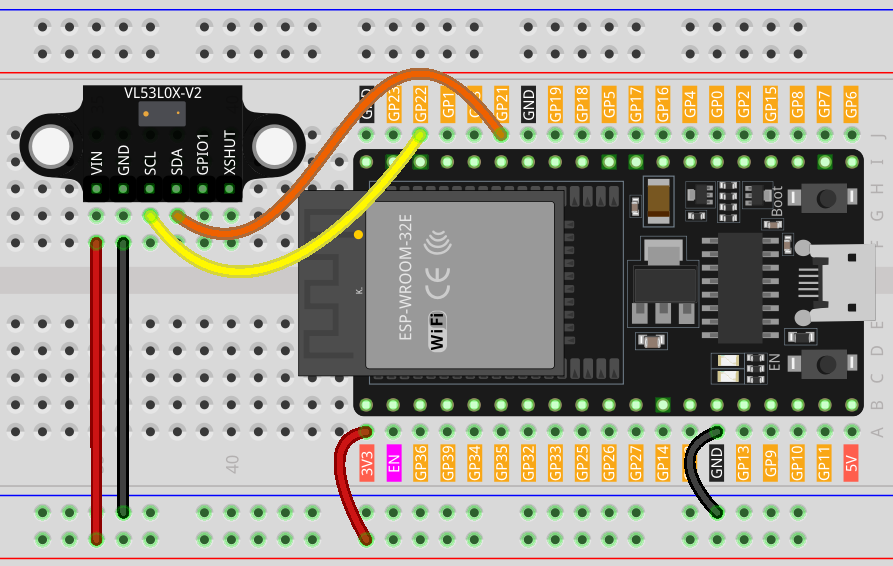

.. note::

   Hallo und willkommen in der SunFounder Raspberry Pi & Arduino & ESP32 Enthusiasten-Gemeinschaft auf Facebook! Tauchen Sie tiefer ein in die Welt von Raspberry Pi, Arduino und ESP32 mit anderen Enthusiasten.

   **Warum beitreten?**

   - **Expertenunterstützung**: Lösen Sie Nachverkaufsprobleme und technische Herausforderungen mit Hilfe unserer Gemeinschaft und unseres Teams.
   - **Lernen & Teilen**: Tauschen Sie Tipps und Anleitungen aus, um Ihre Fähigkeiten zu verbessern.
   - **Exklusive Vorschauen**: Erhalten Sie frühzeitigen Zugang zu neuen Produktankündigungen und exklusiven Einblicken.
   - **Spezialrabatte**: Genießen Sie exklusive Rabatte auf unsere neuesten Produkte.
   - **Festliche Aktionen und Gewinnspiele**: Nehmen Sie an Gewinnspielen und Feiertagsaktionen teil.

   👉 Sind Sie bereit, mit uns zu erkunden und zu erschaffen? Klicken Sie auf [|link_sf_facebook|] und treten Sie heute bei!

.. _esp32_lesson21_vl53l0x:

Lektion 21: Time of Flight Micro-LIDAR Entfernungssensor (VL53L0X)
====================================================================

In dieser Lektion lernen Sie, wie Sie den Adafruit VL53L0X Time of Flight Entfernungssensor mit einem ESP32-Entwicklungsboard verwenden. Wir behandeln die Initialisierung des Sensors, das Auslesen der Entfernungswerte und deren Anzeige in Millimetern auf dem seriellen Monitor.

Benötigte Komponenten
--------------------------

Für dieses Projekt benötigen wir die folgenden Komponenten.

Es ist definitiv praktisch, ein ganzes Kit zu kaufen, hier ist der Link:

.. list-table::
    :widths: 20 20 20
    :header-rows: 1

    *   - Name	
        - ITEMS IN THIS KIT
        - LINK
    *   - Universal Maker Sensor Kit
        - 94
        - |link_umsk|

Sie können sie auch einzeln über die unten stehenden Links kaufen.

.. list-table::
    :widths: 30 10
    :header-rows: 1

    *   - Component Introduction
        - Purchase Link

    *   - ESP32 & Development Board
        - |link_esp32_camera_pro_kit_buy|
    *   - :ref:`cpn_VL53L0X`
        - |link_vl53l0x_module_buy|
    *   - :ref:`cpn_breadboard`
        - |link_breadboard_buy|

Verdrahtung
---------------------------

Code
---------------------------

.. note:: 
   Um die Bibliothek zu installieren, verwenden Sie den Arduino Library Manager und suchen Sie nach **"Adafruit_VL53L0X"** und installieren Sie sie.

.. raw:: html

    <iframe src=https://create.arduino.cc/editor/sunfounder01/2f8bf48c-e404-4a3d-a9ac-eb1878f54017/preview?embed style="height:510px;width:100%;margin:10px 0" frameborder=0></iframe>

Code-Analyse
---------------------------

#. Einbinden der notwendigen Bibliothek und Initialisierung des Sensorobjekts. Wir beginnen mit dem Einbinden der Bibliothek für den VL53L0X-Sensor und erstellen eine Instanz der Klasse Adafruit_VL53L0X.

   .. note:: 
      Um die Bibliothek zu installieren, verwenden Sie den Arduino Library Manager und suchen Sie nach **"Adafruit_VL53L0X"** und installieren Sie sie.

   .. code-block:: arduino

      #include <Adafruit_VL53L0X.h>
      Adafruit_VL53L0X lox = Adafruit_VL53L0X();

#. Initialisierung in der ``setup()``-Funktion. Hier richten wir die serielle Kommunikation ein und initialisieren den Entfernungssensor. Wenn der Sensor nicht initialisiert werden kann, wird das Programm angehalten.

   .. code-block:: arduino

      void setup() {
        Serial.begin(115200);
        while (!Serial) {
          delay(1);
        }
        Serial.println("Adafruit VL53L0X test");
        if (!lox.begin()) {
          Serial.println(F("Failed to boot VL53L0X"));
          while (1)
            ;
        }
        Serial.println(F("VL53L0X API Simple Ranging example\n\n"));
      }

#. Erfassen und Anzeigen der Messwerte in der ``loop()``-Funktion. Das ESP32-Entwicklungsboard erfasst kontinuierlich Entfernungswerte mit der Methode ``rangingTest()``. Wenn die Messung gültig ist, wird sie auf dem seriellen Monitor angezeigt.

   .. code-block:: arduino
       
      void loop() {
        VL53L0X_RangingMeasurementData_t measure;
        Serial.print("Reading a measurement... ");
        lox.rangingTest(&measure, false);
        if (measure.RangeStatus != 4) {
          Serial.print("Distance (mm): ");
          Serial.println(measure.RangeMilliMeter);
        } else {
          Serial.println(" out of range ");
        }
        delay(100);
      }
