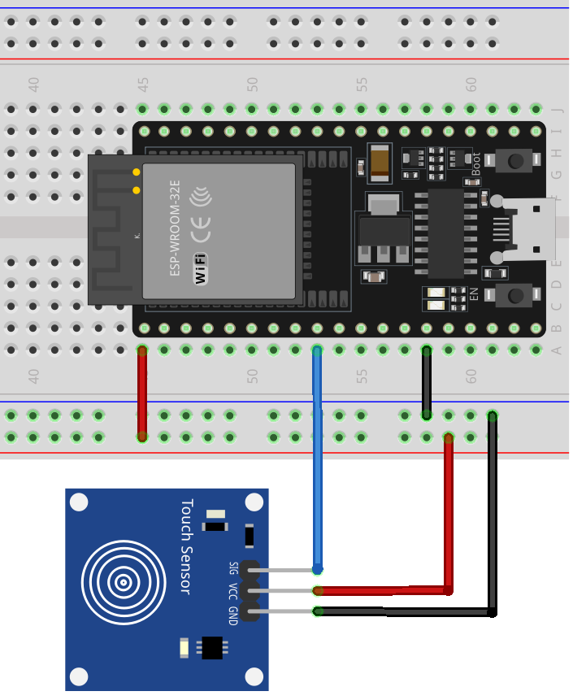

.. _esp32_lesson22_touch_sensor:

Lesson 22: Touch Sensor Module
==================================

In this lesson, you'll learn how to use a touch sensor with an ESP32 Development Board. We'll see how touching the sensor sends a signal to the ESP32, triggering a response displayed through serial communication. This project is ideal for beginners and provides hands-on experience with digital inputs and serial output on the ESP32 platform. You'll develop a foundational understanding of how sensors interact with microcontrollers, which is essential for building interactive hardware projects.

Required Components
---------------------------

.. list-table::
    :widths: 30 20
    :header-rows: 1

    *   - Component Introduction
        - Purchase Link

    *   - ESP32 Development Board
        - \-
    *   - :ref:`cpn_touch`
        - |link_touch_buy|
    *   - :ref:`cpn_breadboard`
        - |link_breadboard_buy|

Wiring
---------------------------

Code
---------------------------

.. raw:: html

    <iframe src=https://create.arduino.cc/editor/sunfounder01/f3fd3d61-1d6b-46b8-8e62-e3c91e262830/preview?embed style="height:510px;width:100%;margin:10px 0" frameborder=0></iframe>

Code Analysis
---------------------------

#. **Setting Up the Pin and Serial Communication**

   - The touch sensor is connected to pin 25 of the ESP32, and this pin is configured as an input.
   - The ``Serial.begin(9600);`` initializes serial communication at a baud rate of 9600 bits per second.
   
   .. raw:: html
      
       

   .. code-block:: arduino

      const int sensorPin = 25;

      void setup() {
        pinMode(sensorPin, INPUT);     // Set the sensor pin as input
        Serial.begin(9600);            // Start the serial communication
      }

#. **Reading the Sensor and Sending Data to Serial Monitor**

   - The ``loop()`` function continuously checks the state of the touch sensor.
   - ``digitalRead(sensorPin)`` reads the digital value (1 or 0) from the sensor pin.
   - If the sensor is touched (value 1), it prints "Touch detected!" to the Serial Monitor.
   - If not touched (value 0), it prints "No touch detected...".
   - The ``delay(100);`` helps in debouncing the sensor, preventing multiple rapid readings.

   .. raw:: html
      
       

   .. code-block:: arduino

      void loop() {
        if (digitalRead(sensorPin) == 1) {  // If the sensor is touched
          Serial.println("Touch detected!");
        } else {
          Serial.println("No touch detected...");
        }
        delay(100);  // Wait for a short period to avoid rapid reading of the sensor
      }