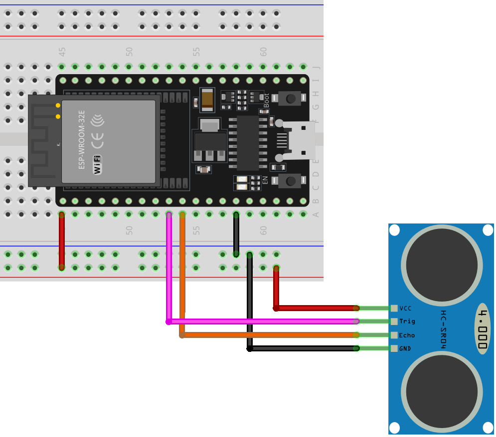

.. _esp32_lesson23_ultrasonic:

Lesson 23: Ultrasonic Sensor Module (HC-SR04)
================================================

In this lesson, you'll learn how to use an ESP32 Development Board for measuring distance with an ultrasonic sensor (HC-SR04). We'll cover setting up the sensor, reading data, and calculating the distance in centimeters. This project is ideal for beginners working with microcontrollers and sensors, offering hands-on experience in data acquisition and serial communication. You'll develop practical skills in programming the ESP32 and grasp ultrasonic sensing technology.

Required Components
---------------------------

.. list-table::
    :widths: 30 20
    :header-rows: 1

    *   - Component Introduction
        - Purchase Link

    *   - ESP32 Development Board
        - \-
    *   - :ref:`cpn_ultrasonic`
        - |link_ultrasonic_buy|
    *   - :ref:`cpn_breadboard`
        - |link_breadboard_buy|

Wiring
---------------------------

Code
---------------------------

.. raw:: html

    <iframe src=https://create.arduino.cc/editor/sunfounder01/b5dbcdfa-3dc8-4f64-adf9-a3227e3f6044/preview?embed style="height:510px;width:100%;margin:10px 0" frameborder=0></iframe>

Code Analysis
---------------------------

1. Pin declaration:

   Start by defining the pins for the ultrasonic sensor. ``echoPin`` and ``trigPin`` are declared as integers and their values are set to match the physical connection on the ESP32 Development Board.

   .. code-block:: arduino

      const int echoPin = 26;
      const int trigPin = 25;

2. ``setup()`` function:

   The ``setup()`` function initializes the serial communication, sets the pin modes, and prints a message to indicate the ultrasonic sensor is ready.
 
   .. code-block:: arduino
 
      void setup() {
        Serial.begin(9600);
        pinMode(echoPin, INPUT);
        pinMode(trigPin, OUTPUT);
        Serial.println("Ultrasonic sensor:");
      }

3. ``loop()`` function:

   The ``loop()`` function reads the distance from the sensor and prints it to the serial monitor, then delays for 400 milliseconds before repeating.

   .. code-block:: arduino

      void loop() {
        float distance = readDistance();
        Serial.print(distance);
        Serial.println(" cm");
        delay(400);
      }

4. ``readDistance()`` function :

   The ``readDistance()`` function triggers the ultrasonic sensor and calculates the distance based on the time it takes for the signal to bounce back.

   For more details, please refer to the working :ref:`principle <cpn_ultrasonic_principle>` of the ultrasonic sensor module.

   .. code-block:: arduino

      float readDistance() {
        digitalWrite(trigPin, LOW);   // Set trig pin to low to ensure a clean pulse
        delayMicroseconds(2);         // Delay for 2 microseconds
        digitalWrite(trigPin, HIGH);  // Send a 10 microsecond pulse by setting trig pin to high
        delayMicroseconds(10);
        digitalWrite(trigPin, LOW);  // Set trig pin back to low
        float distance = pulseIn(echoPin, HIGH) / 58.00;  // Formula: (340m/s * 1us) / 2
        return distance;
      }
