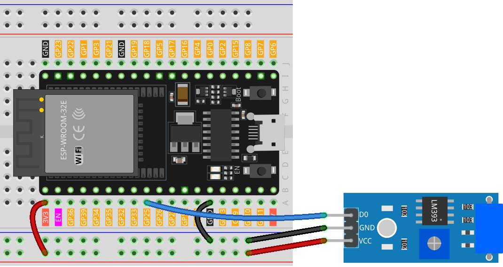

.. note::

    こんにちは、SunFounder Raspberry Pi & Arduino & ESP32 Enthusiasts Communityへようこそ！Facebook上で、仲間と一緒にRaspberry Pi、Arduino、ESP32をさらに深く探求しましょう。

    **なぜ参加するのか？**

    - **専門的なサポート**：購入後の問題や技術的な課題をコミュニティやチームの助けを借りて解決。
    - **学びと共有**：スキルを向上させるためのヒントやチュートリアルを交換。
    - **限定プレビュー**：新製品発表や予告編に早期アクセス。
    - **特別割引**：最新製品の特別割引を楽しむ。
    - **フェスティブプロモーションとプレゼント**：プレゼントやホリデープロモーションに参加。

    👉 私たちと一緒に探索と創造を始める準備はできましたか？[|link_sf_facebook|]をクリックして、今すぐ参加しましょう！

.. _esp32_lesson24_vibration_sensor:

Lesson 24: Vibration Sensor Module (SW-420)
==============================================

In this lesson, you'll learn how to detect vibrations using an ESP32 Development Board and a Vibration Sensor (SW-420). We'll cover reading digital output from the sensor and using conditional statements to display messages on the serial monitor. When the sensor detects vibration, it will display "Detected vibration..."; otherwise, it will output "...". This project provides a practical way to grasp digital inputs and serial communication, making it ideal for electronics and programming beginners.

Required Components
--------------------------

In this project, we need the following components. 

It's definitely convenient to buy a whole kit, here's the link: 

.. list-table::
    :widths: 20 20 20
    :header-rows: 1

    *   - Name	
        - ITEMS IN THIS KIT
        - LINK
    *   - Universal Maker Sensor Kit
        - 94
        - |link_umsk|

You can also buy them separately from the links below.

.. list-table::
    :widths: 30 20
    :header-rows: 1

    *   - Component Introduction
        - Purchase Link

    *   - ESP32 & Development Board
        - |link_esp32_camera_pro_kit_buy|
    *   - :ref:`cpn_vibration`
        - |link_sw420_vibration_module_buy|
    *   - :ref:`cpn_breadboard`
        - |link_breadboard_buy|

Wiring
---------------------------

Code
---------------------------

.. raw:: html

    <iframe src=https://create.arduino.cc/editor/sunfounder01/a64a9f69-b056-4b41-993e-3f77101091e0/preview?embed style="height:510px;width:100%;margin:10px 0" frameborder=0></iframe>

Code Analysis
---------------------------

1. The first line of code is a constant integer declaration for the vibration sensor pin. We use digital pin 25 to read the output from the vibration sensor.

   .. code-block:: arduino
   
      const int sensorPin = 25;

2. In the ``setup()`` function, we initialize the serial communication at a baud rate of 9600 to print readings from the vibration sensor to the serial monitor. We also set the vibration sensor pin as an input.

   .. code-block:: arduino
   
      void setup() {
        Serial.begin(9600);         // Start serial communication at 9600 baud rate
        pinMode(sensorPin, INPUT);  // Set the sensorPin as an input pin
      }

3. The ``loop()`` function is where we continuously check for any vibrations detected by the sensor. If the sensor detects a vibration, it prints "Detected vibration..." to the serial monitor. If no vibration is detected, it prints "...". The loop repeats every 100 milliseconds.

   .. code-block:: arduino
   
      void loop() {
        if (digitalRead(sensorPin)) {               // Check if there is any vibration detected by the sensor
          Serial.println("Detected vibration...");  // Print "Detected vibration..." if vibration detected
        } 
        else {
          Serial.println("...");  // Print "..." otherwise
        }
        // Add a delay to avoid flooding the serial monitor
        delay(100);
      }