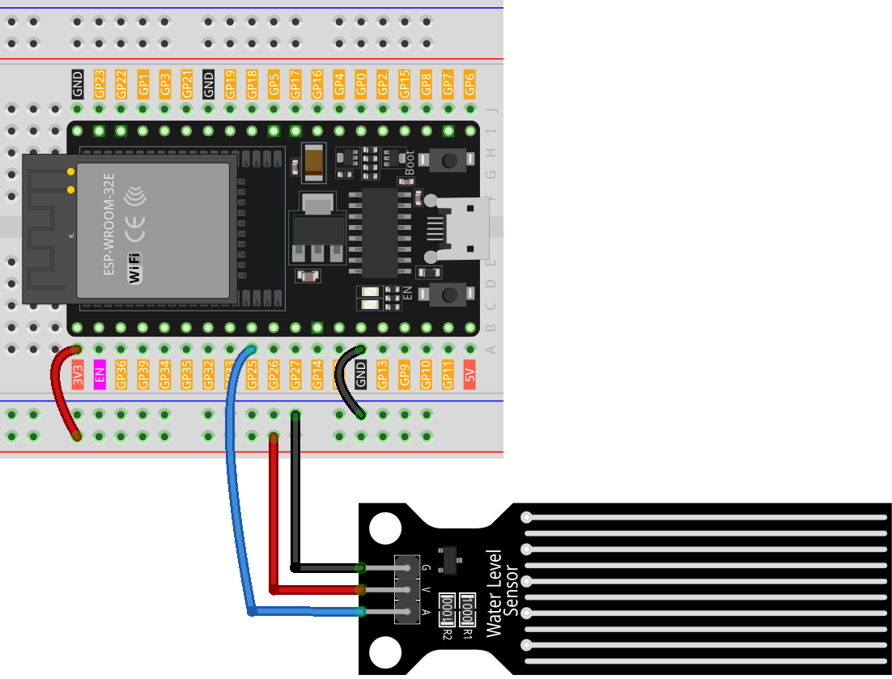

 .. note::

    Hallo und willkommen in der SunFounder Raspberry Pi & Arduino & ESP32 Enthusiasten-Gemeinschaft auf Facebook! Tauchen Sie tiefer ein in die Welt von Raspberry Pi, Arduino und ESP32 mit anderen Enthusiasten.

    **Warum beitreten?**

    - **Expertenunterstützung**: Lösen Sie Nachverkaufsprobleme und technische Herausforderungen mit Hilfe unserer Gemeinschaft und unseres Teams.
    - **Lernen & Teilen**: Tauschen Sie Tipps und Anleitungen aus, um Ihre Fähigkeiten zu verbessern.
    - **Exklusive Vorschauen**: Erhalten Sie frühzeitigen Zugang zu neuen Produktankündigungen und exklusiven Einblicken.
    - **Spezialrabatte**: Genießen Sie exklusive Rabatte auf unsere neuesten Produkte.
    - **Festliche Aktionen und Gewinnspiele**: Nehmen Sie an Gewinnspielen und Feiertagsaktionen teil.

    👉 Sind Sie bereit, mit uns zu erkunden und zu erschaffen? Klicken Sie auf [|link_sf_facebook|] und treten Sie heute bei!

.. _esp32_lesson25_water_level:

Lektion 25: Wasserstandssensormodul
=======================================

In dieser Lektion lernen Sie, wie Sie ein ESP32-Entwicklungsboard zum Auslesen eines Wasserstandssensors verwenden. Wir werden das kontinuierliche Überwachen des analogen Wertes des Sensors und die Anzeige auf dem seriellen Monitor behandeln. Dieses Projekt bietet eine hervorragende Möglichkeit, das Verständnis für die Integration von Sensoren und das Auslesen analoger Daten mit Arduino zu vertiefen, und ist ideal für Anfänger in Elektronik und Mikrocontroller-Programmierung.

Benötigte Komponenten
-------------------------

Für dieses Projekt benötigen wir die folgenden Komponenten.

Es ist definitiv praktisch, ein ganzes Kit zu kaufen, hier ist der Link:

.. list-table::
    :widths: 20 20 20
    :header-rows: 1

    *   - Name	
        - ITEMS IN THIS KIT
        - LINK
    *   - Universal Maker Sensor Kit
        - 94
        - |link_umsk|

Sie können sie auch einzeln über die unten stehenden Links kaufen.

.. list-table::
    :widths: 30 20
    :header-rows: 1

    *   - Component Introduction
        - Purchase Link

    *   - ESP32 & Development Board
        - |link_esp32_camera_pro_kit_buy|
    *   - :ref:`cpn_water_level`
        - \-
    *   - :ref:`cpn_breadboard`
        - |link_breadboard_buy|

Verdrahtung
-------------------

Code
---------------

.. raw:: html

    <iframe src=https://create.arduino.cc/editor/sunfounder01/f312bfd8-5583-4d54-a116-35e32d957ef6/preview?embed style="height:510px;width:100%;margin:10px 0" frameborder=0></iframe>

Code-Analyse
------------

#. **Initialisierung des Sensor-Pins**:

   Bevor der Wasserstandssensor verwendet wird, wird seine Pinnummer mit einer Konstanten definiert. Dies macht den Code lesbarer und einfacher zu ändern.

   .. code-block:: arduino

      const int sensorPin = 25;

#. **Einrichten der seriellen Kommunikation**:

   In der ``setup()``-Funktion wird die Baudrate für die serielle Kommunikation festgelegt. Dies ist entscheidend, damit das Arduino mit dem seriellen Monitor des Computers kommunizieren kann.

   .. code-block:: arduino

      void setup() {
        Serial.begin(9600);  // Start serial communication at 9600 baud rate
      }

#. **Lesen der Sensordaten und Ausgabe auf dem seriellen Monitor**:

   Die ``loop()``-Funktion liest kontinuierlich den analogen Wert des Sensors mit ``analogRead()`` und gibt ihn mit ``Serial.println()`` auf dem seriellen Monitor aus. Die ``delay(100)``-Funktion sorgt dafür, dass das Arduino 100 Millisekunden wartet, bevor die Schleife wiederholt wird, wodurch die Rate der Datenerfassung und -übertragung gesteuert wird.

   .. code-block:: arduino
    
      void loop() {
        Serial.println(analogRead(sensorPin));  // Read the analog value of the sensor and print it to the serial monitor
        delay(100);                             // Wait for 100 milliseconds
      }