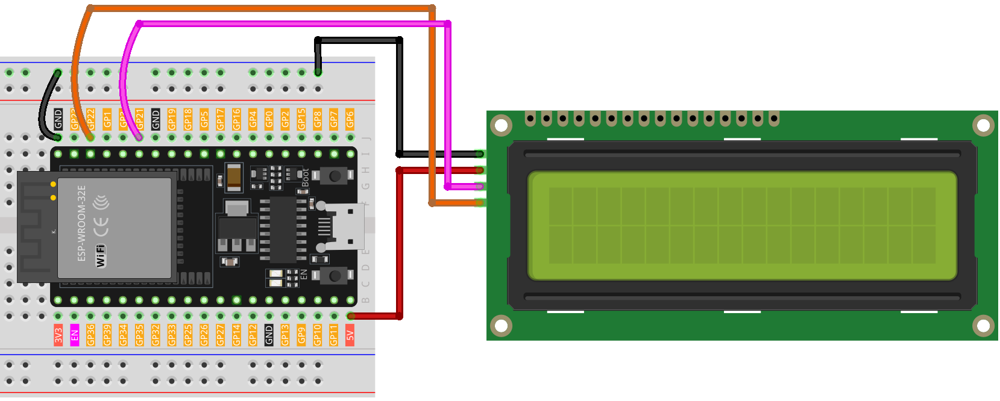

.. note::

    こんにちは、SunFounder Raspberry Pi & Arduino & ESP32 Enthusiasts Communityへようこそ！Facebook上で、仲間と一緒にRaspberry Pi、Arduino、ESP32をさらに深く探求しましょう。

    **なぜ参加するのか？**

    - **専門的なサポート**：購入後の問題や技術的な課題をコミュニティやチームの助けを借りて解決。
    - **学びと共有**：スキルを向上させるためのヒントやチュートリアルを交換。
    - **限定プレビュー**：新製品発表や予告編に早期アクセス。
    - **特別割引**：最新製品の特別割引を楽しむ。
    - **フェスティブプロモーションとプレゼント**：プレゼントやホリデープロモーションに参加。

    👉 私たちと一緒に探索と創造を始める準備はできましたか？[|link_sf_facebook|]をクリックして、今すぐ参加しましょう！

.. _esp32_lesson26_lcd:

Lesson 26: I2C LCD 1602
==================================

In this lesson, you'll learn how to set up and display messages on a 16x2 Liquid Crystal Display (LCD) with an I2C interface using an ESP32 Development Board. We'll cover initializing the LCD using the LiquidCrystal I2C library, then displaying "Hello world!" and "LCD Tutorial" on two separate lines of the screen. This tutorial is ideal for beginners, offering hands-on experience with LCD interfaces and improving your understanding of output operations in Arduino programming.

Required Components
--------------------------

In this project, we need the following components. 

It's definitely convenient to buy a whole kit, here's the link: 

.. list-table::
    :widths: 20 20 20
    :header-rows: 1

    *   - Name	
        - ITEMS IN THIS KIT
        - LINK
    *   - Universal Maker Sensor Kit
        - 94
        - |link_umsk|

You can also buy them separately from the links below.

.. list-table::
    :widths: 30 20
    :header-rows: 1

    *   - Component Introduction
        - Purchase Link

    *   - ESP32 & Development Board
        - |link_esp32_camera_pro_kit_buy|
    *   - :ref:`cpn_i2c_lcd1602`
        - |link_i2clcd1602_buy|
    *   - :ref:`cpn_breadboard`
        - |link_breadboard_buy|

Wiring
---------------------------

Code
---------------------------

.. raw:: html

    <iframe src=https://create.arduino.cc/editor/sunfounder01/3c6bcc49-9030-4539-8220-4ff3c484814c/preview?embed style="height:510px;width:100%;margin:10px 0" frameborder=0></iframe>

Code Analysis
---------------------------

1. Library Inclusion and LCD Initialization:
   The LiquidCrystal I2C library is included to provide functions and methods for LCD interfacing. Following that, an LCD object is created using the LiquidCrystal_I2C class, specifying the I2C address, number of columns, and number of rows.

   .. note:: 
      To install the library, use the Arduino Library Manager and search for **"LiquidCrystal I2C"** and install it.  

   .. code-block:: arduino

      #include <LiquidCrystal_I2C.h>
      LiquidCrystal_I2C lcd(0x27, 16, 2);

2. Setup Function:
   The ``setup()`` function is executed once when the ESP32 Development Board starts. In this function, the LCD is initialized, cleared, and the backlight is turned on. Then, two messages are displayed on the LCD.

   .. code-block:: arduino

      void setup() {
        lcd.init();       // initialize the LCD
        lcd.clear();      // clear the LCD display
        lcd.backlight();  // Make sure backlight is on
      
        // Print a message on both lines of the LCD.
        lcd.setCursor(2, 0);  //Set cursor to character 2 on line 0
        lcd.print("Hello world!");
      
        lcd.setCursor(2, 1);  //Move cursor to character 2 on line 1
        lcd.print("LCD Tutorial");
      }