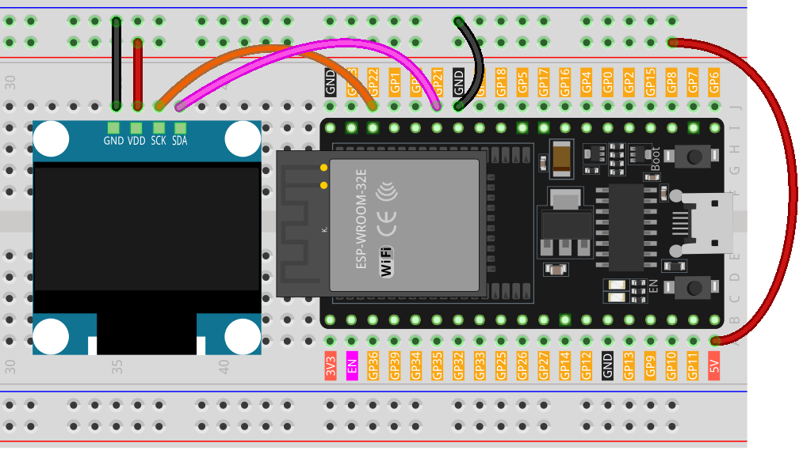

.. _esp32_lesson27_oled:

Lesson 27: OLED Display Module (SSD1306)
============================================

In this lesson, you will learn how to set up and utilize an OLED display with an ESP32 Development Board using the Adafruit SSD1306 and GFX libraries. We will cover displaying text in different sizes, inverting text colors, creating scrolling text animations, and rendering custom bitmap graphics. This project provides a thorough introduction to advanced display techniques, ideal for individuals seeking to improve their skills in developing interactive electronics with microcontrollers.

Required Components
---------------------------

.. list-table::
    :widths: 30 20
    :header-rows: 1

    *   - Component Introduction
        - Purchase Link

    *   - ESP32 Development Board
        - \-
    *   - :ref:`cpn_oled`
        - \-
    *   - :ref:`cpn_breadboard`
        - |link_breadboard_buy|

Wiring
---------------------------

Code
---------------------------

.. raw:: html

    <iframe src=https://create.arduino.cc/editor/sunfounder01/33f2fdd0-af4e-4438-bacf-982894bb8ac4/preview?embed style="height:510px;width:100%;margin:10px 0" frameborder=0></iframe>

Code Analysis
---------------------------

1. **Library Inclusion and Initial Definitions**:
   The necessary libraries for interfacing with the OLED are included. Following that, definitions regarding the OLED's dimensions and I2C address are provided.

   - **Adafruit SSD1306**: This library is designed to help with the interfacing of the SSD1306 OLED display. It provides methods to initialize the display, control its settings, and display content.
   - **Adafruit GFX Library**: This is a core graphics library for displaying text, producing colors, drawing shapes, etc., on various screens including OLEDs.

   .. note:: 
      To install the library, use the Arduino Library Manager and search for **"Adafruit SSD1306"** and **"Adafruit GFX"** and install it. 

   .. code-block:: arduino
    
      #include <SPI.h>
      #include <Wire.h>
      #include <Adafruit_GFX.h>
      #include <Adafruit_SSD1306.h>

      #define SCREEN_WIDTH 128  // OLED display width, in pixels
      #define SCREEN_HEIGHT 64  // OLED display height, in pixels

      #define OLED_RESET -1
      #define SCREEN_ADDRESS 0x3C

2. **Bitmap Data**:
   Bitmap data for displaying a custom icon on the OLED screen. This data represents an image in a format that the OLED can interpret.

   You can use this online tool called |link_image2cpp| that can turn your image into an array. 

   The ``PROGMEM`` keyword denotes that the array is stored in the program memory of the Arduino microcontroller. Storing data in program memory(PROGMEM) instead of RAM can be helpful for large amounts of data, which would otherwise take up too much space in RAM.

   .. code-block:: arduino

      static const unsigned char PROGMEM sunfounderIcon[] = {...};

3. **Setup Function (Initialization and Display)**:
   The ``setup()`` function initializes the OLED and displays a series of patterns, texts, and animations.

   .. code-block:: arduino

      void setup() {
         ...  // Serial initialization and OLED object initialization
         ...  // Displaying various text, numbers, and animations
      }