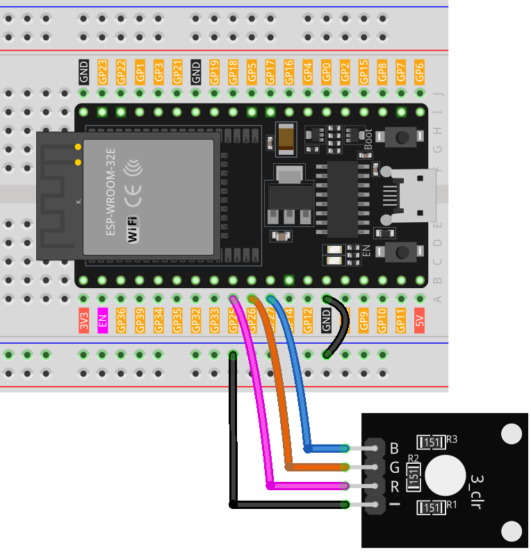

.. note::

    Hello, welcome to the SunFounder Raspberry Pi & Arduino & ESP32 Enthusiasts Community on Facebook! Dive deeper into Raspberry Pi, Arduino, and ESP32 with fellow enthusiasts.

    **Why Join?**

    - **Expert Support**: Solve post-sale issues and technical challenges with help from our community and team.
    - **Learn & Share**: Exchange tips and tutorials to enhance your skills.
    - **Exclusive Previews**: Get early access to new product announcements and sneak peeks.
    - **Special Discounts**: Enjoy exclusive discounts on our newest products.
    - **Festive Promotions and Giveaways**: Take part in giveaways and holiday promotions.

    👉 Ready to explore and create with us? Click [|link_sf_facebook|] and join today!

.. _esp32_lesson28_rgb_module:

Lesson 28: RGB LED Module
==================================

In this lesson, you will learn how to control an RGB LED using an ESP32 Development Board. We'll cover using different color channels to display primary colors and creating a sequence of rainbow colors. This project is ideal for beginners in electronics and programming, providing hands-on experience with output operations and color mixing using the ESP32 and RGB LED module.

Required Components
---------------------------

.. list-table::
    :widths: 30 20
    :header-rows: 1

    *   - Component Introduction
        - Purchase Link

    *   - ESP32 Development Board
        - \-
    *   - :ref:`cpn_rgb`
        - \-
    *   - :ref:`cpn_breadboard`
        - |link_breadboard_buy|

Wiring
---------------------------

Code
---------------------------

.. raw:: html

    <iframe src=https://create.arduino.cc/editor/sunfounder01/a8796969-0aed-4037-8080-f62059cc2db5/preview?embed style="height:510px;width:100%;margin:10px 0" frameborder=0></iframe>

Code Analysis
---------------------------

1. The first segment of the code declares and initializes the pins to which each color channel of the RGB LED module is connected.

   .. code-block:: arduino
       
      const int rledPin = 25;  // pin connected to the red color channel
      const int gledPin = 26;   // pin connected to the green color channel
      const int bledPin = 27;  // pin connected to the blue color channel

2. The ``setup()`` function initializes these pins as OUTPUT. This means we are sending signals OUT from these pins to the RGB LED module.

   .. code-block:: arduino
   
      void setup() {
        pinMode(rledPin, OUTPUT);
        pinMode(gledPin, OUTPUT);
        pinMode(bledPin, OUTPUT);
      }

3. In the ``loop()`` function, the ``setColor()`` function is called with different parameters to display different colors. The ``delay()`` function is used after setting each color to pause for 1000 milliseconds (or 1 second) before moving on to the next color.

   .. code-block:: arduino
   
      void loop() {
        setColor(255, 0, 0);  // Set RGB LED color to red
        delay(1000);
        setColor(0, 255, 0);  // Set RGB LED color to green
        delay(1000);
        // The rest of the color sequence...
      }

4. The ``setColor()`` function uses the ``analogWrite()`` function to adjust the brightness of each color channel on the RGB LED module. The ``analogWrite()`` function employs Pulse Width Modulation (PWM) to simulate varying voltage outputs. By controlling the PWM duty cycle (the percentage of time a signal is HIGH within a fixed period), the brightness of each color channel can be controlled, allowing the mixing of various colors.

   .. code-block:: arduino

      void setColor(int R, int G, int B) {
        analogWrite(rledPin, R);  // Use PWM to control the brightness of the red color channel
        analogWrite(gledPin, G);  // Use PWM to control the brightness of the green color channel
        analogWrite(bledPin, B);  // Use PWM to control the brightness of the blue color channel
      }