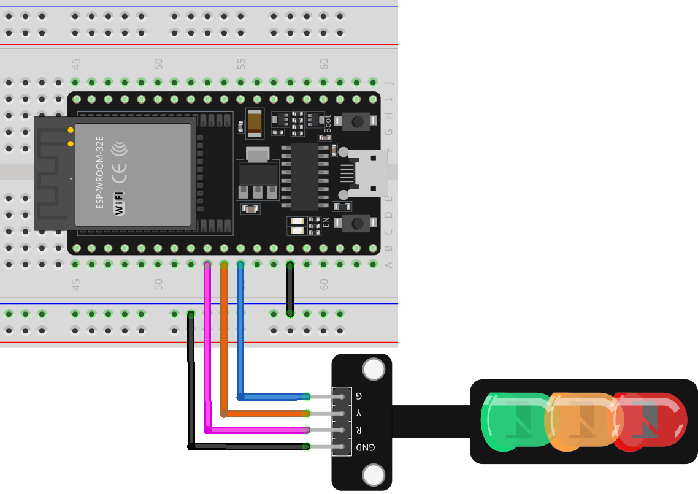

.. note::

   Hallo und willkommen in der SunFounder Raspberry Pi & Arduino & ESP32 Enthusiasten-Gemeinschaft auf Facebook! Tauchen Sie tiefer ein in die Welt von Raspberry Pi, Arduino und ESP32 mit anderen Enthusiasten.

   **Warum beitreten?**

   - **Expertenunterstützung**: Lösen Sie Nachverkaufsprobleme und technische Herausforderungen mit Hilfe unserer Gemeinschaft und unseres Teams.
   - **Lernen & Teilen**: Tauschen Sie Tipps und Anleitungen aus, um Ihre Fähigkeiten zu verbessern.
   - **Exklusive Vorschauen**: Erhalten Sie frühzeitigen Zugang zu neuen Produktankündigungen und exklusiven Einblicken.
   - **Spezialrabatte**: Genießen Sie exklusive Rabatte auf unsere neuesten Produkte.
   - **Festliche Aktionen und Gewinnspiele**: Nehmen Sie an Gewinnspielen und Feiertagsaktionen teil.

   👉 Sind Sie bereit, mit uns zu erkunden und zu erschaffen? Klicken Sie auf [|link_sf_facebook|] und treten Sie heute bei!

.. _esp32_lesson29_traffic_light_module:

Lektion 29: Ampelmodul
=========================

In dieser Lektion lernen Sie, wie Sie ein Mini-Ampelmodul mit einem ESP32-Entwicklungsboard steuern. Wir werden die Einrichtung des Boards und das Schreiben von Code zur Erstellung einer Ampelsequenz behandeln: 5 Sekunden grünes Licht, blinkendes gelbes Licht für 1,5 Sekunden und 5 Sekunden rotes Licht. Dieses Projekt ist ideal für Anfänger in Elektronik und Programmierung, da es praktische Erfahrungen mit Ausgangsoperationen und grundlegender Zeitsteuerung mit dem ESP32 bietet.

Benötigte Komponenten
-------------------------

Für dieses Projekt benötigen wir die folgenden Komponenten.

Es ist definitiv praktisch, ein ganzes Kit zu kaufen, hier ist der Link:

.. list-table::
    :widths: 20 20 20
    :header-rows: 1

    *   - Name
        - ITEMS IN THIS KIT
        - LINK
    *   - Universal Maker Sensor Kit
        - 94
        - |link_umsk|

Sie können sie auch einzeln über die unten stehenden Links kaufen.

.. list-table::
    :widths: 30 20
    :header-rows: 1

    *   - Component Introduction
        - Purchase Link

    *   - ESP32 & Development Board
        - |link_esp32_camera_pro_kit_buy|
    *   - :ref:`cpn_traffic`
        - |link_traffic_light_module_buy|
    *   - :ref:`cpn_breadboard`
        - |link_breadboard_buy|

Verdrahtung
--------------

Code
--------

.. raw:: html

    <iframe src=https://create.arduino.cc/editor/sunfounder01/df3260e8-4f79-4dca-aa47-c3a684867ca1/preview?embed style="height:510px;width:100%;margin:10px 0" frameborder=0></iframe>

Code-Analyse
----------------

#. Vor allen Operationen definieren wir Konstanten für die Pins, an denen die LEDs angeschlossen sind. Dies macht unseren Code leichter lesbar und änderbar.

  .. code-block:: arduino

     const int rledPin = 25;  //red
     const int yledPin = 26;  //yellow
     const int gledPin = 27;  //green

#. Hier spezifizieren wir die Pin-Modi für unsere LED-Pins. Alle werden auf ``OUTPUT`` gesetzt, da wir Spannung zu ihnen senden möchten.

  .. code-block:: arduino

     void setup() {
       pinMode(rledPin, OUTPUT);
       pinMode(yledPin, OUTPUT);
       pinMode(gledPin, OUTPUT);
     }

#. Hier wird die Logik für unseren Ampelzyklus implementiert. Die Abfolge der Operationen ist:

    * Schalten Sie die grüne LED für 5 Sekunden ein.
    * Blinken Sie die gelbe LED dreimal (jedes Blinken dauert 0,5 Sekunden).
    * Schalten Sie die rote LED für 5 Sekunden ein.

  .. code-block:: arduino

     void loop() {
       digitalWrite(gledPin, HIGH);
       delay(5000);
       digitalWrite(gledPin, LOW);

       digitalWrite(yledPin, HIGH);
       delay(500);
       digitalWrite(yledPin, LOW);
       delay(500);
       digitalWrite(yledPin, HIGH);
       delay(500);
       digitalWrite(yledPin, LOW);
       delay(500);
       digitalWrite(yledPin, HIGH);
       delay(500);
       digitalWrite(yledPin, LOW);
       delay(500);

       digitalWrite(rledPin, HIGH);
       delay(5000);
       digitalWrite(rledPin, LOW);
     }

