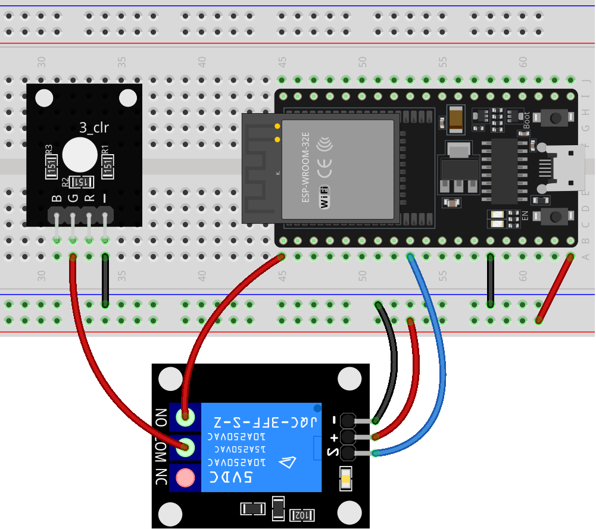

.. _esp32_lesson30_relay_module:

Lesson 30: Relay Module
==================================

In this lesson, you'll learn how to use an ESP32 Development Board to control a one-channel relay module. We'll cover turning the relay on and off in a loop, with a 3-second delay between each state change. This project provides hands-on experience with digital output operations in embedded systems, making it ideal for beginners entering the realm of ESP32 and relay modules.

Required Components
---------------------------

* ESP32 Development Board
* :ref:`cpn_breadboard`
* :ref:`cpn_relay`
* :ref:`cpn_rgb`

Wiring
---------------------------

Code
---------------------------

.. raw:: html

    <iframe src=https://create.arduino.cc/editor/sunfounder01/a0035890-76ca-4a85-9f21-9df01717d906/preview?embed style="height:510px;width:100%;margin:10px 0" frameborder=0></iframe>

Code Analysis
---------------------------

#. Setting up the relay pin:

   - The relay module is connected to pin 25 of the ESP32 Development Board. This pin is defined as ``relayPin`` for ease of reference in the code.

   .. raw:: html

       

   .. code-block:: arduino
    
      const int relayPin = 25;

#. Configuring the relay pin as an output:

   - In the ``setup()`` function, the relay pin is set as an OUTPUT using the ``pinMode()`` function. This means the Arduino will send signals (either HIGH or LOW) to this pin.

   .. raw:: html

       

   .. code-block:: arduino

      void setup() {
        pinMode(relayPin, OUTPUT);
      }

#. Toggling the relay ON and OFF:

   - In the ``loop()`` function, the relay is first set to the OFF state using ``digitalWrite(relayPin, LOW)``. It remains in this state for 3 seconds (``delay(3000)``).
   - Then, the relay is set to the ON state using ``digitalWrite(relayPin, HIGH)``. Again, it remains in this state for 3 seconds.
   - This cycle repeats indefinitely.

   .. raw:: html

       

   .. code-block:: arduino

      void loop() {
        digitalWrite(relayPin, LOW);
        delay(3000);

        digitalWrite(relayPin, HIGH);
        delay(3000);
      }