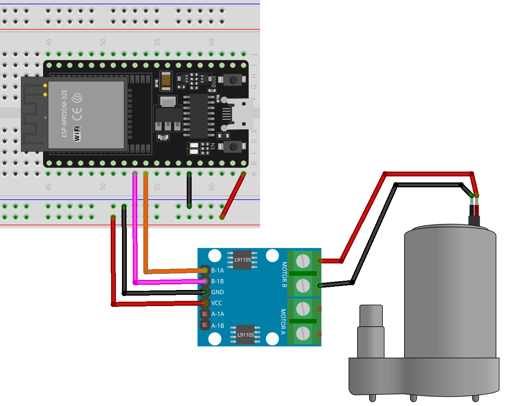

.. note::

    こんにちは、SunFounder Raspberry Pi & Arduino & ESP32 Enthusiasts Communityへようこそ！Facebook上で、仲間と一緒にRaspberry Pi、Arduino、ESP32をさらに深く探求しましょう。

    **なぜ参加するのか？**

    - **専門的なサポート**：購入後の問題や技術的な課題をコミュニティやチームの助けを借りて解決。
    - **学びと共有**：スキルを向上させるためのヒントやチュートリアルを交換。
    - **限定プレビュー**：新製品発表や予告編に早期アクセス。
    - **特別割引**：最新製品の特別割引を楽しむ。
    - **フェスティブプロモーションとプレゼント**：プレゼントやホリデープロモーションに参加。

    👉 私たちと一緒に探索と創造を始める準備はできましたか？[|link_sf_facebook|]をクリックして、今すぐ参加しましょう！
    
.. _esp32_lesson31_pump:

レッスン31: 遠心ポンプ
==================================

このレッスンでは、ESP32開発ボードとL9110モータ制御ボードを使用して遠心ポンプを制御する方法を学びます。モータを操作するために2つのピンを設定して使用し、ポンプを5秒間一方向に回転させて停止させる手順をカバーします。このプロジェクトは、モータ操作の管理とマイクロコントローラプログラミングにおけるデジタル信号の理解に関する実践的な経験を提供し、エレクトロニクスとプログラミングの初心者に最適です。

必要な部品
--------------------------

このプロジェクトには以下の部品が必要です。

すべての部品が揃ったキットを購入すると便利です。リンクはこちら：

.. list-table::
    :widths: 20 20 20
    :header-rows: 1

    *   - Name	
        - ITEMS IN THIS KIT
        - LINK
    *   - Universal Maker Sensor Kit
        - 94
        - |link_umsk|

以下のリンクから個別に購入することもできます。

.. list-table::
    :widths: 30 20
    :header-rows: 1

    *   - Component Introduction
        - Purchase Link

    *   - ESP32 & Development Board
        - |link_esp32_camera_pro_kit_buy|
    *   - :ref:`cpn_pump`
        - \-
    *   - :ref:`cpn_l9110`
        - \-
    *   - :ref:`cpn_breadboard`
        - |link_breadboard_buy|

配線
---------------------------

コード
---------------------------

.. raw:: html

    <iframe src=https://create.arduino.cc/editor/sunfounder01/b1b98b14-d067-4cba-8c3f-a04a8ad5e0c7/preview?embed style="height:510px;width:100%;margin:10px 0" frameborder=0></iframe>

コード解析
---------------------------

1. モータ制御のための2つのピンを定義します。具体的には ``motorB_1A`` と ``motorB_2A`` です。これらのピンはL9110モータ制御ボードに接続され、モータの方向と速度を制御します。
  
   .. code-block:: arduino
   
      const int motorB_1A = 26;
      const int motorB_2A = 25;

2. ピンの設定とモータの制御:

   - ``setup()`` 関数では、ピンを ``OUTPUT`` として初期化します。これにより、モータ制御ボードに信号を送信できます。

   - ``analogWrite()`` 関数を使用してモータの速度を設定します。ここでは、一方のピンを ``HIGH`` 、もう一方を ``LOW`` に設定することで、ポンプを一方向に回転させます。5秒後に両方のピンを0に設定してモータを停止させます。

   .. raw:: html

       
   
   .. code-block:: arduino
   
      void setup() {
         pinMode(motorB_1A, OUTPUT);  // set pump pin 1 as output
         pinMode(motorB_2A, OUTPUT);  // set pump pin 2 as output
         analogWrite(motorB_1A, HIGH); 
         analogWrite(motorB_2A, LOW);
         delay(5000);// wait for 5 seconds
         analogWrite(motorB_1A, 0);  // turn off the pump
         analogWrite(motorB_2A, 0);
      }
