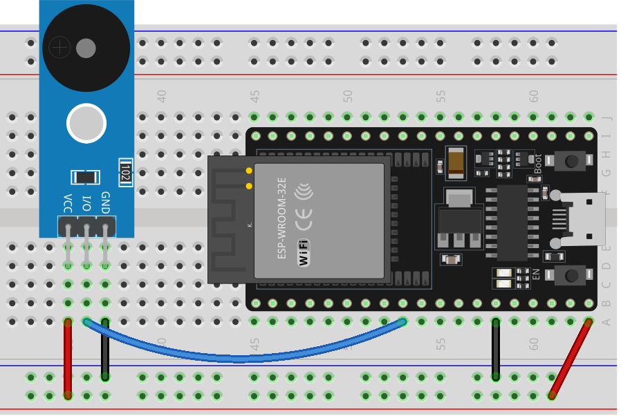

.. note::

    こんにちは、SunFounder Raspberry Pi & Arduino & ESP32 Enthusiasts Communityへようこそ！Facebook上で、仲間と一緒にRaspberry Pi、Arduino、ESP32をさらに深く探求しましょう。

    **なぜ参加するのか？**

    - **専門的なサポート**：購入後の問題や技術的な課題をコミュニティやチームの助けを借りて解決。
    - **学びと共有**：スキルを向上させるためのヒントやチュートリアルを交換。
    - **限定プレビュー**：新製品発表や予告編に早期アクセス。
    - **特別割引**：最新製品の特別割引を楽しむ。
    - **フェスティブプロモーションとプレゼント**：プレゼントやホリデープロモーションに参加。

    👉 私たちと一緒に探索と創造を始める準備はできましたか？[|link_sf_facebook|]をクリックして、今すぐ参加しましょう！
    
.. _esp32_lesson32_passive_buzzer:

レッスン32: パッシブブザーモジュール
====================================

このレッスンでは、ESP32開発ボードを使用してパッシブブザーモジュールでメロディを演奏する方法を学びます。ESP32をプログラムしてブザーを制御し、さまざまな長さの音符を作成する方法をカバーします。このプロジェクトは、エレクトロニクスやプログラミングの初心者に最適で、音の生成と基本的なデジタルサウンドの原理に関する実践的な経験を提供します。ESP32ボードを活用し、パッシブブザーのようなシンプルなコンポーネントを統合する実用的なスキルを身につけることができます。

必要な部品
--------------------------

このプロジェクトには以下の部品が必要です。

すべての部品が揃ったキットを購入すると便利です。リンクはこちら：

.. list-table::
    :widths: 20 20 20
    :header-rows: 1

    *   - Name	
        - ITEMS IN THIS KIT
        - LINK
    *   - Universal Maker Sensor Kit
        - 94
        - |link_umsk|

以下のリンクから個別に購入することもできます。

.. list-table::
    :widths: 30 20
    :header-rows: 1

    *   - Component Introduction
        - Purchase Link

    *   - ESP32 & Development Board
        - |link_esp32_camera_pro_kit_buy|
    *   - :ref:`cpn_buzzer`
        - |link_passive_buzzer_module_buy|
    *   - :ref:`cpn_breadboard`
        - |link_breadboard_buy|

配線
---------------------------

コード
---------------------------

.. raw:: html

    <iframe src=https://create.arduino.cc/editor/sunfounder01/1f3f8514-29eb-491f-b40f-0d808ef0aaac/preview?embed style="height:510px;width:100%;margin:10px 0" frameborder=0></iframe>

コード解析
---------------------------

1. pitchesライブラリのインクルード:

   このライブラリはさまざまな音符の周波数値を提供し、コード内で音楽記譜法を使用することを可能にします。

   .. code-block:: arduino
       
      #include "pitches.h"

2. 定数と配列の定義:

   * ``buzzerPin``は、パッシブブザーが接続されているESP32開発ボードのデジタルピンです。

   * ``melody[]``は、再生する音符のシーケンスを格納する配列です。

   * ``noteDurations[]``は、メロディ内の各音符の持続時間を格納する配列です。

   .. raw:: html
      
       

   .. code-block:: arduino
   
      const int buzzerPin = 25;
      int melody[] = {
        NOTE_C4, NOTE_G3, NOTE_G3, NOTE_A3, NOTE_G3, 0, NOTE_B3, NOTE_C4
      };
      int noteDurations[] = {
        4, 8, 8, 4, 4, 4, 4, 4
      };

3. メロディの再生:

   * ``for``ループはメロディ内の各音符を繰り返し処理します。

   * ``tone()``関数は特定の持続時間でブザーで音符を再生します。

   * 音符間に区別をつけるために遅延が追加されます。

   * ``noTone()``関数は音を停止します。

   .. raw:: html
      
       

   .. code-block:: arduino
   
      void setup() {
        for (int thisNote = 0; thisNote < 8; thisNote++) {
          int noteDuration = 1000 / noteDurations[thisNote];
          tone(buzzerPin, melody[thisNote], noteDuration);
          int pauseBetweenNotes = noteDuration * 1.30;
          delay(pauseBetweenNotes);
          noTone(buzzerPin);
        }
      }

4. 空のループ関数:

   メロディはセットアップで一度だけ再生されるため、ループ関数にはコードがありません。

