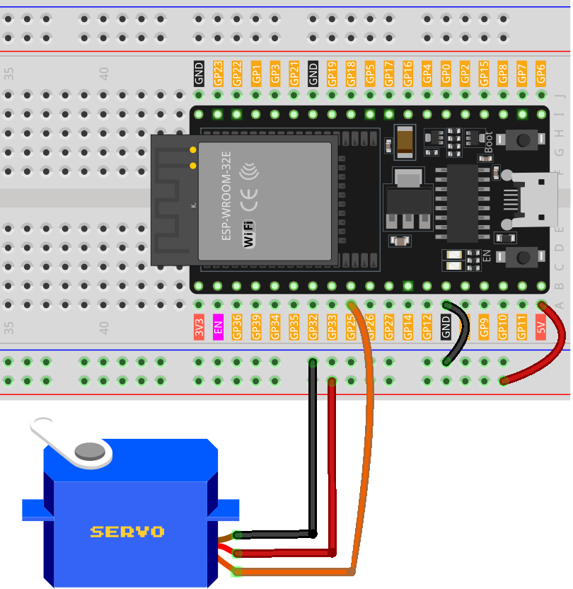

 .. note::

    Hallo und willkommen in der SunFounder Raspberry Pi & Arduino & ESP32 Enthusiasten-Gemeinschaft auf Facebook! Tauchen Sie tiefer ein in die Welt von Raspberry Pi, Arduino und ESP32 mit anderen Enthusiasten.

    **Warum beitreten?**

    - **Expertenunterstützung**: Lösen Sie Nachverkaufsprobleme und technische Herausforderungen mit Hilfe unserer Gemeinschaft und unseres Teams.
    - **Lernen & Teilen**: Tauschen Sie Tipps und Anleitungen aus, um Ihre Fähigkeiten zu verbessern.
    - **Exklusive Vorschauen**: Erhalten Sie frühzeitigen Zugang zu neuen Produktankündigungen und exklusiven Einblicken.
    - **Spezialrabatte**: Genießen Sie exklusive Rabatte auf unsere neuesten Produkte.
    - **Festliche Aktionen und Gewinnspiele**: Nehmen Sie an Gewinnspielen und Feiertagsaktionen teil.

    👉 Sind Sie bereit, mit uns zu erkunden und zu erschaffen? Klicken Sie auf [|link_sf_facebook|] und treten Sie heute bei!

.. _esp32_lesson33_servo:

Lektion 33: Servomotor (SG90)
==================================

In dieser Lektion lernen Sie, wie Sie einen Servomotor mit einem ESP32-Entwicklungsboard steuern. Wir werden den Prozess abdecken, den Servomotor von 0 auf 180 Grad und zurück zu bewegen, wodurch Sie praktische Erfahrungen in der Steuerung von Servobewegungen sammeln können. Dieses Projekt ist ideal für diejenigen, die die Motorsteuerung und die Verwendung der Pulsweitenmodulation (PWM) in der Robotik verstehen möchten, unter Verwendung des vielseitigen ESP32-Boards.

Benötigte Komponenten
-------------------------

Für dieses Projekt benötigen wir die folgenden Komponenten. 

Es ist definitiv praktisch, ein ganzes Kit zu kaufen, hier ist der Link:

.. list-table::
    :widths: 20 20 20
    :header-rows: 1

    *   - Name	
        - ITEMS IN THIS KIT
        - LINK
    *   - Universal Maker Sensor Kit
        - 94
        - |link_umsk|

Sie können sie auch einzeln über die unten stehenden Links kaufen.

.. list-table::
    :widths: 30 20
    :header-rows: 1

    *   - Component Introduction
        - Purchase Link

    *   - ESP32 & Development Board
        - |link_esp32_camera_pro_kit_buy|
    *   - :ref:`cpn_servo`
        - |link_servo_buy|
    *   - :ref:`cpn_breadboard`
        - |link_breadboard_buy|

Verkabelung
---------------

Code
-------

.. raw:: html

    <iframe src=https://create.arduino.cc/editor/sunfounder01/877c9719-5f1b-4df1-9d3b-9e9500a5df08/preview?embed style="height:510px;width:100%;margin:10px 0" frameborder=0></iframe>

Code-Analyse
---------------

#. Einbinden der Bibliothek

   Die ESP32Servo-Bibliothek wird eingebunden, um die Servomotoroperationen zu verwalten.

   .. code-block:: arduino

     #include <ESP32Servo.h>

#. Definition von Servo und Pin

   Ein Servo-Objekt wird erstellt, und ein Pin wird zur Steuerung des Servos definiert.

   .. raw:: html
      
       

   .. code-block:: arduino

     Servo myServo;
     const int servoPin = 25;

#. Festlegen der Pulsbreitengrenzen

   Minimale und maximale Pulsbreiten werden für die Bewegungsgrenzen des Servos definiert.

   .. raw:: html
      
       

   .. code-block:: arduino

     const int minPulseWidth = 500; // 0.5 ms
     const int maxPulseWidth = 2500; // 2.5 ms

#. Setup Function

   - Der Servo wird an den definierten Pin angeschlossen und der Pulsbreitenbereich wird festgelegt.
   - Die PWM-Frequenz wird auf 50Hz eingestellt, was für Servos standard ist.

   .. raw:: html
      
       

   .. code-block:: arduino

     void setup() {
       myServo.attach(servoPin, minPulseWidth, maxPulseWidth);
       myServo.setPeriodHertz(50);
     }

#. Loop-Funktion

   - Die Drehung des Servos wird in einer Schleife gesteuert, die sich von 0 auf 180 Grad und dann wieder auf 0 Grad bewegt.
   - ``writeMicroseconds()`` wird verwendet, um die Position des Servos basierend auf der Pulsbreite einzustellen.

   .. raw:: html
      
       

   .. code-block:: arduino

      void loop() {
        // Rotate the servo from 0 to 180 degrees
        for (int angle = 0; angle <= 180; angle++) {
          int pulseWidth = map(angle, 0, 180, minPulseWidth, maxPulseWidth);
          myServo.writeMicroseconds(pulseWidth);
          delay(15);
        }
      
        // Rotate the servo from 180 to 0 degrees
        for (int angle = 180; angle >= 0; angle--) {
          int pulseWidth = map(angle, 0, 180, minPulseWidth, maxPulseWidth);
          myServo.writeMicroseconds(pulseWidth);
          delay(15);
        }
      }