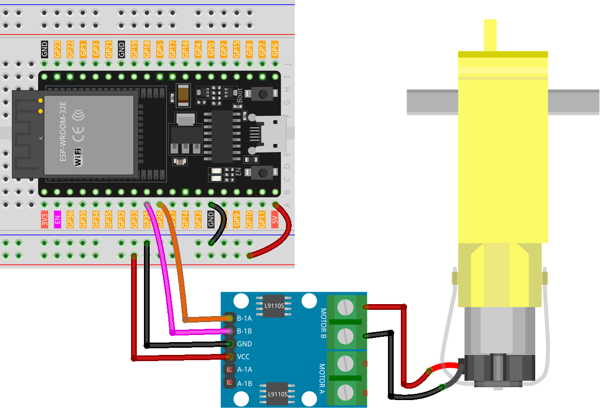

 .. note::

    Hallo und willkommen in der SunFounder Raspberry Pi & Arduino & ESP32 Enthusiasten-Gemeinschaft auf Facebook! Tauchen Sie tiefer ein in die Welt von Raspberry Pi, Arduino und ESP32 mit anderen Enthusiasten.

    **Warum beitreten?**

    - **Expertenunterstützung**: Lösen Sie Nachverkaufsprobleme und technische Herausforderungen mit Hilfe unserer Gemeinschaft und unseres Teams.
    - **Lernen & Teilen**: Tauschen Sie Tipps und Anleitungen aus, um Ihre Fähigkeiten zu verbessern.
    - **Exklusive Vorschauen**: Erhalten Sie frühzeitigen Zugang zu neuen Produktankündigungen und exklusiven Einblicken.
    - **Spezialrabatte**: Genießen Sie exklusive Rabatte auf unsere neuesten Produkte.
    - **Festliche Aktionen und Gewinnspiele**: Nehmen Sie an Gewinnspielen und Feiertagsaktionen teil.

    👉 Sind Sie bereit, mit uns zu erkunden und zu erschaffen? Klicken Sie auf [|link_sf_facebook|] und treten Sie heute bei!

.. _esp32_lesson34_motor:

Lektion 34: TT-Motor
=======================

In dieser Lektion lernen Sie, wie Sie einen Motor mit dem ESP32-Entwicklungsboard und einem L9110-Motorsteuerungsboard steuern. Wir werden das Definieren und Initialisieren der Motorpins, das Festlegen dieser als Ausgänge und das Einstellen der Motorgeschwindigkeit mithilfe der Funktion `analogWrite` behandeln. Dieses Projekt ist ideal für diejenigen, die die Motorsteuerung und Pulsweitenmodulation (PWM) auf der ESP32-Plattform verstehen möchten, und bietet eine praktische Demonstration von Ausgangsoperationen in einer Mikrocontroller-Umgebung.

Benötigte Komponenten
-------------------------

Für dieses Projekt benötigen wir die folgenden Komponenten. 

Es ist definitiv praktisch, ein ganzes Kit zu kaufen, hier ist der Link:

.. list-table::
    :widths: 20 20 20
    :header-rows: 1

    *   - Name	
        - ITEMS IN THIS KIT
        - LINK
    *   - Universal Maker Sensor Kit
        - 94
        - |link_umsk|

Sie können sie auch einzeln über die unten stehenden Links kaufen.

.. list-table::
    :widths: 30 20
    :header-rows: 1

    *   - Component Introduction
        - Purchase Link

    *   - ESP32 & Development Board
        - |link_esp32_camera_pro_kit_buy|
    *   - :ref:`cpn_ttmotor`
        - \-
    *   - :ref:`cpn_l9110`
        - \-
    *   - :ref:`cpn_breadboard`
        - |link_breadboard_buy|

Verkabelung
--------------

Code
-------

.. raw:: html

    <iframe src=https://create.arduino.cc/editor/sunfounder01/c1d4e7f5-140c-4ed4-a149-1af81df5dc0b/preview?embed style="height:510px;width:100%;margin:10px 0" frameborder=0></iframe>

Code-Analyse
---------------

1. Der erste Teil des Codes definiert die Motorsteuerungspins. Diese sind mit dem L9110-Motorsteuerungsboard verbunden.

   .. code-block:: arduino
   
      // Define the motor pins
      const int motorB_1A = 26;
      const int motorB_2A = 25;

2. Die Funktion ``setup()`` initialisiert die Motorsteuerungspins als Ausgänge mit der Funktion ``pinMode()``. Anschließend wird ``analogWrite()`` verwendet, um die Geschwindigkeit des Motors einzustellen. Der an ``analogWrite()`` übergebene Wert kann von 0 (aus) bis 255 (volle Geschwindigkeit) reichen. Eine ``delay()``-Funktion wird verwendet, um den Code für 5000 Millisekunden (oder 5 Sekunden) anzuhalten, danach wird die Motorgeschwindigkeit auf 0 (aus) gesetzt.

   .. code-block:: arduino
   
      void setup() {
        pinMode(motorB_1A, OUTPUT);  // set motor pin 1 as output
        pinMode(motorB_2A, OUTPUT);  // set motor pin 2 as output
   
        analogWrite(motorB_1A, 255);  // set motor speed (0-255)
        analogWrite(motorB_2A, 0);
   
        delay(5000);
   
        analogWrite(motorB_1A, 0);  
        analogWrite(motorB_2A, 0);
      }
