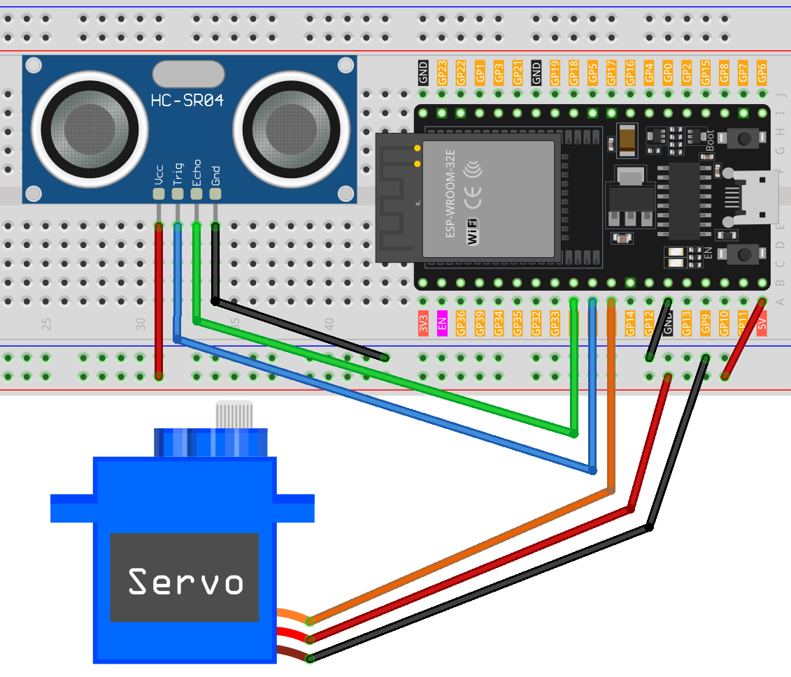

.. _esp32_trashcan:

Lesson 35: Smart trashcan
==================================

This project revolves around the concept of a smart trash can. 
The primary aim is to have the trash can's lid automatically open 
when an object approaches within a set distance (20cm in this case). 
The functionality is achieved by using an ultrasonic distance sensor paired with a servo motor. 
The distance between the object and the sensor is continually measured. 
If the object is close enough, the servo motor is triggered to open the lid. 

Required Components
---------------------------

.. list-table::
    :widths: 30 20
    :header-rows: 1

    *   - Component Introduction
        - Purchase Link

    *   - ESP32 Development Board
        - \-
    *   - :ref:`cpn_ultrasonic`
        - |link_ultrasonic_buy|
    *   - :ref:`cpn_servo`
        - |link_servo_buy|
    *   - :ref:`cpn_breadboard`
        - |link_breadboard_buy|
        

Wiring
---------------------------

Code
---------------------------

.. raw:: html

    <iframe src=https://create.arduino.cc/editor/sunfounder01/a4b1e0f2-4e01-4adc-9cb9-f984ca76dbfa/preview?embed style="height:510px;width:100%;margin:10px 0" frameborder=0></iframe>

    
Code Analysis
---------------------------

The project is based on real-time monitoring of the distance between an object and a trash can. An ultrasonic sensor continuously measures this distance, and if an object approaches within 20cm, the trash can interprets it as an intention to dispose of waste and automatically opens its lid. This automation adds smartness and convenience to a regular trash can.

#. Initial Setup and Variable Declaration

   Here, we're including the ``ESP32Servo`` library and defining the constants and variables we'll use. The pins for the servo and the ultrasonic sensor are declared. We also have an array ``averDist`` to hold the three distance measurements.

   .. code-block:: arduino
       
        #include <ESP32Servo.h>

        // Set up the servo motor parameters
        Servo servo;
        const int servoPin = 27;
        const int openAngle = 0;
        const int closeAngle = 90;

        // Define the minimum and maximum pulse widths for the servo
        const int minPulseWidth = 500; // 0.5 ms
        const int maxPulseWidth = 2500; // 2.5 ms

        // Set up the ultrasonic sensor parameters
        const int trigPin = 26;
        const int echoPin = 25;
        long distance, averageDistance;
        long averDist[3];

        // Distance threshold in centimeters
        const int distanceThreshold = 20;

#. ``setup()`` Function

   The ``setup()`` function initializes serial communication, configures the ultrasonic sensor's pins, and sets the initial position of the servo to the closed position.

   .. code-block:: arduino
   
      void setup() {
        Serial.begin(9600);
        pinMode(trigPin, OUTPUT);
        pinMode(echoPin, INPUT);
        servo.attach(servoPin);
        servo.write(closeAngle);
        delay(100);
      }

   

#. ``loop()`` Function

   The ``loop()`` function is responsible for continuously measuring the distance, computing its average, and then making a decision whether to open or close the trash can's lid based on this averaged distance.

   .. code-block:: arduino
   
        void loop() {
            // Measure the distance three times
            for (int i = 0; i <= 2; i++) {
                distance = readDistance();
                averDist[i] = distance;
                delay(10);
            }

            // Calculate the average distance
            averageDistance = (averDist[0] + averDist[1] + averDist[2]) / 3;
            Serial.println(averageDistance);

            // Control the servo based on the averaged distance
            if (averageDistance <= distanceThreshold) {
                servo.attach(servoPin);  // Reattach the servo before sending a command
                delay(1);
                servo.write(openAngle);  // Rotate the servo to the open position
                delay(3500);
            } else {
                servo.write(closeAngle);  // Rotate the servo back to the closed position
                delay(1000);
                servo.detach();  // Detach the servo to save power when not in use
            }
        }
        

#. Distance Reading Function

   This function, ``readDistance()``, is what actually interacts with the ultrasonic sensor. It sends a pulse and waits for an echo. The time taken for the echo is then used to calculate the distance between the sensor and any object in front of it.

   You can refer to the :ref:`cpn_ultrasonic_principle` of the ultrasonic sensor.

   .. code-block:: arduino
   
        float readDistance() {
            // Send a pulse on the trigger pin of the ultrasonic sensor
            digitalWrite(trigPin, LOW);
            delayMicroseconds(2);
            digitalWrite(trigPin, HIGH);
            delayMicroseconds(10);
            digitalWrite(trigPin, LOW);

            // Measure the pulse width of the echo pin and calculate the distance value
            float distance = pulseIn(echoPin, HIGH) / 58.00;  // Formula: (340m/s * 1us) / 2
            return distance;
        }

#. Servo Write Function

    This function maps the angle value to pulse width and calls the ``writeMicroseconds(pulseWidth)`` function to deflect the servo to a specific angle.

    .. code-block:: arduino
        
        // Function to make the servo work
        void servoWrite(int angle){
            int pulseWidth = map(angle, 0, 180, minPulseWidth, maxPulseWidth);
            servo.writeMicroseconds(pulseWidth);
        }
