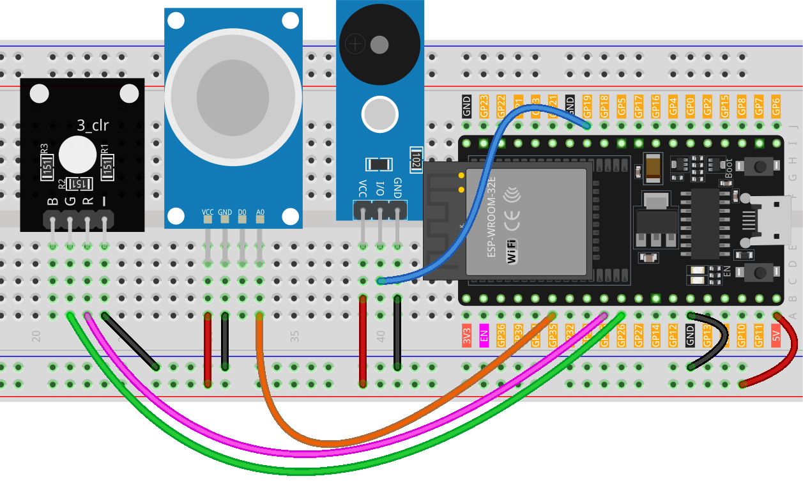

.. note::

   Hallo und willkommen in der SunFounder Raspberry Pi & Arduino & ESP32 Enthusiasten-Gemeinschaft auf Facebook! Tauchen Sie tiefer ein in die Welt von Raspberry Pi, Arduino und ESP32 mit anderen Enthusiasten.

   **Warum beitreten?**

   - **Expertenunterstützung**: Lösen Sie Nachverkaufsprobleme und technische Herausforderungen mit Hilfe unserer Gemeinschaft und unseres Teams.
   - **Lernen & Teilen**: Tauschen Sie Tipps und Anleitungen aus, um Ihre Fähigkeiten zu verbessern.
   - **Exklusive Vorschauen**: Erhalten Sie frühzeitigen Zugang zu neuen Produktankündigungen und exklusiven Einblicken.
   - **Spezialrabatte**: Genießen Sie exklusive Rabatte auf unsere neuesten Produkte.
   - **Festliche Aktionen und Gewinnspiele**: Nehmen Sie an Gewinnspielen und Feiertagsaktionen teil.

   👉 Sind Sie bereit, mit uns zu erkunden und zu erschaffen? Klicken Sie auf [|link_sf_facebook|] und treten Sie heute bei!

.. _esp32_gas_leak_alarm:

Lektion 36: Gasleck-Alarm
==================================

Dieses Projekt dreht sich um die Simulation eines Gasleck-Erkennungsszenarios mit einem ESP32-Board. 
Durch den Einsatz eines MQ-2-Gassensors und einer RGB-LED wird kontinuierlich die Gaskonzentration gemessen. 
Überschreitet diese Konzentration einen vordefinierten Schwellenwert, 
wird ein Alarm (Summer) ausgelöst und die RGB-LED leuchtet rot. 
Bleibt die Konzentration unter diesem Schwellenwert, 
bleibt der Alarm inaktiv und die LED leuchtet grün. 
Es ist wichtig zu betonen, dass diese Demonstration rein illustrativ ist und nicht als Ersatz für echte Gasleck-Erkennungssysteme dienen sollte.

Benötigte Komponenten
--------------------------

In diesem Projekt benötigen wir die folgenden Komponenten. 

Es ist definitiv praktisch, ein ganzes Kit zu kaufen, hier ist der Link:

.. list-table::
    :widths: 20 20 20
    :header-rows: 1

    *   - Name    
        - ITEMS IN THIS KIT
        - LINK
    *   - Universal Maker Sensor Kit
        - 94
        - |link_umsk|

Sie können sie auch separat über die untenstehenden Links kaufen.

.. list-table::
    :widths: 30 20
    :header-rows: 1

    *   - Component Introduction
        - Purchase Link

    *   - ESP32 & Development Board
        - |link_esp32_camera_pro_kit_buy|
    *   - :ref:`cpn_gas`
        - |link_mq2_gas_sensor_module_buy|
    *   - :ref:`cpn_buzzer`
        - |link_passive_buzzer_module_buy|
    *   - :ref:`cpn_rgb`
        - \-
    *   - :ref:`cpn_breadboard`
        - |link_breadboard_buy|
        

Verdrahtung
---------------------------

Code
---------------------------

.. raw:: html

    <iframe src=https://create.arduino.cc/editor/sunfounder01/3c24f636-7411-4d3d-8d2e-ac4400084a93/preview?embed style="height:510px;width:100%;margin:10px 0" frameborder=0></iframe>
    
Code-Analyse
---------------------------

Das Kernprinzip des Projekts besteht darin, kontinuierlich die Gaskonzentration zu überwachen. Wenn die ermittelte Gaskonzentration einen bestimmten Schwellenwert überschreitet, wird ein Alarm ausgelöst und die LED wechselt die Farbe zu Rot. Dies dient als simuliertes Warnsignal, das auf potenziell gefährliche Bedingungen hinweist. Sinkt die Konzentration unter den Schwellenwert, wird der Alarm deaktiviert und die LED wechselt zu Grün, was auf eine sichere Umgebung hinweist.

1. Definition von Konstanten und Variablen

    Diese Zeilen deklarieren und initialisieren die Pinnummern für verschiedene Komponenten. Der ``sensorPin`` bezeichnet den analogen Pin, an dem der MQ-2-Gassensor angeschlossen ist. ``sensorValue`` ist eine Ganzzahlvariable, die den analogen Ausgang des Sensors speichert. Der ``buzzerPin`` gibt den digitalen Pin an, an dem der Summer angeschlossen ist. Schließlich sind der ``RPin`` und der ``GPin`` die Pins für die roten und grünen Kanäle der RGB-LED.

    .. code-block:: arduino
   
        // Define the pin numbers for the Gas Sensor
        const int sensorPin = 35;
        int sensorValue;

        // Define the pin number for the buzzer
        const int buzzerPin = 19;

        // Define pin numbers for the RGB LED
        const int RPin = 25;  // R channel of RGB LED
        const int GPin = 26;  // G channel of RGB LED

   

2. Initialisierung in ``setup()``

    Die ``setup()``-Funktion initialisiert die erforderlichen Einstellungen. Die serielle Kommunikation beginnt mit einer Baudrate von 9600, sodass wir die Sensorwerte im seriellen Monitor anzeigen können. Die Pins für den Summer und die RGB-LED werden als ``OUTPUT`` gesetzt, was bedeutet, dass sie Signale an externe Komponenten senden.

    .. code-block:: arduino
   
        void setup() {
            Serial.begin(9600);  // Start serial communication at 9600 baud rate
    
            // Initialize the buzzer and RGB LED pins as output
            pinMode(buzzerPin, OUTPUT);
            pinMode(RPin, OUTPUT);
            pinMode(GPin, OUTPUT);
        }
   

3. Hauptschleife: Sensorlesen und Alarmauslösung

    Die ``loop()``-Funktion liest kontinuierlich den Ausgang des Gassensors. Der Messwert wird dann im seriellen Monitor zur Beobachtung angezeigt. Abhängig vom Sensorwert können zwei Szenarien auftreten:
    
    - Wenn der Wert 300 überschreitet, wird der Summer mit ``tone()`` aktiviert und die RGB-LED wird rot.
    - Wenn der Wert unter 300 liegt, wird der Summer mit ``noTone()`` stummgeschaltet und die LED wird grün.
    
    Schließlich wird eine Verzögerung von 50 Millisekunden eingeführt, bevor die nächste Schleifeniteration beginnt, um die Lesefrequenz zu steuern und die CPU-Last zu reduzieren.

    .. code-block:: arduino
   
        void loop() {
            // Read the analog value of the gas sensor
            sensorValue = analogRead(sensorPin);

            // Print the sensor value to the serial monitor
            Serial.print("Analog output: ");
            Serial.println(sensorValue);

            // If the sensor value exceeds the threshold, trigger the alarm and make the RGB LED red
            if (sensorValue > 3000) {
                tone(buzzerPin, 500, 300);
                digitalWrite(GPin, LOW);
                digitalWrite(RPin, HIGH);
                delay(500);
                // stop the tone playing:
                noTone(buzzerPin);
            } else {
                // If the sensor value is below the threshold, turn off the alarm and make the RGB LED green
                noTone(buzzerPin);
                digitalWrite(RPin, LOW);
                digitalWrite(GPin, HIGH);
            }
            
            // Wait for 50 milliseconds before the next loop iteration
            delay(50);
        }

    
   
