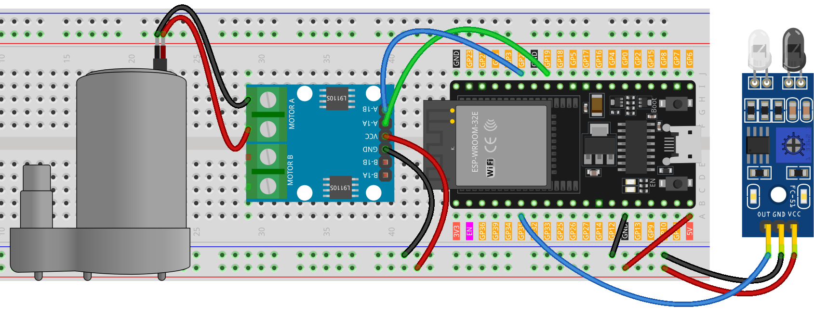

.. note::

    こんにちは、SunFounder Raspberry Pi & Arduino & ESP32 Enthusiasts Communityへようこそ！Facebook上で、仲間と一緒にRaspberry Pi、Arduino、ESP32をさらに深く探求しましょう。

    **なぜ参加するのか？**

    - **専門的なサポート**：購入後の問題や技術的な課題をコミュニティやチームの助けを借りて解決。
    - **学びと共有**：スキルを向上させるためのヒントやチュートリアルを交換。
    - **限定プレビュー**：新製品発表や予告編に早期アクセス。
    - **特別割引**：最新製品の特別割引を楽しむ。
    - **フェスティブプロモーションとプレゼント**：プレゼントやホリデープロモーションに参加。

    👉 私たちと一緒に探索と創造を始める準備はできましたか？[|link_sf_facebook|]をクリックして、今すぐ参加しましょう！
    
.. _esp32_soap_dispenser:

レッスン37: 自動ソープディスペンサー
=======================================

自動ソープディスペンサーのプロジェクトは、Arduino Unoボードと赤外線障害物回避センサーおよび水ポンプを使用します。
センサーは手などの物体の存在を検知し、水ポンプを作動させて石鹸を出します。

必要な部品
--------------------------

このプロジェクトでは、以下の部品が必要です。

便利なキットを購入するのがおすすめです。こちらのリンクから購入できます：

.. list-table::
    :widths: 20 20 20
    :header-rows: 1

    *   - Name	
        - ITEMS IN THIS KIT
        - LINK
    *   - Universal Maker Sensor Kit
        - 94
        - |link_umsk|

以下のリンクから部品を個別に購入することもできます。

.. list-table::
    :widths: 30 20
    :header-rows: 1

    *   - Component Introduction
        - Purchase Link

    *   - ESP32 & Development Board
        - |link_esp32_camera_pro_kit_buy|
    *   - :ref:`cpn_ir_obstacle`
        - |link_obstacle_avoidance_module_buy|
    *   - :ref:`cpn_pump`
        - \-
    *   - :ref:`cpn_l9110`
        - \-
    *   - :ref:`cpn_power_module`
        - \-
    *   - :ref:`cpn_breadboard`
        - |link_breadboard_buy|
        

配線
---------------------------

Code
---------------------------

.. raw:: html

    <iframe src=https://create.arduino.cc/editor/sunfounder01/f1923f60-5b82-497b-915f-ecc7ad46fea4/preview?embed style="height:510px;width:100%;margin:10px 0" frameborder=0></iframe>
    
コード解析
---------------------------

このプロジェクトの主な目的は、ハンズフリーのソープディスペンサーシステムを作成することです。赤外線障害物回避センサーが物体（手など）が近くにあることを検知します。物体を検知すると、センサーはArduinoに信号を送り、これによりウォーターポンプが作動して石鹸を出します。ポンプは短時間作動し、石鹸を出した後に停止します。

#. **センサーとポンプのピンの定義**

    このコードスニペットでは、センサーとポンプに接続するArduinoのピンを定義します。
    センサーピンとして7番ピンを定義し、このセンサーから読み取ったデータを格納するために``sensorValue``変数を使用します。
    ウォーターポンプには、9番ピンと10番ピンを使用します。

    .. code-block:: arduino
   
        // Define the pin numbers for the Infrared obstacle avoidance sensor
        const int sensorPin = 35;
        int sensorValue;

        // Define pin numbers for the water pump
        const int pump1A = 19;
        const int pump1B = 21;

#. **センサーとポンプの設定**

    ``setup()``関数では、使用するピンのモードを定義します。
    センサーピンはセンサーからデータを受信するために ``INPUT`` に設定されます。
    ポンプピンはポンプにコマンドを送信するために ``OUTPUT`` に設定されます。
    ``pump1B``ピンは ``LOW`` 状態（オフ）で開始され、
    シリアル通信を9600ボーの速度で開始します。

    .. code-block:: arduino
    
        void setup() {
            // Set the sensor pin as input
            pinMode(sensorPin, INPUT);

            // Initialize the pump pins as output
            pinMode(pump1A, OUTPUT);    
            pinMode(pump1B, OUTPUT);    

            // Keep pump1B low
            digitalWrite(pump1A, LOW); 
            digitalWrite(pump1B, LOW);  

            Serial.begin(9600);
        }

#. **センサーの連続チェックとポンプの制御**
 
    ``loop()``関数では、Arduinoがセンサーからの値を ``digitalRead()`` を使用して常に読み取り、それを ``sensorValue`` に割り当てます。その後、この値をデバッグ目的でシリアルモニターに表示します。センサーが物体を検知すると、 ``sensorValue`` は0になります。この場合、 ``pump1A`` が ``HIGH`` に設定され、ポンプが作動し、700ミリ秒の遅延で石鹸を出します。その後、 ``pump1A`` を ``LOW`` に設定してポンプを停止し、1秒の遅延でユーザーが手を離す時間を確保します。このサイクルが繰り返されます。

    .. note:: 
   
        センサーが正しく動作しない場合、IR送信機と受信機を平行に調整してください。また、内蔵のポテンショメータを使用して検出範囲を調整することができます。

    .. code-block:: arduino
   
        void loop() {
            sensorValue = digitalRead(sensorPin);
            Serial.println(sensorValue);

            // If an object is detected, turn on the pump for a brief period, then turn it off
            if (sensorValue == 0) {  
                digitalWrite(pump1A, HIGH);
                delay(700);
                digitalWrite(pump1A, LOW);
                delay(1000);
            }
        }
