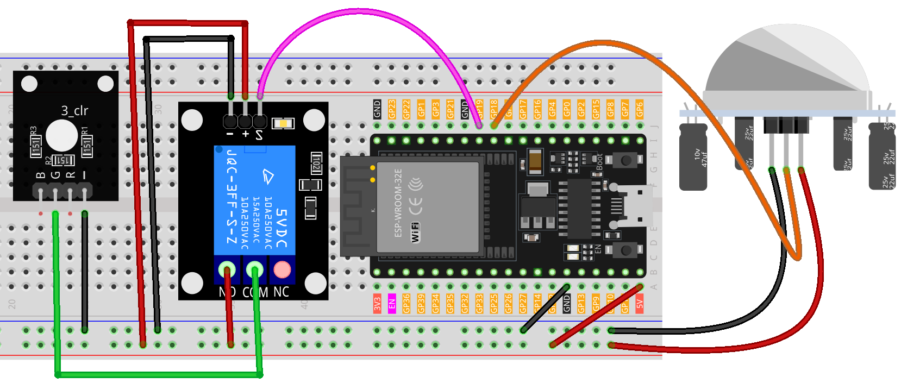

.. note::

    こんにちは、SunFounder Raspberry Pi & Arduino & ESP32 Enthusiasts Communityへようこそ！Facebook上で、仲間と一緒にRaspberry Pi、Arduino、ESP32をさらに深く探求しましょう。

    **なぜ参加するのか？**

    - **専門的なサポート**：購入後の問題や技術的な課題をコミュニティやチームの助けを借りて解決。
    - **学びと共有**：スキルを向上させるためのヒントやチュートリアルを交換。
    - **限定プレビュー**：新製品発表や予告編に早期アクセス。
    - **特別割引**：最新製品の特別割引を楽しむ。
    - **フェスティブプロモーションとプレゼント**：プレゼントやホリデープロモーションに参加。

    👉 私たちと一緒に探索と創造を始める準備はできましたか？[|link_sf_facebook|]をクリックして、今すぐ参加しましょう！
.. _esp32_motion_triggered_relay:

レッスン38: モーション検知リレー
==================================

このプロジェクトは、パッシブ赤外線（PIR）センサーを使用してリレー操作のライトを制御することを目的としています。
PIRセンサーが動きを検知すると、リレーが作動し、ライトが点灯します。最後に動きを検知してから5秒間、ライトは点灯したままになります。

.. warning::

    デモンストレーションとして、リレーを使用してRGB LEDモジュールを制御していますが、実際のシナリオでは最も実用的なアプローチではないかもしれません。

    **実際のアプリケーションではリレーを他の機器に接続することもできますが、高電圧の交流電圧を扱う際には極めて注意が必要です。不適切または誤った使用は、重傷や死亡に繋がる可能性があります。そのため、高電圧の交流電圧について熟知している人々を対象としています。常に安全を最優先してください。**

必要な部品
--------------------------

このプロジェクトでは、以下の部品が必要です。

全セットを購入するのが便利です。こちらのリンクをご利用ください。

.. list-table::
    :widths: 20 20 20
    :header-rows: 1

    *   - Name	
        - ITEMS IN THIS KIT
        - LINK
    *   - Universal Maker Sensor Kit
        - 94
        - |link_umsk|

You can also buy them separately from the links below.

.. list-table::
    :widths: 30 20
    :header-rows: 1

    *   - Component Introduction
        - Purchase Link

    *   - ESP32 & Development Board
        - |link_esp32_camera_pro_kit_buy|
    *   - :ref:`cpn_pir_motion`
        - \-
    *   - :ref:`cpn_relay`
        - \-
    *   - :ref:`cpn_rgb`
        - \-
    *   - :ref:`cpn_breadboard`
        - |link_breadboard_buy|
        

配線
---------------------------

コード
---------------------------

.. raw:: html

    <iframe src=https://create.arduino.cc/editor/sunfounder01/5a29dc43-f362-434e-9e5a-f32dcd41b952/preview?embed style="height:510px;width:100%;margin:10px 0" frameborder=0></iframe>

コード分析
---------------------------

このプロジェクトは、PIRモーションセンサーの動きを検知する能力に基づいています。動きが検知されると、信号がArduinoに送られ、リレーモジュールが作動し、ライトが点灯します。ライトは、最後に動きを検知してから指定された期間（この場合は5秒間）点灯し続けます。これにより、動きが止まっても短期間照明が維持されます。

1. **初期設定と変数の宣言**

    このセグメントでは、コード全体で使用される定数と変数を定義します。リレーとPIRピンの設定と、動きの遅延定数を設定します。また、最後に動きを検知した時間を記録する変数と、動きを検知したかどうかを監視するフラグもあります。

    .. code-block:: arduino
   
        // Define the pin number for the relay
        const int relayPin = 19;

        // Define the pin number for the PIR sensor
        const int pirPin = 18;

        // Motion delay threshold in milliseconds
        const unsigned long MOTION_DELAY = 5000;

        unsigned long lastMotionTime = 0;  // Timestamp of the last motion detection
        bool motionDetected = false;       // Flag to track if motion is detected
        
   

2. **setup()関数でのピンの設定**

    ``setup()``関数では、リレーとPIRセンサーのピンモードを設定します。また、最初はリレーがオフであるように初期化します。

    .. code-block:: arduino
    
        void setup() {
            pinMode(relayPin, OUTPUT);    // Set relayPin as an output pin
            pinMode(pirPin, INPUT);       // Set the PIR pin as an input
            digitalWrite(relayPin, LOW);  // Turn off the relay initially
        }

3. **loop()関数でのメインロジック**

    ``loop()``関数には主要なロジックが含まれています。PIRセンサーが動きを検知すると、 ``HIGH`` 信号を送信し、リレーをオンにして ``lastMotionTime`` を更新します。指定された遅延期間（この場合は5秒間）動きがない場合、リレーをオフにします。
    
    このアプローチにより、動きが断続的または短時間であっても、最後に動きを検知してから少なくとも5秒間ライトが点灯し続け、安定した照明期間が提供されます。

    .. code-block:: arduino
    
        void loop() {
            if (digitalRead(pirPin) == HIGH) {
                lastMotionTime = millis();     // Update the last motion time
                digitalWrite(relayPin, HIGH);  // Turn on the relay (and hence the light)
                motionDetected = true;
            }
    
            // If motion was detected earlier and 5 seconds have elapsed, turn off the relay
            if (motionDetected && (millis() - lastMotionTime >= MOTION_DELAY)) {
                digitalWrite(relayPin, LOW);  // Turn off the relay
                motionDetected = false;
            }
        }
   
   
