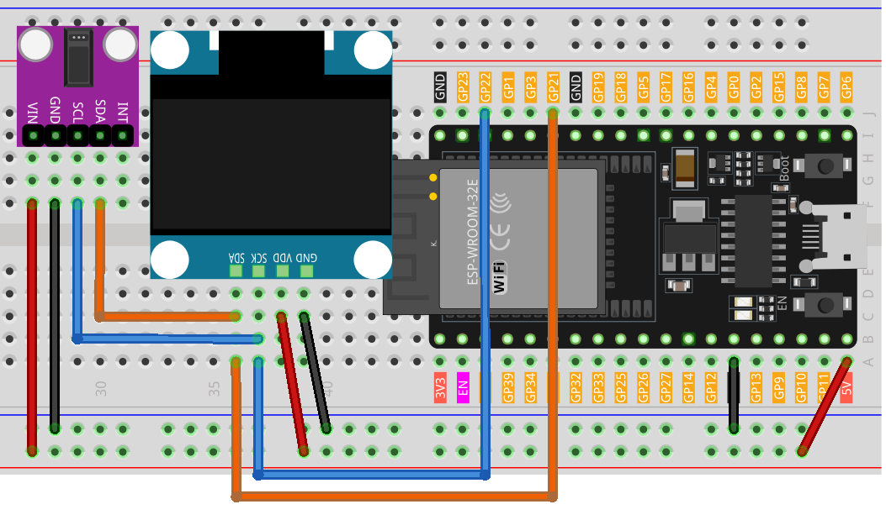

.. note::

    こんにちは、SunFounder Raspberry Pi & Arduino & ESP32 Enthusiasts Communityへようこそ！Facebook上で、仲間と一緒にRaspberry Pi、Arduino、ESP32をさらに深く探求しましょう。

    **なぜ参加するのか？**

    - **専門的なサポート**：購入後の問題や技術的な課題をコミュニティやチームの助けを借りて解決。
    - **学びと共有**：スキルを向上させるためのヒントやチュートリアルを交換。
    - **限定プレビュー**：新製品発表や予告編に早期アクセス。
    - **特別割引**：最新製品の特別割引を楽しむ。
    - **フェスティブプロモーションとプレゼント**：プレゼントやホリデープロモーションに参加。

    👉 私たちと一緒に探索と創造を始める準備はできましたか？[|link_sf_facebook|]をクリックして、今すぐ参加しましょう！

.. _esp32_heartrate_monitor:

レッスン39: 心拍数モニター
==================================

このArduinoプロジェクトは、MAX30102パルスオキシメーターセンサーとSSD1306 OLEDディスプレイを使用して、シンプルな心拍数モニターを作成することを目的としています。コードは、心拍の間隔を測定することによって心拍数を計測します。4回の測定を行い、それらの平均値を計算し、結果として得られた平均心拍数をOLEDスクリーンに表示します。センサーが指を検出しない場合、ユーザーにセンサーに正しく指を置くよう促します。

必要なコンポーネント
--------------------------

このプロジェクトでは、以下のコンポーネントが必要です。

全部が揃ったキットを購入するのが便利です。リンクはこちら：

.. list-table::
    :widths: 20 20 20
    :header-rows: 1

    *   - Name	
        - ITEMS IN THIS KIT
        - LINK
    *   - Universal Maker Sensor Kit
        - 94
        - |link_umsk|

以下のリンクから個別に購入することもできます。

.. list-table::
    :widths: 30 20
    :header-rows: 1

    *   - Component Introduction
        - Purchase Link

    *   - ESP32 & Development Board
        - |link_esp32_camera_pro_kit_buy|
    *   - :ref:`cpn_max30102`
        - |link_max30102_module_buy|
    *   - :ref:`cpn_oled`
        - \-
    *   - :ref:`cpn_breadboard`
        - |link_breadboard_buy|
        

配線
---------------------------

コード
---------------------------

.. note:: 
   ライブラリをインストールするには、Arduinoライブラリマネージャーを開き、 **"SparkFun MAX3010x"** 、 **"Adafruit SSD1306"** 、および **"Adafruit GFX"** を検索してインストールしてください。

.. raw:: html

    <iframe src=https://create.arduino.cc/editor/sunfounder01/1da3c9e2-e205-4af9-8741-43f7ea19bec8/preview?embed style="height:510px;width:100%;margin:10px 0" frameborder=0></iframe>
    
コード解析
---------------------------

このプロジェクトの主な原理は、MAX30102センサーを使用して指を通る血流の脈動をキャプチャすることです。
血液が体を通ってポンプで送り出されると、指先の血管内の血液の量に微小な変化が生じます。
指を通して光を照射し、吸収されたり反射されたりする光の量を測定することで、
センサーはこれらの微小な体積変化を検出します。
次の脈動までの時間間隔を使用して、1分あたりの心拍数（BPM）を計算します。
この値を4回の測定で平均し、OLEDスクリーンに表示します。

1. **ライブラリのインクルードと初期宣言**:

   このコードは、OLEDディスプレイ、MAX30102センサー、および心拍数計算のための必要なライブラリをインクルードすることから始まります。さらに、OLEDディスプレイの設定と心拍数計算のための変数が宣言されます。

   .. note:: 
      ライブラリをインストールするには、Arduinoライブラリマネージャーを開き、**"SparkFun MAX3010x"** 、**"Adafruit SSD1306"** 、および **"Adafruit GFX"** を検索してインストールしてください。

   .. code-block:: arduino

      #include <Adafruit_GFX.h>  // OLED  libraries
      #include <Adafruit_SSD1306.h>
      #include <Wire.h>
      #include "MAX30105.h"   // MAX3010x library
      #include "heartRate.h"  // Heart rate  calculating algorithm

      // ... Variables and OLED configuration

   このプロジェクトでは、いくつかのビットマップも準備しています。
   ``PROGMEM`` キーワードは、配列がマイクロコントローラのプログラムメモリに格納されることを示します。
   プログラムメモリ(PROGMEM)にデータを保存することは、RAMを大量に使用せずに済むため、特に大容量データに役立ちます。

   .. code-block:: arduino

      static const unsigned char PROGMEM beat1_bmp[] = {...}

      static const unsigned char PROGMEM beat2_bmp[] = {...}

2. **セットアップ関数**:

   I2C通信を初期化し、シリアル通信を開始し、OLEDディスプレイを初期化し、MAX30102センサーをセットアップします。

   .. code-block:: arduino

      void setup() {
          Wire.setClock(400000);
          Serial.begin(9600);
          display.begin(SSD1306_SWITCHCAPVCC, SCREEN_ADDRESS);
          // ... Rest of the setup code
      

3. **メインループ**:

   ここに主要な機能があります。センサーからIR値を読み取ります。
   指が検出された場合（IR値が50,000を超える）、プログラムは心拍が検出されているかを確認します。
   心拍が検出された場合、OLED画面にBPMが表示され、心拍の間隔がBPMの計算に使用されます。
   そうでない場合は、ユーザーにセンサーに指を置くよう促します。
   
   また、2つの心拍ビットマップを用意しており、これらを切り替えることで動的な視覚効果を実現しています。

   .. code-block:: arduino

      void loop() {
        // Get IR value from sensor
        long irValue = particleSensor.getIR();  
      
        //If a finger is detected
        if (irValue > 50000) {
      
          // Check if a beat is detected
          if (checkForBeat(irValue) == true) {

            // Update OLED display
            // Calculate the BPM
      
            // Calculate the average BPM
            //Print the IR value, current BPM value, and average BPM value to the serial monitor

            // Update OLED display
            
          }
        }
        else {
          // ... Prompt to place the finger on the sensor
        }
      }
      

