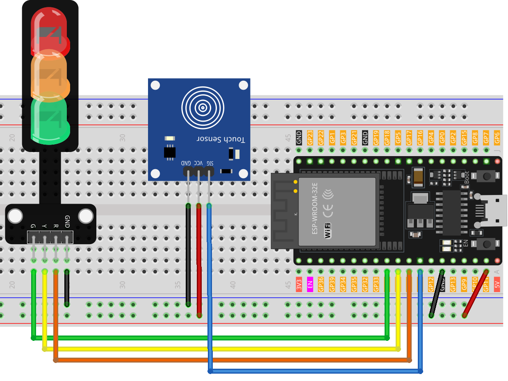

.. _esp32_touch_toggle_light:

Lesson 40: Touch toggle light
==================================

This project is a simple implementation of a traffic light control system utilizing a touch sensor and a traffic light LED module. 
Activating the touch sensor initiates a sequence where LEDs illuminate in the following order: Red -> Yellow -> Green.

Required Components
---------------------------

.. list-table::
    :widths: 30 20
    :header-rows: 1

    *   - Component Introduction
        - Purchase Link

    *   - ESP32 Development Board
        - \-
    *   - :ref:`cpn_touch`
        - \-
    *   - :ref:`cpn_traffic`
        - \-
    *   - :ref:`cpn_breadboard`
        - |link_breadboard_buy|
        

Wiring
---------------------------

Code
---------------------------

.. raw:: html

  <iframe src=https://create.arduino.cc/editor/sunfounder01/3745fb2e-d031-4698-9360-a2f7e9a54c13/preview?embed style="height:510px;width:100%;margin:10px 0" frameborder=0></iframe>

  
Code Analysis
---------------------------

The operation of this project is straightforward: 
a touch detection on the sensor triggers the illumination of the next LED in the sequence (Red -> Yellow -> Green), controlled by the ``currentLED`` variable.

1. Define pins and initial values

    .. code-block:: arduino
   
        // Define pins for touch sensor and LEDs
        const int touchSensorPin = 14;  // touch sensor pin
        const int rledPin = 27;         // red LED pin
        const int yledPin = 26;         // yellow LED pin
        const int gledPin = 25;         // green LED pin

        int lastTouchState;     // the previous state of touch sensor
        int currentTouchState;  // the current state of touch sensor
        int currentLED = 0;     // current LED 0->Red, 1->Yellow, 2->Green
   
   These lines establish the pin connections for the Arduino board components and initialize the touch sensor and LED states.

2. setup() function

    .. code-block:: arduino
   
      void setup() {
        Serial.begin(9600);              // initialize serial
        pinMode(touchSensorPin, INPUT);  // configure touch sensor pin as input

        // set LED pins as outputs
        pinMode(rledPin, OUTPUT);
        pinMode(yledPin, OUTPUT);
        pinMode(gledPin, OUTPUT);

        currentTouchState = digitalRead(touchSensorPin);
      }
   
    This function configures the initial setup for the Arduino, defining input and output modes and starting serial communication for debugging.

3. loop() function

    .. code-block:: arduino
   
      void loop() {
        lastTouchState = currentTouchState;               // save the last state
        currentTouchState = digitalRead(touchSensorPin);  // read new state

        // check if the touch sensor was just touched
        if (lastTouchState == LOW && currentTouchState == HIGH) {
          Serial.println("The sensor is touched");

          turnAllLEDsOff();  // Turn off all LEDs

          // switch on the next LED in sequence
          switch (currentLED) {
            case 0:
              digitalWrite(rledPin, HIGH);
              currentLED = 1;
              break;
            case 1:
              digitalWrite(yledPin, HIGH);
              currentLED = 2;
              break;
            case 2:
              digitalWrite(gledPin, HIGH);
              currentLED = 0;
              break;
          }
        }
      }

    The loop continuously monitors the touch sensor, cycling through the LEDs when a touch is detected, ensuring only one LED is on at any given time.

4. Turn off LEDs function

    .. code-block:: arduino
      
      // function to turn off all LEDs
      void turnAllLEDsOff() {
        digitalWrite(rledPin, LOW);
        digitalWrite(yledPin, LOW);
        digitalWrite(gledPin, LOW);
      }

    This auxiliary function turns off all LEDs, aiding in the cycling process.