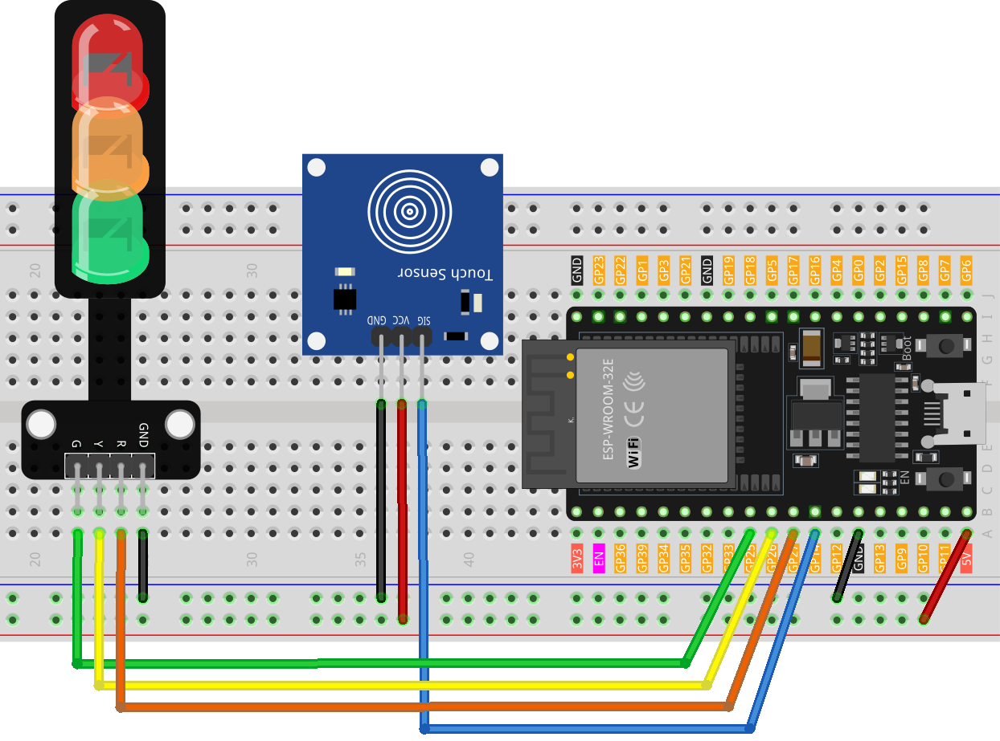

.. note::

   Hallo und willkommen in der SunFounder Raspberry Pi & Arduino & ESP32 Enthusiasten-Gemeinschaft auf Facebook! Tauchen Sie tiefer ein in die Welt von Raspberry Pi, Arduino und ESP32 mit anderen Enthusiasten.

   **Warum beitreten?**

   - **Expertenunterstützung**: Lösen Sie Nachverkaufsprobleme und technische Herausforderungen mit Hilfe unserer Gemeinschaft und unseres Teams.
   - **Lernen & Teilen**: Tauschen Sie Tipps und Anleitungen aus, um Ihre Fähigkeiten zu verbessern.
   - **Exklusive Vorschauen**: Erhalten Sie frühzeitigen Zugang zu neuen Produktankündigungen und exklusiven Einblicken.
   - **Spezialrabatte**: Genießen Sie exklusive Rabatte auf unsere neuesten Produkte.
   - **Festliche Aktionen und Gewinnspiele**: Nehmen Sie an Gewinnspielen und Feiertagsaktionen teil.

   👉 Sind Sie bereit, mit uns zu erkunden und zu erschaffen? Klicken Sie auf [|link_sf_facebook|] und treten Sie heute bei!

.. _esp32_touch_toggle_light:

Lektion 40: Berührungssensor-Lichtumschalter
=====================================================

Dieses Projekt ist eine einfache Implementierung eines Ampelsteuerungssystems unter Verwendung eines Berührungssensors und eines Ampel-LED-Moduls. 
Das Aktivieren des Berührungssensors startet eine Sequenz, bei der die LEDs in folgender Reihenfolge aufleuchten: Rot -> Gelb -> Grün.

Benötigte Komponenten
---------------------------

Für dieses Projekt benötigen wir die folgenden Komponenten. 

Es ist definitiv praktisch, ein ganzes Kit zu kaufen, hier ist der Link:

.. list-table::
    :widths: 20 20 20
    :header-rows: 1

    *   - Name    
        - ITEMS IN THIS KIT
        - LINK
    *   - Universal Maker Sensor Kit
        - 94
        - |link_umsk|

Sie können sie auch separat über die untenstehenden Links kaufen.

.. list-table::
    :widths: 30 20
    :header-rows: 1

    *   - Component Introduction
        - Purchase Link

    *   - ESP32 & Development Board
        - |link_esp32_camera_pro_kit_buy|
    *   - :ref:`cpn_touch`
        - \-
    *   - :ref:`cpn_traffic`
        - \-
    *   - :ref:`cpn_breadboard`
        - |link_breadboard_buy|
        

Verdrahtung
---------------------------

Code
---------------------------

.. raw:: html

  <iframe src=https://create.arduino.cc/editor/sunfounder01/3745fb2e-d031-4698-9360-a2f7e9a54c13/preview?embed style="height:510px;width:100%;margin:10px 0" frameborder=0></iframe>

  
Code-Analyse
---------------------------

Die Funktionsweise dieses Projekts ist einfach: 
Eine Berührungserkennung am Sensor löst das Aufleuchten der nächsten LED in der Sequenz aus (Rot -> Gelb -> Grün), gesteuert durch die Variable ``currentLED``.

1. Pins definieren und Anfangswerte festlegen

    .. code-block:: arduino
   
        // Define pins for touch sensor and LEDs
        const int touchSensorPin = 14;  // touch sensor pin
        const int rledPin = 27;         // red LED pin
        const int yledPin = 26;         // yellow LED pin
        const int gledPin = 25;         // green LED pin

        int lastTouchState;     // the previous state of touch sensor
        int currentTouchState;  // the current state of touch sensor
        int currentLED = 0;     // current LED 0->Red, 1->Yellow, 2->Green
   
   Diese Zeilen stellen die Pin-Verbindungen für die Arduino-Komponenten her und initialisieren den Berührungssensor sowie die LED-Zustände.

2. setup() Funktion

    .. code-block:: arduino
   
      void setup() {
        Serial.begin(9600);              // initialize serial
        pinMode(touchSensorPin, INPUT);  // configure touch sensor pin as input

        // set LED pins as outputs
        pinMode(rledPin, OUTPUT);
        pinMode(yledPin, OUTPUT);
        pinMode(gledPin, OUTPUT);

        currentTouchState = digitalRead(touchSensorPin);
      }
   
    Diese Funktion konfiguriert die anfängliche Einrichtung für den Arduino, definiert Eingangs- und Ausgangsmodi und startet die serielle Kommunikation für das Debugging.

3. loop() Funktion

    .. code-block:: arduino
   
      void loop() {
        lastTouchState = currentTouchState;               // save the last state
        currentTouchState = digitalRead(touchSensorPin);  // read new state

        // check if the touch sensor was just touched
        if (lastTouchState == LOW && currentTouchState == HIGH) {
          Serial.println("The sensor is touched");

          turnAllLEDsOff();  // Turn off all LEDs

          // switch on the next LED in sequence
          switch (currentLED) {
            case 0:
              digitalWrite(rledPin, HIGH);
              currentLED = 1;
              break;
            case 1:
              digitalWrite(yledPin, HIGH);
              currentLED = 2;
              break;
            case 2:
              digitalWrite(gledPin, HIGH);
              currentLED = 0;
              break;
          }
        }
      }

    Die Schleife überwacht kontinuierlich den Berührungssensor und schaltet die LEDs durch, wenn eine Berührung erkannt wird, wobei stets nur eine LED leuchtet.

4. Funktion zum Ausschalten der LEDs

    .. code-block:: arduino
      
      // function to turn off all LEDs
      void turnAllLEDsOff() {
        digitalWrite(rledPin, LOW);
        digitalWrite(yledPin, LOW);
        digitalWrite(gledPin, LOW);
      }

    Diese Hilfsfunktion schaltet alle LEDs aus und unterstützt so den Umschaltprozess.
