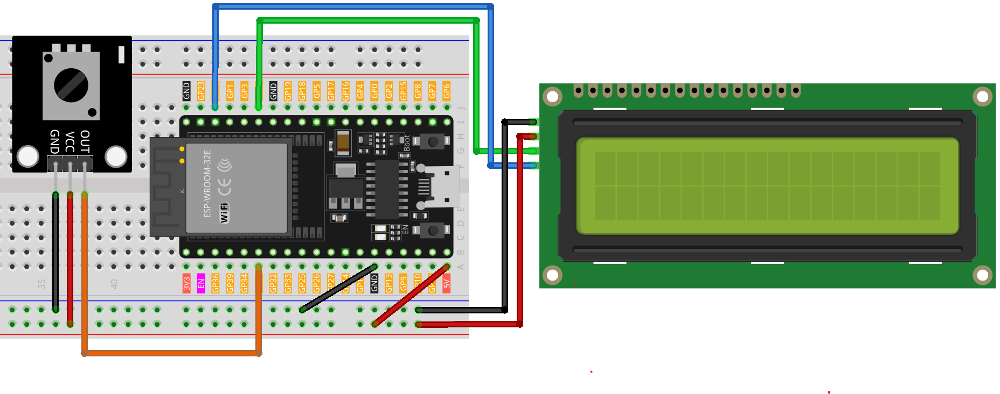

.. note::

    Hello, welcome to the SunFounder Raspberry Pi & Arduino & ESP32 Enthusiasts Community on Facebook! Dive deeper into Raspberry Pi, Arduino, and ESP32 with fellow enthusiasts.

    **Why Join?**

    - **Expert Support**: Solve post-sale issues and technical challenges with help from our community and team.
    - **Learn & Share**: Exchange tips and tutorials to enhance your skills.
    - **Exclusive Previews**: Get early access to new product announcements and sneak peeks.
    - **Special Discounts**: Enjoy exclusive discounts on our newest products.
    - **Festive Promotions and Giveaways**: Take part in giveaways and holiday promotions.

    👉 Ready to explore and create with us? Click [|link_sf_facebook|] and join today!

.. _esp32_potentiometer_scale_value:

Lesson 41: Potentiometer scale value
=============================================================

This project focuses on reading a potentiometer's value and displaying it on an LCD 1620 equipped with an I2C interface. 
Additionally, the value is transmitted to the serial monitor for live monitoring. 
A distinctive aspect of this project is the graphical representation of the potentiometer's value on the LCD, 
which is depicted as a variable-length bar proportional to the potentiometer's reading.

Required Components
---------------------------

.. list-table::
    :widths: 30 20
    :header-rows: 1

    *   - Component Introduction
        - Purchase Link

    *   - ESP32 Development Board
        - \-
    *   - :ref:`cpn_potentiometer`
        - \-
    *   - :ref:`cpn_i2c_lcd1602`
        - \-
    *   - :ref:`cpn_breadboard`
        - |link_breadboard_buy|
        

Wiring
---------------------------

Code
---------------------------

.. raw:: html

   <iframe src=https://create.arduino.cc/editor/sunfounder01/407cf491-e932-4334-a3f3-e04f7309c941/preview?embed style="height:510px;width:100%;margin:10px 0" frameborder=0></iframe>

   
Code Analysis
---------------------------

The core functionality of this project is to consistently read the potentiometer's value, map it to a scaled range (0-16), and display the result both numerically and graphically on the LCD. The implementation minimizes jitter by updating the display only when significant changes in the reading occur, thus maintaining a smooth visual experience.

1. **Library Inclusion and Initialization**:

   .. code-block:: arduino
   
      // Required libraries for I2C and LCD operations
      #include <Wire.h>
      #include <LiquidCrystal_I2C.h>

      // Initialize LCD at I2C address 0x27 with 16 columns and 2 rows
      LiquidCrystal_I2C lcd(0x27, 16, 2);

   This segment incorporates the necessary libraries for I2C communication and LCD control. It then initializes an LCD instance with the I2C address of ``0x27``, specifying its dimensions as ``16 columns`` and ``2 rows``.

2. **Variable Declaration**:

   .. code-block:: arduino
   
      // Variables to hold the potentiometer readings
      int lastRead = 0;     // Previous potentiometer value
      int currentRead = 0;  // Current potentiometer value

   Variables ``lastRead`` and ``currentRead`` are used to keep track of the potentiometer's readings across different moments.

3. **setup() Function**:

   .. code-block:: arduino
   
      void setup() {
        lcd.init();          // Initiates the LCD
        lcd.backlight();     // Activates the LCD's backlight
        Serial.begin(9600);  // Commences serial communication at 9600 baud
      }

   This function prepares the LCD and starts serial communication, setting up the environment for the project's operation.

4. **Main Loop**:

   .. code-block:: arduino
   
      void loop() {
         // Read the current potentiometer value
         int currentRead = analogRead(35);

         // Map the read value from 0-4096 to 0-16
         int barLength = map(currentRead, 0, 4096, 0, 16);

         // Update LCD only if the difference between current and last reading is greater than 2 to avoid jitter
         if (abs(lastRead - currentRead) > 2) {
            lcd.clear();
            lcd.setCursor(0, 0);
            lcd.print("Value:");
            lcd.setCursor(7, 0);
            lcd.print(currentRead);
            Serial.println(currentRead);

            // Display a bar on the second row of LCD proportional to the potentiometer value
            for (int i = 0; i < barLength; i++) {
               lcd.setCursor(i, 1);
               lcd.print(char(255));
            }
         }
         // Update the last read value for the next iteration
         lastRead = currentRead;

         // Introduce a delay for a stable reading
         delay(200);
      }

   * Reads the potentiometer and converts its value to a scale suitable for visual representation.
   * Updates the LCD only when a meaningful change is detected, displaying the numeric value and a corresponding bar graph.
   * Also sends the reading to the serial monitor for external observation.
   * Ensures stability and responsiveness by introducing a brief delay between iterations.

