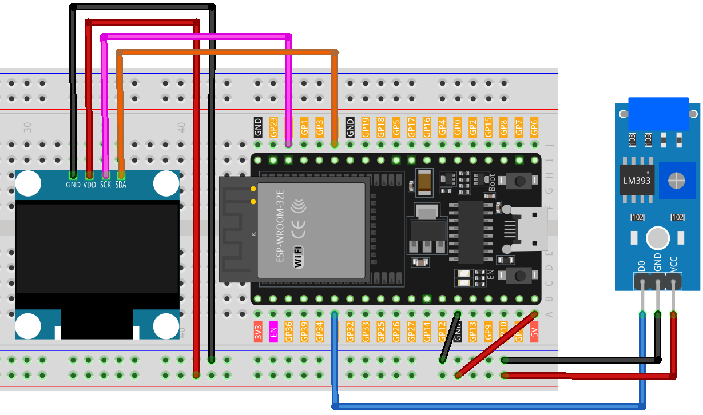

.. note::

    Hello, welcome to the SunFounder Raspberry Pi & Arduino & ESP32 Enthusiasts Community on Facebook! Dive deeper into Raspberry Pi, Arduino, and ESP32 with fellow enthusiasts.

    **Why Join?**

    - **Expert Support**: Solve post-sale issues and technical challenges with help from our community and team.
    - **Learn & Share**: Exchange tips and tutorials to enhance your skills.
    - **Exclusive Previews**: Get early access to new product announcements and sneak peeks.
    - **Special Discounts**: Enjoy exclusive discounts on our newest products.
    - **Festive Promotions and Giveaways**: Take part in giveaways and holiday promotions.

    👉 Ready to explore and create with us? Click [|link_sf_facebook|] and join today!

.. _esp32_digital_dice:

Lesson 42: Digital Dice
=============================================================

This program simulates a dice roll using an OLED display. 
The simulation is triggered by shaking the vibration switch, causing the display to cycle through numbers 1 to 6, 
akin to rolling a dice. 
The display halts after a short duration, revealing a randomly selected number that represents the dice roll outcome.

Required Components
--------------------------

In this project, we need the following components. 

It's definitely convenient to buy a whole kit, here's the link: 

.. list-table::
    :widths: 20 20 20
    :header-rows: 1

    *   - Name	
        - ITEMS IN THIS KIT
        - LINK
    *   - Universal Maker Sensor Kit
        - 94
        - |link_umsk|

You can also buy them separately from the links below.

.. list-table::
    :widths: 30 20
    :header-rows: 1

    *   - Component Introduction
        - Purchase Link

    *   - ESP32 & Development Board
        - |link_esp32_camera_pro_kit_buy|
    *   - :ref:`cpn_vibration`
        - |link_sw420_vibration_module_buy|
    *   - :ref:`cpn_oled`
        - \-
    *   - :ref:`cpn_breadboard`
        - |link_breadboard_buy|
        

Wiring
---------------------------

Code
---------------------------

.. raw:: html

    <iframe src=https://create.arduino.cc/editor/sunfounder01/f3c250f6-c5f6-4dc9-906a-a5a914741fe3/preview?embed style="height:510px;width:100%;margin:10px 0" frameborder=0></iframe>

Code Analysis
---------------------------

A comprehensive breakdown of the code:

1. Initialization of variables:

    ``vibPin``: Digital pin connected to the vibration sensor.

    .. code-block:: arduino

        const int vibPin = 35;    // The pin where the vib switch is connected

2. Volatile variables:

    ``rolling``: A volatile flag that indicates the dice's rolling status. It is volatile as it is accessed within both the interrupt service routine and the main program.

    .. code-block:: arduino

        volatile bool rolling = false;

3. ``setup()``:

    Configures the vibration sensor's input mode.
    Assigns an interrupt to the sensor to trigger the rollDice function upon state change.
    Initializes the OLED display.

    .. code-block:: arduino

        void setup() {
            // Initialize pins
            pinMode(vibPin, INPUT);  

            // initialize the OLED object
            if (!display.begin(SSD1306_SWITCHCAPVCC, SCREEN_ADDRESS)) {
                Serial.println(F("SSD1306 allocation failed"));
                for (;;)
                ;
            }

            // Attach an interrupt to the vibPin. When the vib switch is activated, the shakeDetected function will be called
            attachInterrupt(digitalPinToInterrupt(vibPin), rollDice, CHANGE);
        }

4. ``loop()``:

    Continuously checks if ``rolling`` is true, displaying a random number between 1 and 6 during this state. The rolling ceases if the sensor has been shaken for over 500 milliseconds.

    .. code-block:: arduino

        void loop() {
            // Check if it's rolling
            if (rolling) {
                byte number = random(1, 7);  // Generate a random number between 1 and 6
                displayNumber(number);
                delay(80);  // Delay to make the rolling effect visible

                // Stop rolling after 1 second
                if ((millis() - lastShakeTime) > 1000) {
                    rolling = false;
                }
            }
        }

5. ``rollDice()``:

    The interrupt service routine for the vibration sensor. It initiates the dice roll when the sensor is shaken by recording the current time.

    .. code-block:: arduino

        // Interrupt handler for shake detection
        void rollDice() {
            if (digitalRead(vibPin) == LOW) {
                lastShakeTime = millis();  // Record the time of shake
                rolling = true;            // Start rolling
            }
        }

6. ``displayNumber()``:

    Displays a selected number on the OLED screen.

    .. code-block:: arduino

        // Function to display a number on the 7-segment display
        void displayNumber(byte number) {
            display.clearDisplay();  // Clear the screen

            // Display Text
            display.setTextSize(4);       // Set text size
            display.setTextColor(WHITE);  // Set text color
            display.setCursor(54, 20);     // Set cursor position
            display.println(number);
            display.display();  // Display the content on the screen

        }