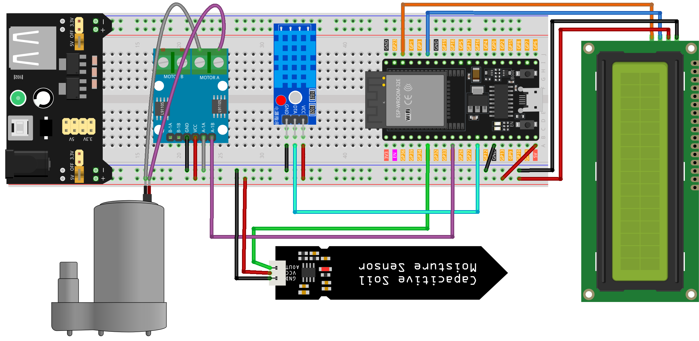

.. note::

    こんにちは、SunFounder Raspberry Pi & Arduino & ESP32 Enthusiasts Communityへようこそ！Facebook上で、仲間と一緒にRaspberry Pi、Arduino、ESP32をさらに深く探求しましょう。

    **なぜ参加するのか？**

    - **専門的なサポート**：購入後の問題や技術的な課題をコミュニティやチームの助けを借りて解決。
    - **学びと共有**：スキルを向上させるためのヒントやチュートリアルを交換。
    - **限定プレビュー**：新製品発表や予告編に早期アクセス。
    - **特別割引**：最新製品の特別割引を楽しむ。
    - **フェスティブプロモーションとプレゼント**：プレゼントやホリデープロモーションに参加。

    👉 私たちと一緒に探索と創造を始める準備はできましたか？[|link_sf_facebook|]をクリックして、今すぐ参加しましょう！

.. _esp32_plant_monitor:

レッスン43: プラントモニター
=============================================================

このプロジェクトは、土壌の湿度レベルが所定の閾値を下回ると水ポンプを作動させることで、植物の水やりを自動化します。
また、LCDディスプレイには温度、湿度、および土壌湿度レベルが表示され、ユーザーに植物の環境条件に関する貴重な情報を提供します。

必要な部品
--------------------------

このプロジェクトでは、以下の部品が必要です。

セット全体を購入するのが便利です。リンクはこちらです：

.. list-table::
    :widths: 20 20 20
    :header-rows: 1

    *   - Name	
        - ITEMS IN THIS KIT
        - LINK
    *   - Universal Maker Sensor Kit
        - 94
        - |link_umsk|

以下のリンクから個別に購入することもできます。

.. list-table::
    :widths: 30 20
    :header-rows: 1

    *   - Component Introduction
        - Purchase Link

    *   - ESP32 & Development Board
        - |link_esp32_camera_pro_kit_buy|
    *   - :ref:`cpn_breadboard`
        - |link_breadboard_buy|
    *   - :ref:`cpn_power_module`
        - \-
    *   - :ref:`cpn_i2c_lcd1602`
        - |link_i2clcd1602_buy|
    *   - :ref:`cpn_pump`
        - \-
    *   - :ref:`cpn_l9110`
        - \-
    *   - :ref:`cpn_soil`
        - |link_soil_moisture_buy|
    *   - :ref:`cpn_dht11`
        - \-

配線
---------------------------

.. note:: 
   このキットには異なるバージョンのDHT11モジュールが含まれている場合があります。お持ちのモジュールに応じて配線方法を確認してください。

.. image:: img/Lesson_43_Plant_monitor_esp32_bb.png
    :width: 100%

コード
---------------------------

.. note:: 
   ライブラリをインストールするには、Arduino Library Managerを使用し、 **"LiquidCrystal I2C"**と **"DHT sensor library"** を検索してインストールしてください。

.. raw:: html

    <iframe src=https://create.arduino.cc/editor/sunfounder01/c769b454-80f4-4516-83ce-9ff702d8627f/preview?embed style="height:510px;width:100%;margin:10px 0" frameborder=0></iframe>

コード解析
---------------------------

このコードは環境パラメータを監視しながら植物の水やりをシームレスに管理するように設計されています。

1. ライブラリのインクルードと定数・変数の宣言:

    ``Wire.h`` 、 ``LiquidCrystal_I2C.h`` 、および ``DHT.h`` ライブラリをインクルードして機能を提供します。
    DHT11センサー、土壌湿度センサー、水ポンプのピン割り当てと設定を指定します。

    .. note:: 
       ライブラリをインストールするには、Arduino Library Managerを使用し、 **"LiquidCrystal I2C"**と **"DHT sensor library"** を検索してインストールしてください。

    .. code-block:: arduino

        #include <Wire.h>
        #include <LiquidCrystal_I2C.h>
        #include <DHT.h>

        #define DHTPIN 14              // Digital pin for DHT11 sensor
        #define DHTTYPE DHT11         // DHT11 sensor type
        #define SOIL_MOISTURE_PIN 35  // Analog pin for soil moisture sensor
        #define WATER_PUMP_PIN 25      // Digital pin for water pump

        // Initialize sensor and LCD objects
        DHT dht(DHTPIN, DHTTYPE);
        LiquidCrystal_I2C lcd(0x27, 16, 2);

2. ``setup()``:

    土壌湿度センサーとポンプのピンモードを設定します。
    初めにポンプをオフにします。
    LCDを初期化してバックライトをオンにします。
    DHTセンサーを起動します。

    .. code-block:: arduino

        void setup() {
            // Set pin modes
            pinMode(SOIL_MOISTURE_PIN, INPUT);
            pinMode(WATER_PUMP_PIN, OUTPUT);

            // Initialize water pump as off
            digitalWrite(WATER_PUMP_PIN, LOW);

            // Initialize LCD and backlight
            lcd.init();
            lcd.backlight();

            // Start DHT sensor
            dht.begin();
        }

3. ``loop()``:

    DHTセンサーを使用して湿度と温度を測定します。
    土壌湿度センサーで土壌の湿度を測定します。
    温度と湿度をLCDに表示し、その後に土壌湿度レベルを表示します。
    土壌湿度を評価して水ポンプの作動を判断します。土壌湿度が500（調整可能な閾値）を下回る場合は、ポンプを1秒間作動させます。

    .. code-block:: arduino

        void loop() {
            // Read humidity and temperature from DHT11
            float humidity = dht.readHumidity();
            float temperature = dht.readTemperature();

            // Read soil moisture level
            int soilMoisture = analogRead(SOIL_MOISTURE_PIN);

            // Display temperature and humidity on LCD
            lcd.clear();
            lcd.setCursor(0, 0);
            lcd.print("Temp: " + String(temperature) + "C");
            lcd.setCursor(0, 1);
            lcd.print("Humidity: " + String(humidity) + "%");

            delay(2000);

            // Display soil moisture on LCD
            lcd.clear();
            lcd.setCursor(0, 0);
            lcd.print("Soil Moisture: ");
            lcd.setCursor(0, 1);
            lcd.print(String(soilMoisture));

            // Activate water pump if soil is dry
            if (soilMoisture > 650) {
                digitalWrite(WATER_PUMP_PIN, HIGH);  // Turn on water pump
                delay(1000);                         // Pump water for 1 second
                digitalWrite(WATER_PUMP_PIN, LOW);   // Turn off water pump
            }

            delay(2000);  // Wait before next loop iteration
        }

