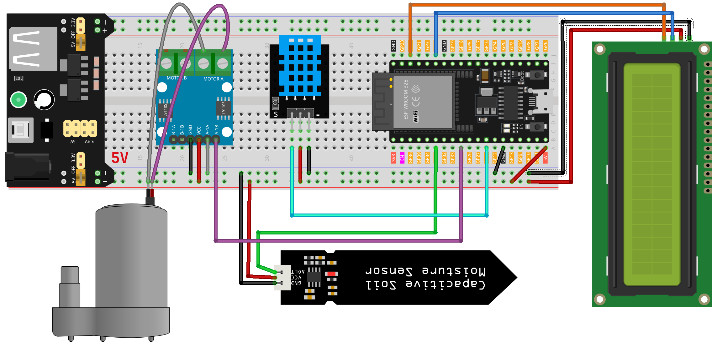

 .. note::

    Hallo und willkommen in der SunFounder Raspberry Pi & Arduino & ESP32 Enthusiasten-Gemeinschaft auf Facebook! Tauchen Sie tiefer ein in die Welt von Raspberry Pi, Arduino und ESP32 mit anderen Enthusiasten.

    **Warum beitreten?**

    - **Expertenunterstützung**: Lösen Sie Nachverkaufsprobleme und technische Herausforderungen mit Hilfe unserer Gemeinschaft und unseres Teams.
    - **Lernen & Teilen**: Tauschen Sie Tipps und Anleitungen aus, um Ihre Fähigkeiten zu verbessern.
    - **Exklusive Vorschauen**: Erhalten Sie frühzeitigen Zugang zu neuen Produktankündigungen und exklusiven Einblicken.
    - **Spezialrabatte**: Genießen Sie exklusive Rabatte auf unsere neuesten Produkte.
    - **Festliche Aktionen und Gewinnspiele**: Nehmen Sie an Gewinnspielen und Feiertagsaktionen teil.

    👉 Sind Sie bereit, mit uns zu erkunden und zu erschaffen? Klicken Sie auf [|link_sf_facebook|] und treten Sie heute bei!

.. _esp32_plant_monitor:

Lektion 43: Pflanzenmonitor
=============================================================

Dieses Projekt automatisiert intelligent die Bewässerung von Pflanzen, indem eine Wasserpumpe aktiviert wird, sobald der Bodenfeuchtigkeitsgehalt unter einen festgelegten Schwellenwert fällt. 
Es verfügt auch über ein LCD-Display, das Temperatur, Luftfeuchtigkeit und Bodenfeuchtigkeitswerte anzeigt, und bietet den Benutzern wertvolle Einblicke in die Umweltbedingungen der Pflanze.

Benötigte Komponenten
--------------------------

Für dieses Projekt benötigen wir die folgenden Komponenten. 

Es ist definitiv praktisch, ein ganzes Kit zu kaufen, hier ist der Link: 

.. list-table::
    :widths: 20 20 20
    :header-rows: 1

    *   - Name    
        - ITEMS IN THIS KIT
        - LINK
    *   - Universal Maker Sensor Kit
        - 94
        - |link_umsk|

Sie können sie auch separat über die untenstehenden Links kaufen.

.. list-table::
    :widths: 30 20
    :header-rows: 1

    *   - Component Introduction
        - Purchase Link

    *   - ESP32 & Development Board
        - |link_esp32_camera_pro_kit_buy|
    *   - :ref:`cpn_breadboard`
        - |link_breadboard_buy|
    *   - :ref:`cpn_power_module`
        - \-
    *   - :ref:`cpn_i2c_lcd1602`
        - |link_i2clcd1602_buy|
    *   - :ref:`cpn_pump`
        - \-
    *   - :ref:`cpn_l9110`
        - \-
    *   - :ref:`cpn_soil`
        - |link_soil_moisture_buy|
    *   - :ref:`cpn_dht11`
        - \-

Verdrahtung
---------------------------

Code
---------------------------

.. raw:: html

    <iframe src=https://create.arduino.cc/editor/sunfounder01/c769b454-80f4-4516-83ce-9ff702d8627f/preview?embed style="height:510px;width:100%;margin:10px 0" frameborder=0></iframe>
    

Code-Analyse
---------------------------

Der Code ist so strukturiert, dass er nahtlos die Pflanzenbewässerung verwaltet, indem Umgebungsparameter überwacht werden:

1. Bibliotheken und Konstanten/Variablen:

    Einbinden der Bibliotheken ``Wire.h``, ``LiquidCrystal_I2C.h`` und ``DHT.h`` für die Funktionalität.
    Festlegen der Pinbelegungen und Einstellungen für den DHT11-Sensor, den Bodenfeuchtigkeitssensor und die Wasserpumpe.

    .. code-block:: arduino

        #include <Wire.h>
        #include <LiquidCrystal_I2C.h>
        #include <DHT.h>

        #define DHTPIN 14              // Digital pin for DHT11 sensor
        #define DHTTYPE DHT11         // DHT11 sensor type
        #define SOIL_MOISTURE_PIN 35  // Analog pin for soil moisture sensor
        #define WATER_PUMP_PIN 25      // Digital pin for water pump

        // Initialize sensor and LCD objects
        DHT dht(DHTPIN, DHTTYPE);
        LiquidCrystal_I2C lcd(0x27, 16, 2);

2. ``setup()``:

    Konfigurieren der Pin-Modi für den Feuchtigkeitssensor und die Pumpe.
    Deaktivieren der Pumpe zu Beginn.
    Initialisieren und Hintergrundbeleuchtung des LCD.
    Aktivieren des DHT-Sensors.

    .. code-block:: arduino

        void setup() {
            // Set pin modes
            pinMode(SOIL_MOISTURE_PIN, INPUT);
            pinMode(WATER_PUMP_PIN, OUTPUT);

            // Initialize water pump as off
            digitalWrite(WATER_PUMP_PIN, LOW);

            // Initialize LCD and backlight
            lcd.init();
            lcd.backlight();

            // Start DHT sensor
            dht.begin();
        }

3. ``loop()``:

    Messen der Luftfeuchtigkeit und Temperatur über den DHT-Sensor.
    Erfassen der Bodenfeuchtigkeit über den Bodenfeuchtigkeitssensor.
    Anzeigen der Temperatur und Luftfeuchtigkeit auf dem LCD, anschließend der Bodenfeuchtigkeitswerte.
    Überprüfen der Bodenfeuchtigkeit zur Entscheidung über die Wasserpumpenaktivierung; wenn die Bodenfeuchtigkeit unter 500 (anpassbarer Schwellenwert) liegt, die Pumpe für 1 Sekunde laufen lassen.

    .. code-block:: arduino

        void loop() {
            // Read humidity and temperature from DHT11
            float humidity = dht.readHumidity();
            float temperature = dht.readTemperature();

            // Read soil moisture level
            int soilMoisture = analogRead(SOIL_MOISTURE_PIN);

            // Display temperature and humidity on LCD
            lcd.clear();
            lcd.setCursor(0, 0);
            lcd.print("Temp: " + String(temperature) + "C");
            lcd.setCursor(0, 1);
            lcd.print("Humidity: " + String(humidity) + "%");

            delay(2000);

            // Display soil moisture on LCD
            lcd.clear();
            lcd.setCursor(0, 0);
            lcd.print("Soil Moisture: ");
            lcd.setCursor(0, 1);
            lcd.print(String(soilMoisture));

            // Activate water pump if soil is dry
            if (soilMoisture > 650) {
                digitalWrite(WATER_PUMP_PIN, HIGH);  // Turn on water pump
                delay(1000);                         // Pump water for 1 second
                digitalWrite(WATER_PUMP_PIN, LOW);   // Turn off water pump
            }

            delay(2000);  // Wait before next loop iteration
        }

