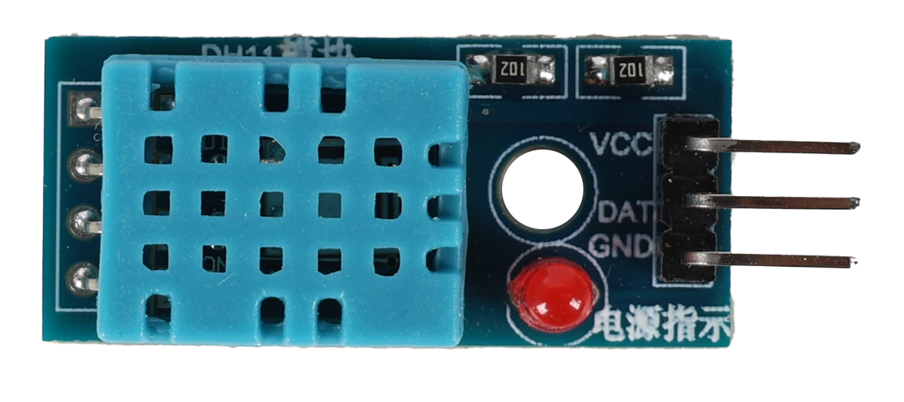

.. note::

    Hello, welcome to the SunFounder Raspberry Pi & Arduino & ESP32 Enthusiasts Community on Facebook! Dive deeper into Raspberry Pi, Arduino, and ESP32 with fellow enthusiasts.

    **Why Join?**

    - **Expert Support**: Solve post-sale issues and technical challenges with help from our community and team.
    - **Learn & Share**: Exchange tips and tutorials to enhance your skills.
    - **Exclusive Previews**: Get early access to new product announcements and sneak peeks.
    - **Special Discounts**: Enjoy exclusive discounts on our newest products.
    - **Festive Promotions and Giveaways**: Take part in giveaways and holiday promotions.

    👉 Ready to explore and create with us? Click [|link_sf_facebook|] and join today!

.. _esp32_adafruit_io:

Lesson 48: Temperature and Humidity Monitoring with Adafruit IO
===========================================================================

In this project, we will guide you on how to use a popular IoT platform. There are many free (or low-cost) platforms available online for programming enthusiasts. Some examples are Adafruit IO, Blynk, Arduino Cloud, ThingSpeak, and so on. The usage of these platforms is quite similar. Here, we will be focusing on Adafruit IO.

We will write an Arduino program that uses the DHT11 sensor to send temperature and humidity readings to Adafruit IO's dashboard. You can also control an LED on the circuit through a switch on the dashboard.

**Required Components**

In this project, we need the following components. 

It's definitely convenient to buy a whole kit, here's the link: 

.. list-table::
    :widths: 20 20 20
    :header-rows: 1

    *   - Name	
        - ITEMS IN THIS KIT
        - LINK
    *   - Universal Maker Sensor Kit
        - 94
        - |link_umsk|

You can also buy them separately from the links below.

.. list-table::
    :widths: 30 20
    :header-rows: 1

    *   - COMPONENT INTRODUCTION
        - PURCHASE LINK

    *   - ESP32 & Development Board (:ref:`cpn_esp32_wroom_32e`)
        - |link_esp32_camera_pro_kit_buy|
    *   - :ref:`cpn_rgb`
        - \-
    *   - :ref:`cpn_dht11`
        - |link_dht11_humiture_buy|

**Setting up the Dashboard**

#. Visit |link_adafruit_io|, then click on **Start for free** to create a free account.

   .. image:: img/sp230516_102503.png

#. Fill out the form to create an account.

   .. image:: img/sp230516_102629.png

#. After creating an Adafruit account, you'll need to reopen Adafruit io. Click on the **Dashboards**, then click on **New Dashboard**.

   .. image:: img/sp230516_103347.png

#. Create a **New Dashboard**.

   .. image:: img/sp230516_103744.png

#. Enter the newly created **Dashboard** and create a new block.

   .. image:: img/sp230516_104234.png

#. Create 1 **Toggle** block.

   .. image:: img/sp230516_105727.png

#. Next, you'll need to create a new feed here. This toggle will be used to control the LED, and we'll name this feed "LED".

   .. image:: img/sp230516_105641.png

#. Check the **LED** feed, then move to the next step.

   .. image:: img/sp230516_105925.png

#. Complete the block settings (mainly Block Title, On Text, and Off Text), then click on the **Create block** button at the bottom right to finish.

   .. image:: img/sp230516_110124.png

#. We also need to create two **Text Blocks** next. They will be used to display temperature and humidity. So, create two feeds named **temperature** and **humidity**.

   .. image:: img/sp230516_110657.png

#. After creation, your Dashboard should look something like this:

   .. image:: img/sp230516_111134.png

#. You can adjust the layout by using the **Edit Layout** option on the Dashboard.

   .. image:: img/sp230516_111240.png

#. Click on **API KEY**, and you will see your username and **API KEY** displayed. Note these down as you'll need them for your code.

   .. image:: img/sp230516_111641.png

**Running the Code**

.. |dht11_module| image:: img/Lesson_19_dht11_module.png 
   :width: 100px

.. |dht11_module_circuit| image:: img/Lesson_48_iot_adafruitio_bb.png
   :width: 500px

.. |dht11_module_withLED_circuit| image:: img/Lesson_48_iot_adafruitio_new_bb.png
   :width: 500px

#. Build the circuit. 

   .. note:: 
      The kit may contain different versions of the DHT11 module. Please confirm the wiring method according to the module you have.
   
   .. csv-table:: 
      :header: "module", "diagram"
      :widths: 25, 75
   
      |dht11_module|, |dht11_module_circuit|
      |dht11_module_withLED|, |dht11_module_withLED_circuit|

#. Then, connect ESP32 to the computer using the USB cable.

#. Open the code.

   * Open the ``Lesson_48_Adafruit_IO.ino`` file located in the ``universal-maker-sensor-kit\esp32\Lesson_48_Adafruit_IO`` directory, or copy the code into the Arduino IDE.
   * After selecting the board (ESP32 Dev Module) and the appropriate port, click the **Upload** button.
   * :ref:`unknown_com_port`
   * The ``Adafruit_MQTT Library`` and ``DHT sensor library`` are used here, you can install them from the **Library Manager**.

   .. raw:: html

       <iframe src=https://create.arduino.cc/editor/sunfounder01/987fb2fd-47e9-4a73-9020-6b2111eadd9c/preview?embed style="height:510px;width:100%;margin:10px 0" frameborder=0></iframe>

#. Find the following lines and replace ``<SSID>`` and ``<PASSWORD>`` with the specific details of your WiFi network.

   .. code-block::  Arduino

       /************************* WiFi Access Point *********************************/

       #define WLAN_SSID "<SSID>"
       #define WLAN_PASS "<PASSWORD>"

#. Then replace ``<YOUR_ADAFRUIT_IO_USERNAME>`` with your Adafruit IO username and ``<YOUR_ADAFRUIT_IO_KEY>`` with the **API KEY** you just copied.

   .. code-block::  Arduino

       // Adafruit IO Account Configuration
       // (to obtain these values, visit https://io.adafruit.com and click on Active Key)
       #define AIO_USERNAME "<YOUR_ADAFRUIT_IO_USERNAME>"
       #define AIO_KEY      "<YOUR_ADAFRUIT_IO_KEY>"

#. After selecting the correct board (ESP32 Dev Module) and port, click the **Upload** button.

#. Once the code is successfully uploaded, you will observe the following message in the serial monitor, indicating successful communication with Adafruit IO.
    
   .. code-block::

       Adafruit IO MQTTS (SSL/TLS) Example

       Connecting to xxxxx
       WiFi connected
       IP address: 
       192.168.18.76
       Connecting to MQTT... MQTT Connected!
       Temperature: 27.10
       Humidity: 61.00

#. Navigate back to Adafruit IO. Now you can observe the temperature and humidity readings on the dashboard, or utilize the LED toggle switch to control the on/off state of the external LED connected to the circuit.

   .. image:: img/sp230516_143220.png
