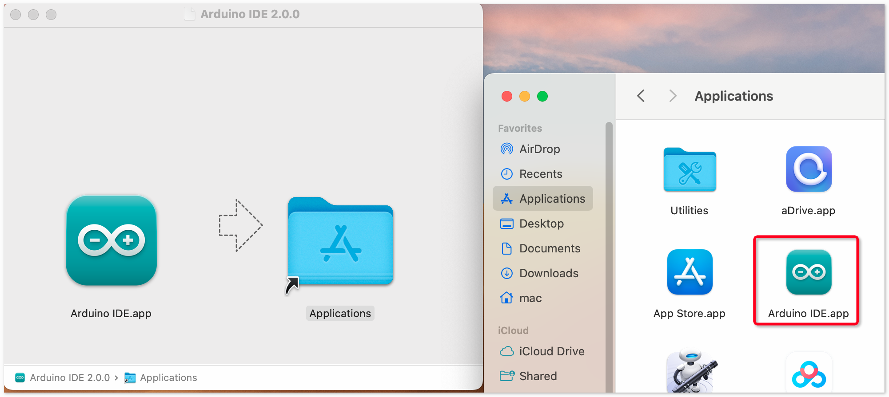

.. note::

    こんにちは、SunFounder Raspberry Pi & Arduino & ESP32 Enthusiasts Communityへようこそ！Facebook上で、仲間と一緒にRaspberry Pi、Arduino、ESP32をさらに深く探求しましょう。

    **なぜ参加するのか？**

    - **専門的なサポート**：購入後の問題や技術的な課題をコミュニティやチームの助けを借りて解決。
    - **学びと共有**：スキルを向上させるためのヒントやチュートリアルを交換。
    - **限定プレビュー**：新製品発表や予告編に早期アクセス。
    - **特別割引**：最新製品の特別割引を楽しむ。
    - **フェスティブプロモーションとプレゼント**：プレゼントやホリデープロモーションに参加。

    👉 私たちと一緒に探索と創造を始める準備はできましたか？[|link_sf_facebook|]をクリックして、今すぐ参加しましょう！

.. _install_arduino:

Arduino IDEのインストール(重要)
======================================

Arduino IDE（Arduino Integrated Development Environment）は、Arduinoプロジェクトを完了するために必要なすべてのソフトウェアサポートを提供します。これはArduino専用に設計されたプログラミングソフトウェアであり、Arduinoチームによって提供されており、プログラムを作成し、それをArduinoボードにアップロードすることができます。

Arduino IDE 2.0はオープンソースプロジェクトであり、堅牢な前身であるArduino IDE 1.xから大きな一歩を踏み出しています。新しいUI、改善されたボード＆ライブラリマネージャー、デバッガー、オートコンプリート機能などが搭載されています。

このチュートリアルでは、Windows、Mac、またはLinuxコンピュータにArduino IDE 2.0をダウンロードしてインストールする方法を紹介します。

必要条件
-------------------

* Windows - Win 10 and newer, 64 bits
* Linux - 64 bits
* Mac OS X - Version 10.14: "Mojave" or newer, 64 bits

Arduino IDE 2.0のダウンロード
-------------------------------

#. |link_download_arduino| を訪問してください。

#. ご使用のOSバージョンに対応するIDEをダウンロードしてください。

   .. image:: img/install_ide_01.png

インストール
------------------------------

Windows
^^^^^^^^^^^^^

#. ダウンロードした ``arduino-ide_xxxx.exe`` ファイルをダブルクリックして実行します。

#. ライセンス契約を読み、同意します。

   .. image:: img/install_ide_02.png

#. インストールオプションを選択します。

   .. image:: img/install_ide_03.png

#. インストール先を選択します。ソフトウェアはシステムドライブ以外のドライブにインストールすることをお勧めします。

   .. image:: img/install_ide_04.png

#. インストール完了。

   .. image:: img/install_ide_05.png

macOS
^^^^^^^^^^^^^^^^

ダウンロードした ``arduino_ide_xxxx.dmg`` ファイルをダブルクリックし、指示に従って **Arduino IDE.app**を **Applications**フォルダにコピーします。数秒後にArduino IDEが正常にインストールされます。

Linux
^^^^^^^^^^^^

LinuxシステムにArduino IDE 2.0をインストールするチュートリアルについては、以下を参照してください：https://docs.arduino.cc/software/ide-v2/tutorials/getting-started/ide-v2-downloading-and-installing#linux

IDEを開く
--------------

#. Arduino IDE 2.0を初めて開くと、自動的にArduino AVRボード、ビルトインライブラリ、およびその他の必要なファイルがインストールされます。

   .. image:: img/install_ide_06.png

#. さらに、ファイアウォールやセキュリティセンターがデバイスドライバのインストールを求めるポップアップが表示されることがあります。すべてインストールしてください。

   .. image:: img/install_ide_07.png

#. これでArduino IDEの準備が整いました！

   .. note::
       ネットワークの問題などで一部のインストールがうまくいかなかった場合、Arduino IDEを再度開くことで残りのインストールが完了します。すべてのインストールが完了すると、出力ウィンドウは自動的には開きませんが、[Verify]または[Upload]をクリックすると表示されます。
