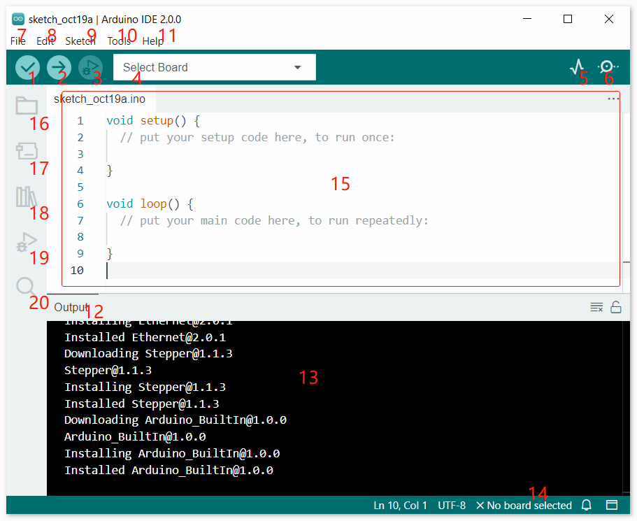

 .. note::

    Hallo und willkommen in der SunFounder Raspberry Pi & Arduino & ESP32 Enthusiasten-Gemeinschaft auf Facebook! Tauchen Sie tiefer ein in die Welt von Raspberry Pi, Arduino und ESP32 mit anderen Enthusiasten.

    **Warum beitreten?**

    - **Expertenunterstützung**: Lösen Sie Nachverkaufsprobleme und technische Herausforderungen mit Hilfe unserer Gemeinschaft und unseres Teams.
    - **Lernen & Teilen**: Tauschen Sie Tipps und Anleitungen aus, um Ihre Fähigkeiten zu verbessern.
    - **Exklusive Vorschauen**: Erhalten Sie frühzeitigen Zugang zu neuen Produktankündigungen und exklusiven Einblicken.
    - **Spezialrabatte**: Genießen Sie exklusive Rabatte auf unsere neuesten Produkte.
    - **Festliche Aktionen und Gewinnspiele**: Nehmen Sie an Gewinnspielen und Feiertagsaktionen teil.

    👉 Sind Sie bereit, mit uns zu erkunden und zu erschaffen? Klicken Sie auf [|link_sf_facebook|] und treten Sie heute bei!

Einführung in die Arduino IDE
=================================

1. **Verify**: Kompiliert Ihren Code. Bei Syntaxfehlern werden entsprechende Fehler angezeigt.

2. **Upload**: Lädt den Code auf Ihr Board hoch. Beim Klicken auf den Button blinken die RX- und TX-LEDs auf dem Board schnell und stoppen erst, wenn der Upload abgeschlossen ist.

3. **Debug**: Für zeilenweises Fehlerprüfen.

4. **Select Board**: Schnelle Einrichtung von Board und Port.

5. **Serial Plotter**: Überprüft die Änderung des Messwerts.

6. **Serial Monitor**: Klicken Sie auf den Button, und ein Fenster erscheint. Es empfängt die vom Steuerboard gesendeten Daten und ist sehr nützlich für die Fehlersuche.

7. **File**: Klicken Sie auf das Menü und eine Dropdown-Liste erscheint, die Datei-Erstellung, -Öffnung, -Speicherung, -Schließung sowie einige Parameterkonfigurationen umfasst.

8. **Edit**: Klicken Sie auf das Menü. In der Dropdown-Liste befinden sich Bearbeitungsfunktionen wie **Ausschneiden**, **Kopieren**, **Einfügen**, **Suchen** usw. mit den entsprechenden Tastenkürzeln.

9. **Sketch**: Beinhaltet Funktionen wie **Verify**, **Upload**, **Add** Dateien usw. Wichtige Funktion ist **Include Library** - hier können Sie Bibliotheken hinzufügen.

10. **Tool**: Beinhaltet Werkzeuge - am häufigsten verwendet werden Board (das verwendete Board) und Port (der Port, an dem Ihr Board angeschlossen ist). Jedes Mal, wenn Sie den Code hochladen möchten, müssen Sie diese auswählen oder überprüfen.

11. **Help**: Wenn Sie ein Anfänger sind, können Sie die Optionen unter diesem Menü überprüfen und die benötigte Hilfe erhalten, einschließlich der Bedienung in der IDE, Einführungsinformationen, Fehlerbehebung, Codeerklärung usw.

12. **Output Bar**: Wechselt den Ausgabe-Tab.

13. **Output Window**: Gibt Informationen aus.

14. **Board and Port**: Hier können Sie das ausgewählte Board und den Port für den Code-Upload einsehen. Sie können sie erneut über **Tools** -> **Board** / **Port** auswählen, falls etwas falsch ist.

15. Der Bearbeitungsbereich der IDE. Hier können Sie den Code schreiben.

16. **Sketchbook**: Zum Verwalten von Sketch-Dateien.

17. **Board Manager**: Zum Verwalten der Board-Treiber.

18. **Library Manager**: Zum Verwalten Ihrer Bibliotheksdateien.

19. **Debug**: Hilft beim Debuggen des Codes.

20. **Search**: Durchsucht den Code in Ihren Sketchen.

