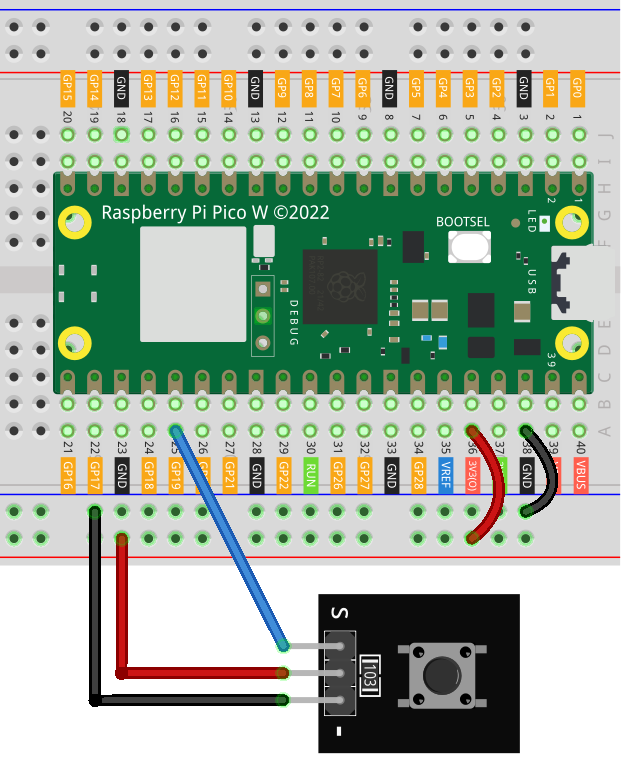

.. _pico_lesson01_button:

Lesson 01: Button Module
==================================

In this lesson, you will learn how to use Raspberry Pi Pico W to interact with the onboard LED using a button. Pressing the button will light up the LED, and releasing the button will turn it off. This project is ideal for beginners as it offers hands-on experience with input and output operations on Raspberry Pi Pico W using MicroPython.

Required Components
--------------------------

In this project, we need the following components. 

It's definitely convenient to buy a whole kit, here's the link: 

.. list-table::
    :widths: 20 20 20
    :header-rows: 1

    *   - Name	
        - ITEMS IN THIS KIT
        - LINK
    *   - Universal Maker Sensor Kit
        - 94
        - |link_umsk|

You can also buy them separately from the links below.

.. list-table::
    :widths: 30 20
    :header-rows: 1

    *   - Component Introduction
        - Purchase Link

    *   - Raspberry Pi Pico W
        - \-
    *   - :ref:`cpn_button`
        - \-
    *   - :ref:`cpn_breadboard`
        - |link_breadboard_buy|

Wiring
---------------------------

Code
---------------------------

.. code-block:: python

   from machine import Pin
   import time
   
   # Set GPIO 2 as an input pin to read the button state
   button = Pin(2, Pin.IN)
   
   # Initialize the onboard LED of the Raspberry Pi Pico W
   led = Pin('LED', Pin.OUT)
   
   while True:
       if button.value() == 0:  # Check if the button is pressed
           led.value(1)  # Turn on the LED
       else:
           led.value(0)  # Turn off the LED
   
       time.sleep(0.1)  # Short delay to reduce CPU usage

Code Analysis
---------------------------

#. Importing Modules

   The ``machine`` module is imported to interact with the GPIO pins, and the ``time`` module is for handling timing.

   .. code-block:: python

      from machine import Pin
      import time

#. Setting up the Button

   GPIO 2 is configured as an input pin. This will read the state of the push button connected to it.

   .. code-block:: python

      button = Pin(2, Pin.IN)

#. Setting up the LED

   The onboard LED is set up as an output pin, enabling us to turn it on or off programmatically.

   .. code-block:: python

      led = Pin('LED', Pin.OUT)

#. Main Loop

   - An infinite loop is used to continuously check the state of the button. 
   - If the button is pressed (``button.value() == 0``), the LED is turned on. Otherwise, it's turned off.
   - A short delay of 0.1 seconds is added to reduce CPU usage.
   
   The :ref:`button module<cpn_button>` used in this project has an internal pull-up resistor (see its :ref:`schematic diagram<cpn_button_sch>`), causing the button to be at a low level when pressed and remain at a high level when released.

   .. code-block:: python

      while True:
          if button.value() == 0:  # Check if the button is pressed
              led.value(1)  # Turn on the LED
          else:
              led.value(0)  # Turn off the LED
          time.sleep(0.1)  # Short delay to reduce CPU usage