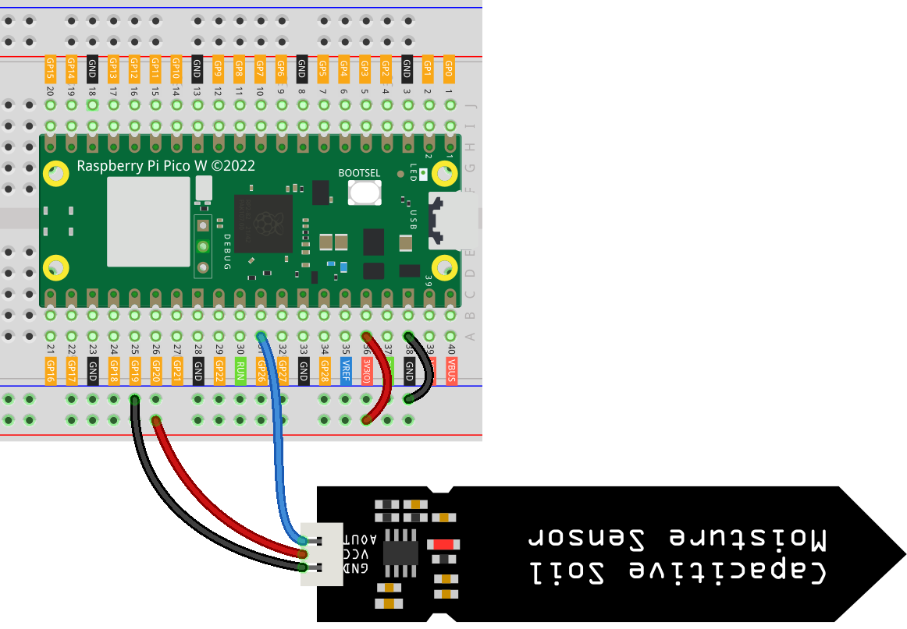

.. note::

    こんにちは、SunFounder Raspberry Pi & Arduino & ESP32 Enthusiasts Communityへようこそ！Facebook上で、仲間と一緒にRaspberry Pi、Arduino、ESP32をさらに深く探求しましょう。

    **なぜ参加するのか？**

    - **専門的なサポート**：購入後の問題や技術的な課題をコミュニティやチームの助けを借りて解決。
    - **学びと共有**：スキルを向上させるためのヒントやチュートリアルを交換。
    - **限定プレビュー**：新製品発表や予告編に早期アクセス。
    - **特別割引**：最新製品の特別割引を楽しむ。
    - **フェスティブプロモーションとプレゼント**：プレゼントやホリデープロモーションに参加。

    👉 私たちと一緒に探索と創造を始める準備はできましたか？[|link_sf_facebook|]をクリックして、今すぐ参加しましょう！
    
.. _pico_lesson02_soil_moisture:

レッスン02: 容量性土壌湿度モジュール
============================================

このレッスンでは、Raspberry Pi Pico Wを使用して容量性センサーとADC（アナログ-デジタルコンバーター）を使い、土壌湿度レベルを測定する方法を学びます。この初心者向けプロジェクトでは、MicroPythonでアナログ信号を扱う基本を紹介します。

必要なコンポーネント
--------------------------

このプロジェクトでは、以下のコンポーネントが必要です。

キット全体を購入するのが便利です。リンクはこちらです：

.. list-table::
    :widths: 20 20 20
    :header-rows: 1

    *   - Name	
        - ITEMS IN THIS KIT
        - LINK
    *   - Universal Maker Sensor Kit
        - 94
        - |link_umsk|

以下のリンクから個別に購入することもできます。

.. list-table::
    :widths: 30 20
    :header-rows: 1

    *   - Component Introduction
        - Purchase Link

    *   - Raspberry Pi Pico W
        - \-
    *   - :ref:`cpn_soil`
        - |link_soil_moisture_buy|
    *   - :ref:`cpn_breadboard`
        - |link_breadboard_buy|

配線
---------------------------

コード
---------------------------

.. code-block:: python

   from machine import ADC
   import time
   
   # Initialize an ADC object on GPIO pin 26.
   # This is typically used for reading analog signals.
   sensor_AO = ADC(26)
   
   # Continuously read and print sensor data.
   while True:
       value = sensor_AO.read_u16()  # Read and convert analog value to 16-bit integer
       print("AO:", value)  # Print the analog value
   
       time.sleep_ms(200)  # Wait for 200 milliseconds before the next read

コード解析
---------------------------

#. ライブラリのインポート:

   .. code-block:: python

      from machine import ADC
      import time

#. ADCの設定:

   .. code-block:: python

      sensor_AO = ADC(26)

   このコードは、GPIOピン26でADCオブジェクトを初期化します。ADCはアナログ信号（アナログセンサーからの信号）をマイクロコントローラーが処理できるデジタルデータに変換するために使用されます。

#. ループ内でセンサーデータを読み取る:

   .. code-block:: python
    
      while True:
          value = sensor_AO.read_u16()
          print("AO:", value)
          time.sleep_ms(200)

   ``while True`` ループは無限に実行され、センサーからのデータを常に読み取ります。 ``read_u16()`` メソッドはアナログ値を読み取り、16ビットの符号なし整数に変換します。 ``print`` 文はこの値を表示します。 ``time.sleep_ms(200)`` はループを200ミリ秒間待機させ、過剰なデータ読み取りとコンソール出力を防ぎます。
