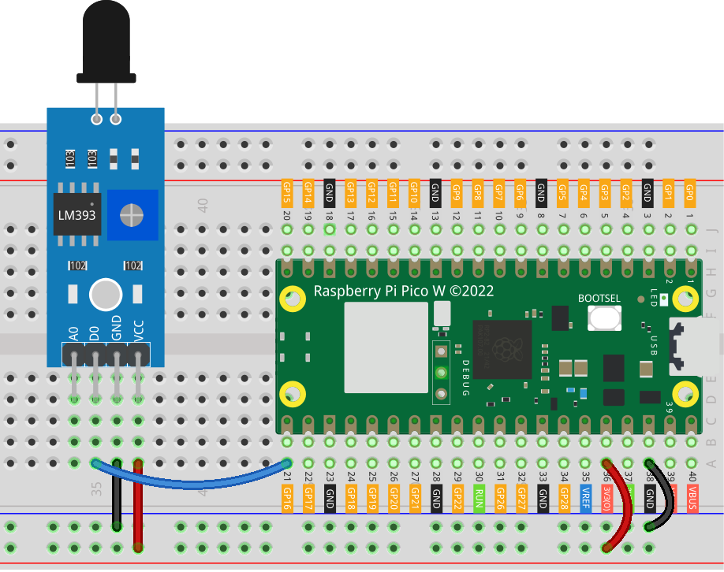

.. _pico_lesson03_flame:

Lesson 03: Flame Sensor Module
==================================

In this lesson, you will learn how to use the Raspberry Pi Pico W to detect fire using a flame sensor. When the sensor detects a flame, the onboard LED of the Raspberry Pi Pico W will turn on and display a message indicating fire detection. If no fire is detected, the LED remains off and shows a different message. This project introduces working with external sensors and provides practical experience in handling digital inputs and outputs on the Raspberry Pi Pico W using MicroPython.

Required Components
--------------------------

In this project, we need the following components. 

It's definitely convenient to buy a whole kit, here's the link: 

.. list-table::
    :widths: 20 20 20
    :header-rows: 1

    *   - Name	
        - ITEMS IN THIS KIT
        - LINK
    *   - Universal Maker Sensor Kit
        - 94
        - |link_umsk|

You can also buy them separately from the links below.

.. list-table::
    :widths: 30 20
    :header-rows: 1

    *   - Component Introduction
        - Purchase Link

    *   - Raspberry Pi Pico W
        - \-
    *   - :ref:`cpn_flame`
        - |link_flame_sensor_module_buy|
    *   - :ref:`cpn_breadboard`
        - |link_breadboard_buy|

Wiring
---------------------------

Code
---------------------------

.. code-block:: python

   from machine import Pin
   import time
   
   # Set GPIO 16 as an input pin to read the flame sensor state
   flame_sensor = Pin(16, Pin.IN)
   
   # Initialize the onboard LED of the Raspberry Pi Pico W
   led = Pin("LED", Pin.OUT)
   
   while True:
       if flame_sensor.value() == 0:
           led.value(1)  # Turn on the LED
           print("** Fire detected!!! **")
       else:
           led.value(0)  # Turn off the LED
           print("No Fire detected")
   
       time.sleep(0.1)  # Short delay to reduce CPU usage

Code Analysis
---------------------------

#. Importing Required Modules

   This part of the code imports necessary modules. ``machine`` is used for interacting with GPIO pins, and ``time`` provides functionality for delays.
   
   .. code-block:: python

      from machine import Pin
      import time

#. Initializing the Flame Sensor and LED

   Sets up the flame sensor and onboard LED. Pin 16 is configured as an input to read the flame sensor, and the onboard LED is set as an output.
   
   .. code-block:: python

      flame_sensor = Pin(16, Pin.IN)
      led = Pin("LED", Pin.OUT)

#. The Main Loop

   - An infinite loop checks the state of the flame sensor. If the sensor detects a flame (value 0), it turns on the LED and prints a message. Otherwise, it turns off the LED and prints a different message.
   - A delay of 0.1 seconds reduces CPU usage.

   .. raw :: html
      
       
   
   .. code-block:: python

      while True:
          if flame_sensor.value() == 0:
              led.value(1)
              print("** Fire detected!!! **")
          else:
              led.value(0)
              print("No Fire detected")
          time.sleep(0.1)