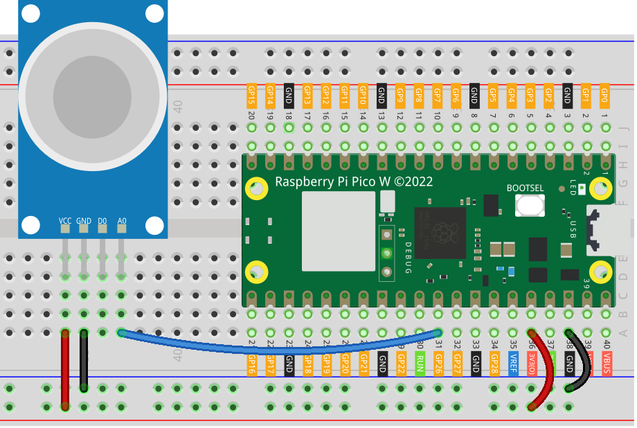

.. note::

   Hallo und willkommen in der SunFounder Raspberry Pi & Arduino & ESP32 Enthusiasten-Gemeinschaft auf Facebook! Tauchen Sie tiefer ein in die Welt von Raspberry Pi, Arduino und ESP32 mit anderen Enthusiasten.

   **Warum beitreten?**

   - **Expertenunterstützung**: Lösen Sie Nachverkaufsprobleme und technische Herausforderungen mit Hilfe unserer Gemeinschaft und unseres Teams.
   - **Lernen & Teilen**: Tauschen Sie Tipps und Anleitungen aus, um Ihre Fähigkeiten zu verbessern.
   - **Exklusive Vorschauen**: Erhalten Sie frühzeitigen Zugang zu neuen Produktankündigungen und exklusiven Einblicken.
   - **Spezialrabatte**: Genießen Sie exklusive Rabatte auf unsere neuesten Produkte.
   - **Festliche Aktionen und Gewinnspiele**: Nehmen Sie an Gewinnspielen und Feiertagsaktionen teil.

   👉 Sind Sie bereit, mit uns zu erkunden und zu erschaffen? Klicken Sie auf [|link_sf_facebook|] und treten Sie heute bei!

.. _pico_lesson04_mq2:

Lektion 04: Gassensor-Modul (MQ-2)
============================================

In dieser Lektion lernen Sie, wie Sie den Raspberry Pi Pico W verwenden, um Daten von einem Gassensor-Modul (MQ-2) unter Verwendung von MicroPython zu lesen. Wir werden Sie durch die Einrichtung eines ADC am GPIO-Pin 26 führen, um analoge Signale vom MQ-2-Sensor zu verarbeiten. Sie werden praktische Erfahrungen im kontinuierlichen Überwachen und Drucken von Sensordaten sammeln, um das Vorhandensein von Gasen in der Umgebung zu verstehen.

Erforderliche Komponenten
------------------------------

Für dieses Projekt benötigen wir folgende Komponenten.

Es ist definitiv praktisch, ein ganzes Kit zu kaufen, hier ist der Link:

.. list-table::
    :widths: 20 20 20
    :header-rows: 1

    *   - Name	
        - ITEMS IN THIS KIT
        - LINK
    *   - Universal Maker Sensor Kit
        - 94
        - |link_umsk|

Sie können sie auch separat von den folgenden Links kaufen.

.. list-table::
    :widths: 30 20
    :header-rows: 1

    *   - Component Introduction
        - Purchase Link

    *   - Raspberry Pi Pico W
        - \-
    *   - :ref:`cpn_gas`
        - |link_mq2_gas_sensor_module_buy|
    *   - :ref:`cpn_breadboard`
        - |link_breadboard_buy|

Verkabelung
---------------------------

Code
---------------------------

.. code-block:: python

   import machine
   import utime
   
   # Initialize an ADC object on GPIO pin 26.
   # This is typically used for reading analog signals.
   mq2_AO = machine.ADC(26)
   
   # Continuously read and print sensor data.
   while True:
       value = mq2_AO.read_u16()  # Read and convert analog value to 16-bit integer
       print("AO:", value)  # Print the analog value
   
       utime.sleep_ms(200)  # Wait for 200 milliseconds before the next read

Codeanalyse
---------------------------

#. Bibliotheken importieren:

   Der Code beginnt mit dem Importieren der benötigten Bibliotheken: ``machine`` für Hardware-Interaktionen und ``utime`` für zeitbezogene Aufgaben.

   .. code-block:: python

      import machine
      import utime

#. Initialisierung des MQ-2-Sensors:

   Ein ADC-Objekt wird am GPIO-Pin 26 erstellt, um analoge Signale vom MQ-2-Sensor zu lesen. Der MQ-2-Sensor gibt ein analoges Signal aus, das mit der Konzentration von Gas in der Luft variiert.

   .. code-block:: python

      mq2_AO = machine.ADC(26)

#. Lesen der Sensordaten in einer Schleife:

   Die Hauptschleife des Programms liest kontinuierlich den analogen Wert vom Sensor. Die Methode ``read_u16`` wird verwendet, um den analogen Wert zu lesen und in eine 16-Bit-Ganzzahl zu konvertieren. Dieser Wert wird dann ausgegeben. Die Schleife enthält eine Verzögerung (``utime.sleep_ms(200)``), um 200 Millisekunden zu warten, bevor der Sensorwert erneut gelesen wird. Diese Verzögerung ist wichtig, um den Sensor und den Mikrocontroller vor übermäßig schnellen Messungen zu schützen.

   .. note:: 

      MQ2 ist ein heizgetriebener Sensor, der normalerweise vorgeheizt werden muss, bevor er verwendet wird. Während der Vorheizperiode liest der Sensor in der Regel hoch und nimmt allmählich ab, bis er stabilisiert ist.

   .. code-block:: python

      while True:
          value = mq2_AO.read_u16()  # Read and convert analog value to 16-bit integer
          print("AO:", value)  # Print the analog value
          utime.sleep_ms(200)  # Wait for 200 milliseconds before the next read