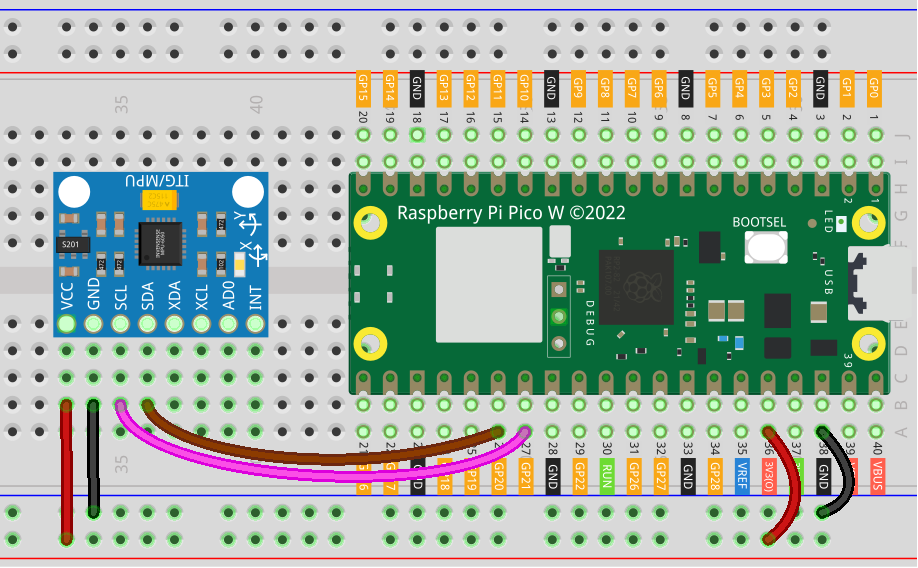

.. note::

    こんにちは、SunFounder Raspberry Pi & Arduino & ESP32 Enthusiasts Communityへようこそ！Facebook上で、仲間と一緒にRaspberry Pi、Arduino、ESP32をさらに深く探求しましょう。

    **なぜ参加するのか？**

    - **専門的なサポート**：購入後の問題や技術的な課題をコミュニティやチームの助けを借りて解決。
    - **学びと共有**：スキルを向上させるためのヒントやチュートリアルを交換。
    - **限定プレビュー**：新製品発表や予告編に早期アクセス。
    - **特別割引**：最新製品の特別割引を楽しむ。
    - **フェスティブプロモーションとプレゼント**：プレゼントやホリデープロモーションに参加。

    👉 私たちと一緒に探索と創造を始める準備はできましたか？[|link_sf_facebook|]をクリックして、今すぐ参加しましょう！

.. _pico_lesson05_mpu6050:

Lesson 05: Gyroscope & Accelerometer Module (MPU6050)
==========================================================

In this lesson, you will learn how to use the Raspberry Pi Pico W with the MPU6050 module, which combines a gyroscope and accelerometer. You'll discover how to connect the MPU6050 to the Raspberry Pi Pico W and read its acceleration and gyroscopic data using MicroPython. The lesson will guide you through writing a script to continuously display the X, Y, and Z values of both the accelerometer and gyroscope. 

Required Components
--------------------------

In this project, we need the following components. 

It's definitely convenient to buy a whole kit, here's the link: 

.. list-table::
    :widths: 20 20 20
    :header-rows: 1

    *   - Name	
        - ITEMS IN THIS KIT
        - LINK
    *   - Universal Maker Sensor Kit
        - 94
        - |link_umsk|

You can also buy them separately from the links below.

.. list-table::
    :widths: 30 20
    :header-rows: 1

    *   - Component Introduction
        - Purchase Link

    *   - Raspberry Pi Pico W
        - \-
    *   - :ref:`cpn_mpu6050`
        - |link_mpu6050_buy|
    *   - :ref:`cpn_breadboard`
        - |link_breadboard_buy|

Wiring
---------------------------

Code
---------------------------

.. note::

    * Open the ``05_mpu6050_module.py`` file under the path of ``universal-maker-sensor-kit-main/pico/Lesson_05_MPU6050_Module`` or copy this code into Thonny, then click "Run Current Script" or simply press F5 to run it. For detailed tutorials, please refer to :ref:`open_run_code_py`. 

    * Here you need to use the ``imu.py`` and ``vector3d.py``, please check if it has been uploaded to Pico W, for a detailed tutorial refer to :ref:`add_libraries_py`.

    * Don't forget to click on the "MicroPython (Raspberry Pi Pico)" interpreter in the bottom right corner. 
    

.. code-block:: python

   # Import libraries
   from imu import MPU6050
   from machine import I2C, Pin
   import time
   
   # Initialize I2C for MPU6050
   i2c = I2C(1, sda=Pin(20), scl=Pin(21), freq=400000)  # I2C bus 1, SDA pin 20, SCL pin 21, 400kHz
   
   # Create MPU6050 object
   mpu = MPU6050(i2c)
   
   # Main loop to read and print sensor data
   while True:
       # Print accelerometer data (x, y, z)
       print("-" * 50)
       print("x: %s, y: %s, z: %s" % (mpu.accel.x, mpu.accel.y, mpu.accel.z))
       time.sleep(0.1)
   
       # Print gyroscope data (x, y, z)
       print("X: %s, Y: %s, Y: %s" % (mpu.gyro.x, mpu.gyro.y, mpu.gyro.z))
       time.sleep(0.1)
   
       # Delay between readings
       time.sleep(0.5)
   

Code Analysis
---------------------------

#. Importing Libraries and Initializing I2C

   The code starts by importing necessary libraries. The ``imu`` library is used to read the values of the MPU6050 sensor, and ``machine`` allows controlling the hardware features of the Raspberry Pi Pico W. I2C is initialized using specific pins (SDA and SCL) for data communication.

   For more information about the ``imu`` library, please visit |link_imu|.

   .. code-block:: python

      from imu import MPU6050
      from machine import I2C, Pin
      import time

      i2c = I2C(1, sda=Pin(20), scl=Pin(21), freq=400000)

#. Creating MPU6050 Object

   An object of the MPU6050 sensor is created by passing the initialized I2C. This object will be used to access sensor data.

   .. code-block:: python

      mpu = MPU6050(i2c)

#. Reading and Printing Sensor Data in a Loop

   The code then enters an infinite loop where it continually reads and prints accelerometer and gyroscope data. ``time.sleep`` is used to create a delay between successive readings.

   .. code-block:: python

      while True:
          print("-" * 50)
          print("x: %s, y: %s, z: %s" % (mpu.accel.x, mpu.accel.y, mpu.accel.z))
          time.sleep(0.1)
          print("X: %s, Y: %s, Y: %s" % (mpu.gyro.x, mpu.gyro.y, mpu.gyro.z))
          time.sleep(0.1)
          time.sleep(0.5)