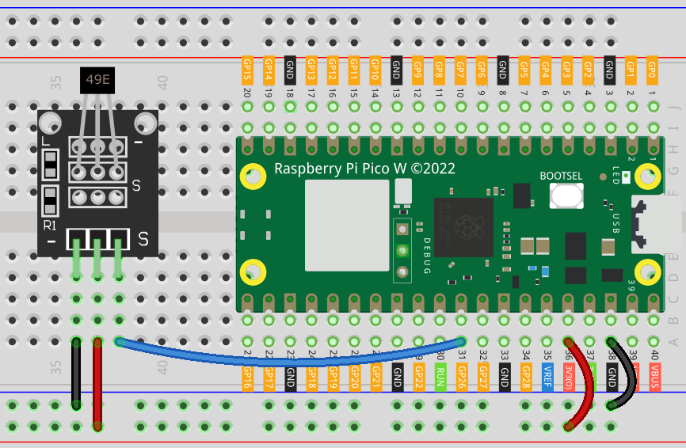

 .. note::

    Hallo und willkommen in der SunFounder Raspberry Pi & Arduino & ESP32 Enthusiasten-Gemeinschaft auf Facebook! Tauchen Sie tiefer ein in die Welt von Raspberry Pi, Arduino und ESP32 mit anderen Enthusiasten.

    **Warum beitreten?**

    - **Expertenunterstützung**: Lösen Sie Nachverkaufsprobleme und technische Herausforderungen mit Hilfe unserer Gemeinschaft und unseres Teams.
    - **Lernen & Teilen**: Tauschen Sie Tipps und Anleitungen aus, um Ihre Fähigkeiten zu verbessern.
    - **Exklusive Vorschauen**: Erhalten Sie frühzeitigen Zugang zu neuen Produktankündigungen und exklusiven Einblicken.
    - **Spezialrabatte**: Genießen Sie exklusive Rabatte auf unsere neuesten Produkte.
    - **Festliche Aktionen und Gewinnspiele**: Nehmen Sie an Gewinnspielen und Feiertagsaktionen teil.

    👉 Sind Sie bereit, mit uns zu erkunden und zu erschaffen? Klicken Sie auf [|link_sf_facebook|] und treten Sie heute bei!

.. _pico_lesson06_hall_sensor:

Lektion 06: Hall-Sensor-Modul
=====================================

In dieser Lektion lernst du, wie du den Raspberry Pi Pico W verwendest, um magnetische Felder mit einem Hall-Effekt-Sensor zu messen. Indem du den Sensor mit dem Pico W verbindest, wirst du erfahren, wie du analoge Werte liest und interpretierst, um das Vorhandensein und den Typ magnetischer Pole zu erkennen. Dieses ansprechende Projekt ist perfekt für Einsteiger, da es praktische Erfahrung mit der Verarbeitung analoger Eingänge auf dem Raspberry Pi Pico W unter Verwendung von MicroPython bietet. Du wirst lernen, wie du den Sensor einrichtest, seine Daten liest und bedingte Logik anwendest, um den Typ des magnetischen Pols zu bestimmen, was deine Fähigkeiten in Elektronik und Programmierung verbessert.

Erforderliche Komponenten
----------------------------

Für dieses Projekt benötigen wir folgende Komponenten. 

Es ist definitiv praktisch, ein ganzes Kit zu kaufen, hier ist der Link: 

.. list-table::
    :widths: 20 20 20
    :header-rows: 1

    *   - Name	
        - ITEMS IN THIS KIT
        - LINK
    *   - Universal Maker Sensor Kit
        - 94
        - |link_umsk|

Du kannst sie auch separat von den folgenden Links kaufen.

.. list-table::
    :widths: 30 20
    :header-rows: 1

    *   - Component Introduction
        - Purchase Link

    *   - Raspberry Pi Pico W
        - \-
    *   - :ref:`cpn_hall`
        - \-
    *   - :ref:`cpn_breadboard`
        - |link_breadboard_buy|

Verkabelung
---------------------------

Code
---------------------------

.. code-block:: python

   import machine
   import utime
   
   # Initialize an ADC on GPIO pin 26 for Hall effect sensor readings.
   hall_sensor = machine.ADC(26)
   
   # Continuously monitor and process Hall sensor data.
   while True:
       # Read the analog value from the sensor and convert to a 16-bit integer.
       value = hall_sensor.read_u16()
       print(value, end="")  # Output the raw sensor value.
   
       # Detect and print the type of magnetic pole based on the sensor reading.
       if value >= 48000:
           print(" - South pole detected", end="")
       elif value <= 18000:
           print(" - North pole detected", end="")
   
       print()
   
       # Wait 200 milliseconds before the next sensor reading
       utime.sleep_ms(200)

Code-Analyse
---------------------------

#. **Erforderliche Module importieren**:

   In diesem Abschnitt werden die erforderlichen Module importiert. ``machine`` wird für Hardware-Schnittstellen verwendet, und ``utime`` stellt Zeitfunktionen bereit.

   .. code-block:: python

      import machine
      import utime

#. **Initialisierung des Hall-Sensors**:

   Hier initialisieren wir einen ADC (Analog-Digital-Wandler) am GPIO-Pin 26. Hier ist der Hall-Sensor angeschlossen. Die Funktion ``machine.ADC`` wird verwendet, um analoge Werte vom Sensor zu lesen.

   .. code-block:: python
   
      hall_sensor = machine.ADC(26)
   
   

#. **Hauptschleife für das Lesen des Sensors**:

   In dieser Schleife liest ``hall_sensor.read_u16()`` den analogen Wert des Sensors und wandelt ihn in eine 16-Bit-Ganzzahl um. Diese Schleife wird unendlich ausgeführt.

   .. code-block:: python

      while True:
          value = hall_sensor.read_u16()

#. **Verarbeitung der Sensordaten**:

   Nach dem Lesen des Werts überprüft der Code, ob er innerhalb bestimmter Schwellenwerte liegt, um festzustellen, ob ein magnetischer Nord- oder Südpol erkannt wird. Die Werte ``48000`` und ``18000`` sind Schwellenwerte, die das Vorhandensein verschiedener magnetischer Pole repräsentieren. Sie können die Schwellenwerte, die die Süd- und Nordpole repräsentieren, entsprechend den tatsächlichen Bedingungen anpassen.

   Das Hall-Sensor-Modul ist mit einem 49E-Linearsensor für den Hall-Effekt ausgestattet, der die Polarität der magnetischen Pole Nord und Süd sowie die relative Stärke des magnetischen Felds messen kann. Wenn Sie einen Magneten mit Südpol in die mit 49E markierte Seite (die Seite mit der eingravierten Beschriftung) legen, wird der vom Code gelesene Wert linear proportional zur aufgebrachten magnetischen Feldstärke zunehmen. Wenn Sie hingegen einen Nordpol an diese Seite legen, wird der vom Code gelesene Wert linear proportional zu dieser magnetischen Feldstärke abnehmen. Weitere Details finden Sie unter :ref:`cpn_hall`.

   .. code-block:: python

      print(value, end="")
      if value >= 48000:
          print(" - South pole detected", end="")
      elif value <= 18000:
          print(" - North pole detected", end="")
      print()

#. **Verzögerung zwischen den Messungen**:

   Diese Zeile führt eine 200 Millisekunden lange Verzögerung vor der nächsten Messung ein, indem ``utime.sleep_ms`` verwendet wird. Dadurch wird verhindert, dass die Schleife zu schnell läuft und die Ausgabe überflutet.

   .. code-block:: python

      utime.sleep_ms(200)

