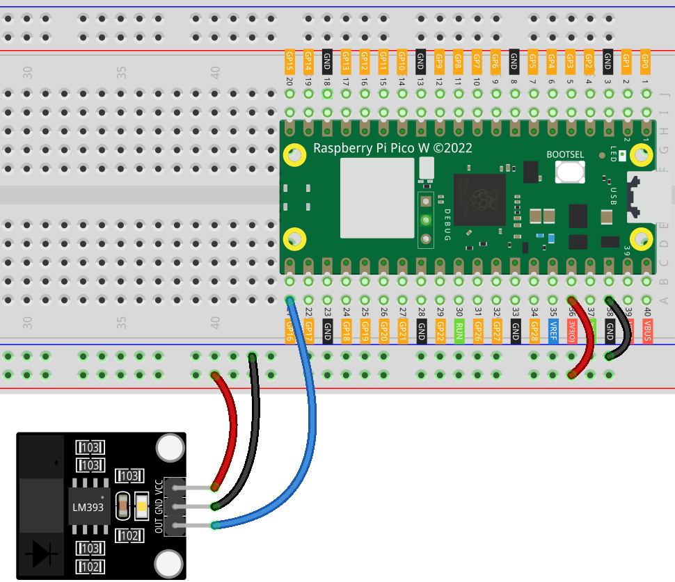

.. note::

    Hello, welcome to the SunFounder Raspberry Pi & Arduino & ESP32 Enthusiasts Community on Facebook! Dive deeper into Raspberry Pi, Arduino, and ESP32 with fellow enthusiasts.

    **Why Join?**

    - **Expert Support**: Solve post-sale issues and technical challenges with help from our community and team.
    - **Learn & Share**: Exchange tips and tutorials to enhance your skills.
    - **Exclusive Previews**: Get early access to new product announcements and sneak peeks.
    - **Special Discounts**: Enjoy exclusive discounts on our newest products.
    - **Festive Promotions and Giveaways**: Take part in giveaways and holiday promotions.

    👉 Ready to explore and create with us? Click [|link_sf_facebook|] and join today!

.. _pico_lesson07_speed:

Lesson 07: Infrared Speed Sensor Module
==========================================

In this lesson, you will learn how to use the Raspberry Pi Pico W to interface with an infrared speed sensor module. By connecting the sensor to GPIO 16, you will detect obstructions in real-time. The program monitors the sensor output, and when an obstruction is detected, it prints "Obstruction detected" to the console. If there's no obstruction, it prints "Unobstructed."

Required Components
---------------------------

.. list-table::
    :widths: 30 20
    :header-rows: 1

    *   - Component Introduction
        - Purchase Link

    *   - Raspberry Pi Pico W
        - \-
    *   - :ref:`cpn_speed`
        - |link_speed_sensor_module_buy|
    *   - :ref:`cpn_breadboard`
        - |link_breadboard_buy|

Wiring
---------------------------

Code
---------------------------

.. code-block:: python

   from machine import Pin
   import time
   
   # Set GPIO 16 as an input pin to read the speed sensor
   speed_sensor = Pin(16, Pin.IN)
   
   while True:
       if speed_sensor.value() == 1:
           print("Obstruction detected")
       else:
           print("Unobstructed")
   
       time.sleep(0.1)  # Short delay to reduce CPU usage

Code Analysis
---------------------------

#. **Import Libraries**:

   This code begins by importing necessary libraries. The ``machine`` library is used to interact with the GPIO pins, and the ``time`` library is for adding delays in the program.

   .. code-block:: python

      from machine import Pin
      import time

#. **Sensor Configuration**:

   The infrared speed sensor is connected to GPIO 16. It's set as an input, meaning the Pi Pico W will read data from this pin.

   .. code-block:: python

      speed_sensor = Pin(16, Pin.IN)

#. **Main Loop**:

   The ``while True:`` loop creates an infinite loop. Inside this loop, the program continuously checks the sensor's value.
   
   If ``speed_sensor.value()`` is 1, it means the sensor detects an obstruction. If it is 0, then there is no obstruction.

   .. code-block:: python

      while True:
          if speed_sensor.value() == 1:
              print("Obstruction detected")
          else:
              print("Unobstructed")

#. **Delay to Reduce CPU Usage**:

   A short delay of 0.1 seconds is introduced in each iteration of the loop. This reduces the CPU usage by preventing the loop from running too rapidly.

   .. code-block:: python
     
      time.sleep(0.1)

#. **More**

   If an encoder is mounted on the motor, the rotational speed of the motor can be calculated by counting the number of times an obstruction passes the sensor within a specific period.

   .. image:: img/Lesson_07_Encoder_Disk.png
      :align: center
      :width: 20%