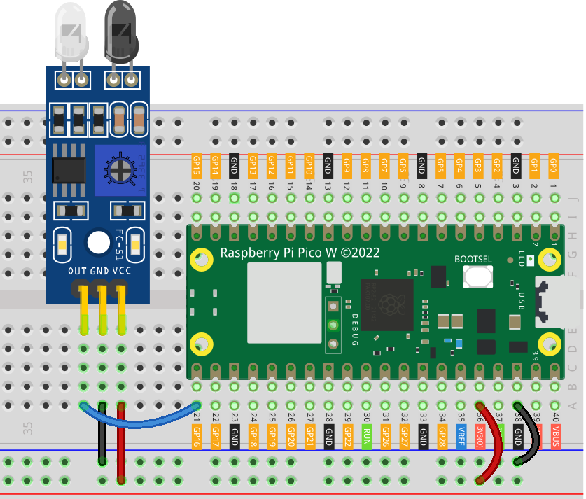

.. note::

    Hello, welcome to the SunFounder Raspberry Pi & Arduino & ESP32 Enthusiasts Community on Facebook! Dive deeper into Raspberry Pi, Arduino, and ESP32 with fellow enthusiasts.

    **Why Join?**

    - **Expert Support**: Solve post-sale issues and technical challenges with help from our community and team.
    - **Learn & Share**: Exchange tips and tutorials to enhance your skills.
    - **Exclusive Previews**: Get early access to new product announcements and sneak peeks.
    - **Special Discounts**: Enjoy exclusive discounts on our newest products.
    - **Festive Promotions and Giveaways**: Take part in giveaways and holiday promotions.

    👉 Ready to explore and create with us? Click [|link_sf_facebook|] and join today!

.. _pico_lesson08_ir_obstacle_avoidance:

Lesson 08: IR Obstacle Avoidance Sensor Module
====================================================

In this lesson, you'll learn how to use the Raspberry Pi Pico W with an IR Obstacle Avoidance Sensor Module. We'll walk you through setting up the sensor and writing a MicroPython script that continuously reads its value to detect obstacles. By monitoring changes in the sensor data, you'll grasp how to use it for basic obstacle detection.

Required Components
--------------------------

In this project, we need the following components. 

It's definitely convenient to buy a whole kit, here's the link: 

.. list-table::
    :widths: 20 20 20
    :header-rows: 1

    *   - Name	
        - ITEMS IN THIS KIT
        - LINK
    *   - Universal Maker Sensor Kit
        - 94
        - |link_umsk|

You can also buy them separately from the links below.

.. list-table::
    :widths: 30 20
    :header-rows: 1

    *   - Component Introduction
        - Purchase Link

    *   - Raspberry Pi Pico W
        - \-
    *   - :ref:`cpn_ir_obstacle`
        - |link_obstacle_avoidance_module_buy|
    *   - :ref:`cpn_breadboard`
        - |link_breadboard_buy|

Wiring
---------------------------

Code
---------------------------

.. code-block:: python

   from machine import Pin
   import time
   
   # Initialize obstacle avoidance sensor connected to pin 16 as input
   obstacle_avoidance_sensor = Pin(16, Pin.IN)
   
   while True:
       # Read and print the value of the obstacle avoidance sensor
       print(obstacle_avoidance_sensor.value())
   
       # Wait for 0.1 seconds before the next read
       time.sleep(0.1)

Code Analysis
---------------------------

#. Importing Libraries

   The ``machine`` module is imported to interact with the GPIO pins, and the ``time`` module is used for adding delays.

   .. code-block:: python

      from machine import Pin
      import time

#. Setting Up the Sensor
   
   The obstacle avoidance sensor is set up as an input device on GPIO pin 16. The ``Pin.IN`` parameter configures the pin as an input.

   .. code-block:: python

      obstacle_avoidance_sensor = Pin(16, Pin.IN)

#. Reading Sensor Data in a Loop

   The ``while True:`` loop continuously checks the sensor's output. If the sensor detects an obstacle, it returns ``0``, which is printed out. The ``time.sleep(0.1)`` adds a small delay to make the readings more manageable.

   .. code-block:: python

      while True:
          print(obstacle_avoidance_sensor.value())
          time.sleep(0.1)

   .. note:: 
   
      If the sensor is not working properly, adjust the IR transmitter and receiver to make them parallel. Additionally, you can adjust the detection range using the built-in potentiometer.
