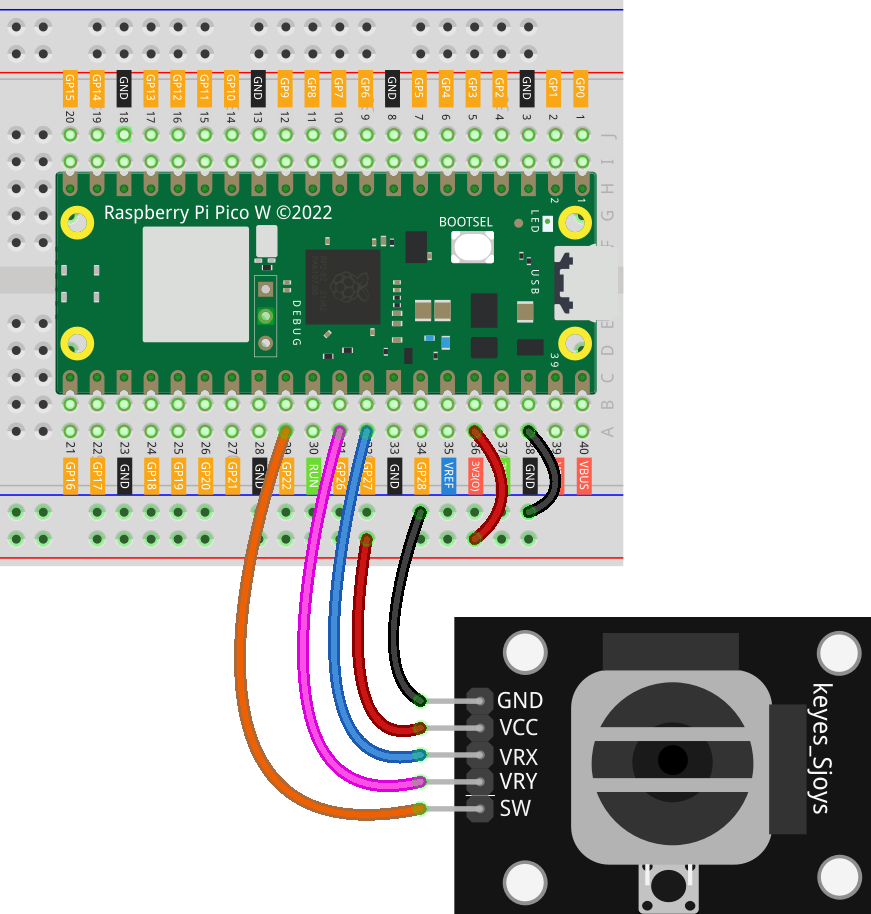

.. note::

    Hello, welcome to the SunFounder Raspberry Pi & Arduino & ESP32 Enthusiasts Community on Facebook! Dive deeper into Raspberry Pi, Arduino, and ESP32 with fellow enthusiasts.

    **Why Join?**

    - **Expert Support**: Solve post-sale issues and technical challenges with help from our community and team.
    - **Learn & Share**: Exchange tips and tutorials to enhance your skills.
    - **Exclusive Previews**: Get early access to new product announcements and sneak peeks.
    - **Special Discounts**: Enjoy exclusive discounts on our newest products.
    - **Festive Promotions and Giveaways**: Take part in giveaways and holiday promotions.

    👉 Ready to explore and create with us? Click [|link_sf_facebook|] and join today!

.. _pico_lesson09_joystick:

Lesson 09: Joystick Module
==================================

In this lesson, you'll learn how to interface with and read data from a joystick module using the Raspberry Pi Pico W. You'll explore initializing and reading analog values from the X and Y axes of the joystick, as well as handling digital input from its switch using MicroPython. This lesson is ideal for beginners, offering practical experience in reading and interpreting analog and digital inputs on the Raspberry Pi Pico W.

Required Components
--------------------------

In this project, we need the following components. 

It's definitely convenient to buy a whole kit, here's the link: 

.. list-table::
    :widths: 20 20 20
    :header-rows: 1

    *   - Name	
        - ITEMS IN THIS KIT
        - LINK
    *   - Universal Maker Sensor Kit
        - 94
        - |link_umsk|

You can also buy them separately from the links below.

.. list-table::
    :widths: 30 20
    :header-rows: 1

    *   - Component Introduction
        - Purchase Link

    *   - Raspberry Pi Pico W
        - \-
    *   - :ref:`cpn_joystick`
        - |link_joystick_buy|
    *   - :ref:`cpn_breadboard`
        - |link_breadboard_buy|

Wiring
---------------------------

Code
---------------------------

.. code-block:: python

   import machine  # Import hardware control module
   import time  # Import time module
   
   # Initialize X and Y axes of the joystick
   x_joystick = machine.ADC(27)
   y_joystick = machine.ADC(26)
   
   # Initialize joystick switch with pull-up resistor
   z_switch = machine.Pin(22, machine.Pin.IN, machine.Pin.PULL_UP)
   
   while True:  # Continuous reading loop
       x_value = x_joystick.read_u16()  # Read X-axis value
       y_value = y_joystick.read_u16()  # Read Y-axis value
       z_value = z_switch.value()  # Read switch state
   
       # Print joystick values and switch state
       print("X: ", x_value, " Y: ", y_value)
       print("SW: ", z_value)
   
       time.sleep_ms(200)  # Loop every 200 milliseconds

Code Analysis
---------------------------

#. Import Libraries

   The ``machine`` and ``time`` modules are imported for hardware control and time functions.

   .. code-block:: python

      import machine  # Import hardware control module
      import time  # Import time module

#. Initialize Joystick Axes

   The joystick's X and Y axes are connected to analog pins (27 and 26 respectively). These pins are initialized as ADC (Analog to Digital Converter) objects.

   .. code-block:: python

      x_joystick = machine.ADC(27)
      y_joystick = machine.ADC(26)

#. Initialize Joystick Switch

   The joystick's switch is connected to pin 22. It's set as an input with a pull-up resistor. When the button is not pressed, it reads high (1), and when pressed, it reads low (0).

   .. code-block:: python

      z_switch = machine.Pin(22, machine.Pin.IN, machine.Pin.PULL_UP)

#. Main Loop

   - An infinite loop continuously reads values from the joystick. 
   - ``read_u16`` method is used to read 16-bit values from the X and Y axes.
   - ``value()`` method is used to read the state of the switch.
   - The values are then printed, and the loop pauses for 200 milliseconds.

   .. raw:: html

       

   .. code-block:: python

      while True:  # Continuous reading loop
          x_value = x_joystick.read_u16()  # Read X-axis value
          y_value = y_joystick.read_u16()  # Read Y-axis value
          z_value = z_switch.value()  # Read switch state

          # Print joystick values and switch state
          print("X: ", x_value, " Y: ", y_value)
          print("SW: ", z_value)

          time.sleep_ms(200)  # Loop every 200 milliseconds