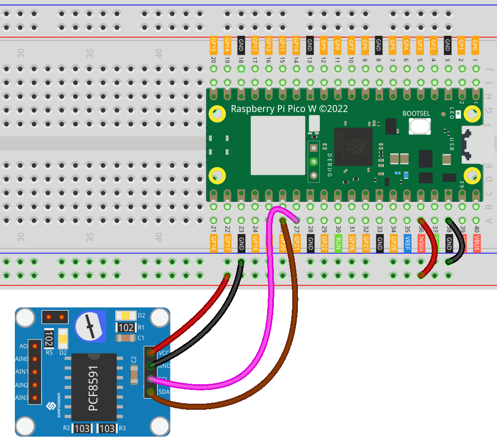

.. _pico_lesson10_pcf8591:

Lesson 10: PCF8591 ADC DAC Converter Module
==============================================

In this lesson, you'll learn how to connect the Raspberry Pi Pico W with the PCF8591 ADC DAC Converter Module using MicroPython. You'll establish an I2C connection, initialize the PCF8591 module, and read analog values from its channels. This hands-on session will deepen your grasp of analog-to-digital conversion and I2C communication on the Raspberry Pi Pico W. The module's potentiometer is connected to AIN0 using jumper caps, and the D2 LED on the module is connected to AOUT, so you can see that the brightness of D2 LED changes as you rotate the potentiometer.

Required Components
---------------------------

* Raspberry Pi Pico W
* :ref:`cpn_pcf8591`
* :ref:`cpn_breadboard`

Wiring
---------------------------

Code
---------------------------

.. code-block:: python

   from machine import I2C, Pin
   import time
   from PCF8591 import PCF8591
   
   # Setup I2C connection on pins 20 (SDA) and 21 (SCL)
   i2c = I2C(0, sda=Pin(20), scl=Pin(21))
   
   # Initialize the PCF8591 module at address 0x48
   pcf8591 = PCF8591(0x48, i2c)  # Adjust the address if needed
   
   # Check if the PCF8591 module is connected
   if pcf8591.begin():
       print("PCF8591 found")
   
   # Main loop to read analog values
   while True:
       # Read and print the analog value from channel AIN0
       AIN0 = pcf8591.analog_read(PCF8591.AIN0)
       print("AIN0 ", AIN0)  # PCF8591.CHANNEL_0 can also be used
       # Additional channels can be read by uncommenting the following lines
       # print("AIN1 ", pcf8591.analog_read(PCF8591.AIN1))
       # print("AIN2 ", pcf8591.analog_read(PCF8591.AIN2))
       # print("AIN3 ", pcf8591.analog_read(PCF8591.AIN3))
   
       # Write the value back to AOUT. This will change the brightness of the D2 LED on the module.
       pcf8591.analog_write(AIN0)
   
       # Wait for 0.2 seconds before the next read
       time.sleep(0.2)

Code Analysis
---------------------------

#. Importing Libraries and Setting Up I2C

   - The ``machine`` module is imported to use I2C communication and ``Pin`` class.
   - The ``time`` module is imported for adding delays in the program.
   - The ``PCF8591`` library is imported for easy interaction with the PCF8591 module. For more information about the ``PCF8591`` library, please visit |link_PCF8591_micropython_library|.

   .. raw:: html

       

   .. code-block:: python

      from machine import I2C, Pin
      import time
      from PCF8591 import PCF8591

#. Initializing I2C Connection

   I2C communication is initialized using SDA (Serial Data) and SCL (Serial Clock) pins. The Raspberry Pi Pico W uses GPIO 20 and 21 for this purpose.

   .. code-block:: python

      i2c = I2C(0, sda=Pin(20), scl=Pin(21))

#. Initializing the PCF8591 Module

   The PCF8591 module is initialized with its I2C address (0x48). This address might need adjustment depending on the module's configuration.

   .. code-block:: python

      pcf8591 = PCF8591(0x48, i2c)  # Adjust the address if needed

#. Checking Connection

   The program checks if the PCF8591 module is connected correctly.

   .. code-block:: python

      if pcf8591.begin():
          print("PCF8591 found")

#. Main Loop for Reading Analog Values

   - The program enters an infinite loop, continuously reading the analog value from channel AIN0.
   - The ``analog_read`` function is used to read the value from a specified channel.
   - The ``analog_write`` function is used to write the value to AOUT. 
   - Jumper caps link the module's potentiometer to AIN0, and the D2 LED is connected to AOUT. So the brightness of the LED changes as the potentiometer is rotated. Please refer to the PCF8591 module :ref:`schematic <cpn_pcf8591_sch>` for details. 
   - A delay of 0.2 seconds is added between reads to stabilize the output.

   .. raw:: html

       

   .. code-block:: python

      while True:
          # Read and print the analog value from channel AIN0
          AIN0 = pcf8591.analog_read(PCF8591.AIN0)
          print("AIN0 ", AIN0)  # PCF8591.CHANNEL_0 can also be used
          # Additional channels can be read by uncommenting the following lines
          # print("AIN1 ", pcf8591.analog_read(PCF8591.AIN1))
          # print("AIN2 ", pcf8591.analog_read(PCF8591.AIN2))
          # print("AIN3 ", pcf8591.analog_read(PCF8591.AIN3))
      
          # Write the value back to AOUT. This will change the brightness of the D2 LED on the module.
          pcf8591.analog_write(AIN0)
      
          # Wait for 0.2 seconds before the next read
          time.sleep(0.2)
