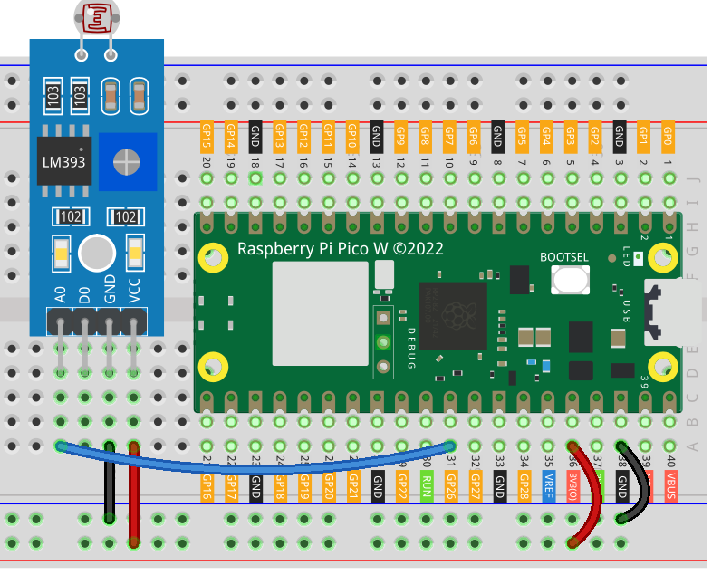

.. note::

    こんにちは、SunFounder Raspberry Pi & Arduino & ESP32 Enthusiasts Communityへようこそ！Facebook上で、仲間と一緒にRaspberry Pi、Arduino、ESP32をさらに深く探求しましょう。

    **なぜ参加するのか？**

    - **専門的なサポート**：購入後の問題や技術的な課題をコミュニティやチームの助けを借りて解決。
    - **学びと共有**：スキルを向上させるためのヒントやチュートリアルを交換。
    - **限定プレビュー**：新製品発表や予告編に早期アクセス。
    - **特別割引**：最新製品の特別割引を楽しむ。
    - **フェスティブプロモーションとプレゼント**：プレゼントやホリデープロモーションに参加。

    👉 私たちと一緒に探索と創造を始める準備はできましたか？[|link_sf_facebook|]をクリックして、今すぐ参加しましょう！

.. _pico_lesson11_photoresistor:

Lesson 11: Photoresistor Module
==================================

In this lesson, you'll learn how to connect a photoresistor module to the Raspberry Pi Pico W in order to measure light intensity. By linking the photoresistor to the analog input, you can read different analog values that correspond to varying light levels. This project is ideal for beginners and provides hands-on experience in utilizing analog inputs on the Raspberry Pi Pico W with MicroPython.

Required Components
--------------------------

In this project, we need the following components. 

It's definitely convenient to buy a whole kit, here's the link: 

.. list-table::
    :widths: 20 20 20
    :header-rows: 1

    *   - Name	
        - ITEMS IN THIS KIT
        - LINK
    *   - Universal Maker Sensor Kit
        - 94
        - |link_umsk|

You can also buy them separately from the links below.

.. list-table::
    :widths: 30 20
    :header-rows: 1

    *   - Component Introduction
        - Purchase Link

    *   - Raspberry Pi Pico W
        - \-
    *   - :ref:`cpn_photoresistor`
        - |link_photoresistor_sensor_module_buy|
    *   - :ref:`cpn_breadboard`
        - |link_breadboard_buy|

Wiring
---------------------------

Code
---------------------------

.. code-block:: python

   import machine  # Hardware control library
   import time  # Time control library
   
   photoresistor = machine.ADC(26)  # Initialize ADC on pin 26
   
   while True:
       value = photoresistor.read_u16()  # Read analog value
       print(value)  # Print the value
   
       time.sleep_ms(200)  # Delay of 200 ms between reads

Code Analysis
---------------------------

1. **Importing Libraries**:

   The code begins by importing necessary libraries. The ``machine`` library is used for controlling hardware components, and the ``time`` library is used for managing time-related tasks such as delays.

   .. code-block:: python

      import machine  # Hardware control library
      import time  # Time control library

2. **Initializing the Photoresistor**:

   Here, we initialize the photoresistor. We use the ``machine.ADC`` class to create an ADC object on pin 26, where the photoresistor is connected. The ADC object will be used to read the analog values from the photoresistor.

   .. code-block:: python

      photoresistor = machine.ADC(26)  # Initialize ADC on pin 26

3. **Reading from the Photoresistor**:

   In this loop, the code continuously reads the analog value from the photoresistor using ``photoresistor.read_u16()``. This method reads the value as a 16-bit unsigned integer. The value is then printed to the console.

   .. code-block:: python

      while True:
          value = photoresistor.read_u16()  # Read analog value
          print(value)  # Print the value

4. **Adding a Delay**:

   To prevent the code from running too quickly and flooding the console with data, a delay of 200 milliseconds is introduced after each read using ``time.sleep_ms(200)``.

   .. code-block:: python

      time.sleep_ms(200)  # Delay of 200 ms between reads